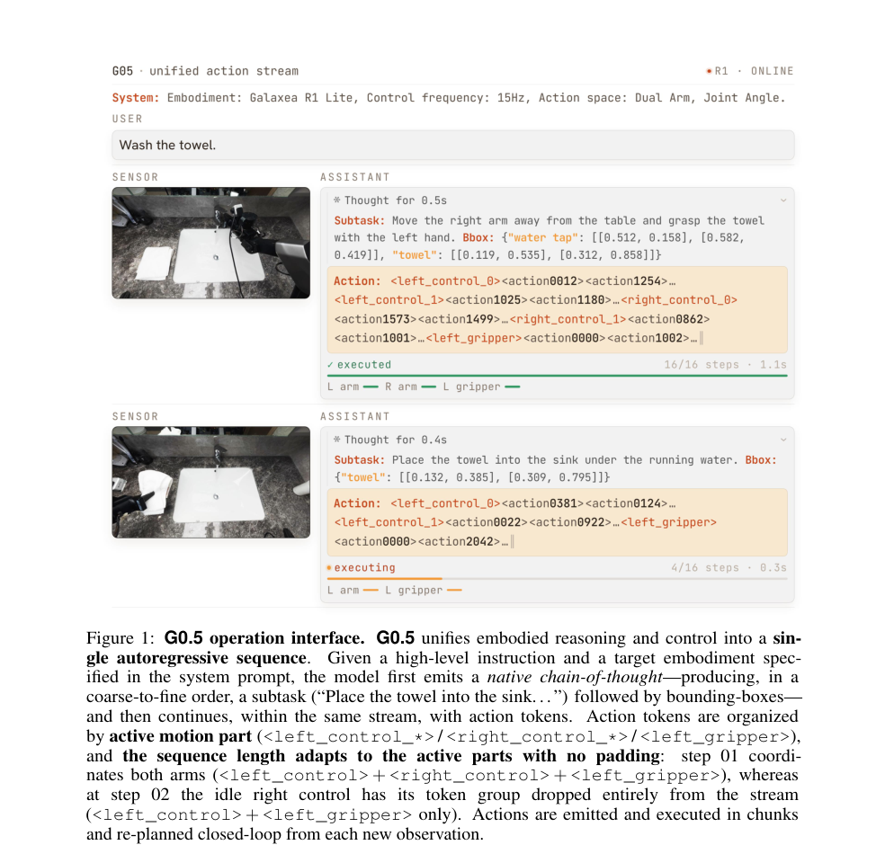
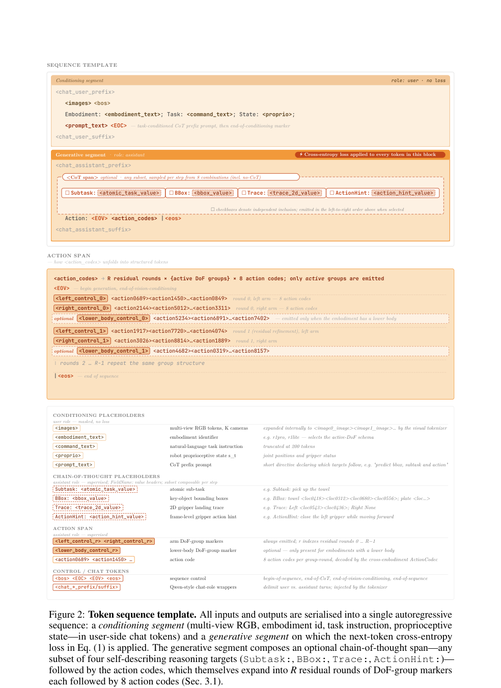
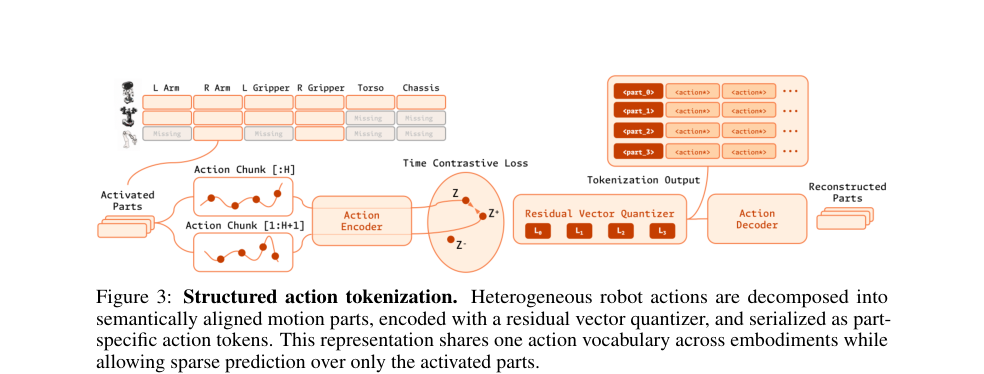
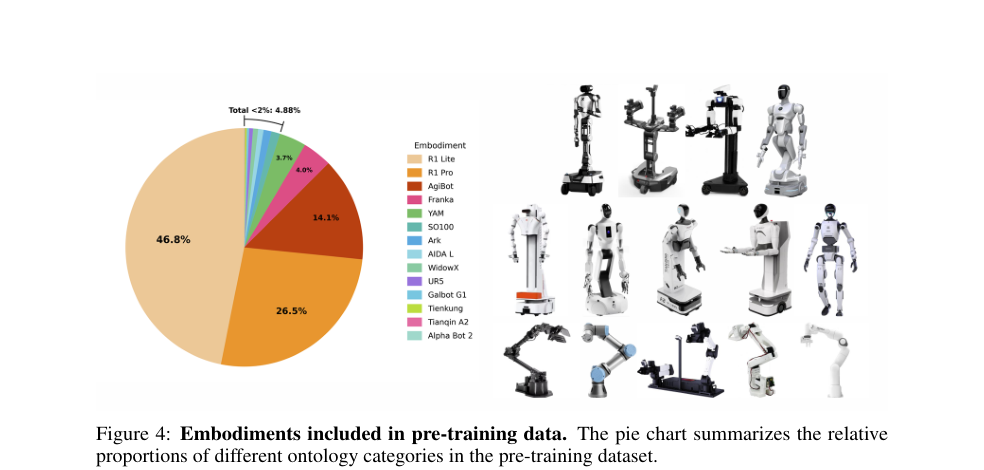
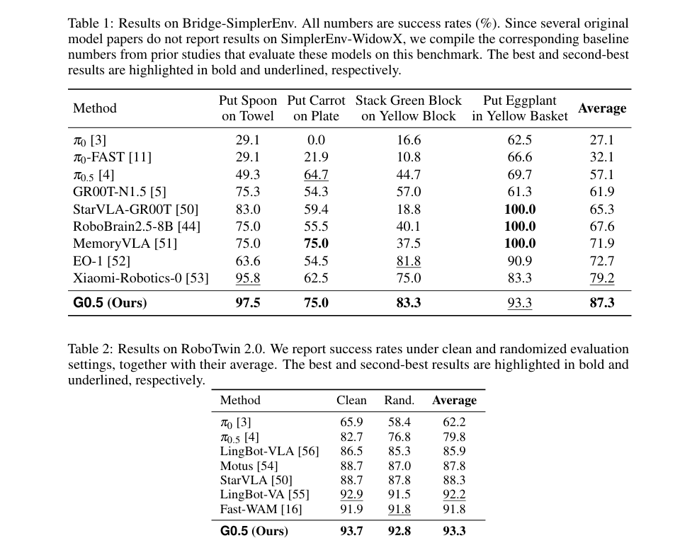
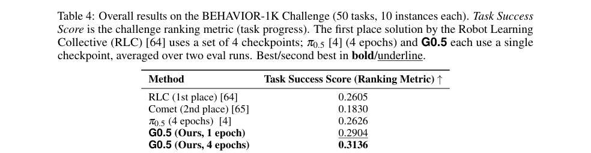
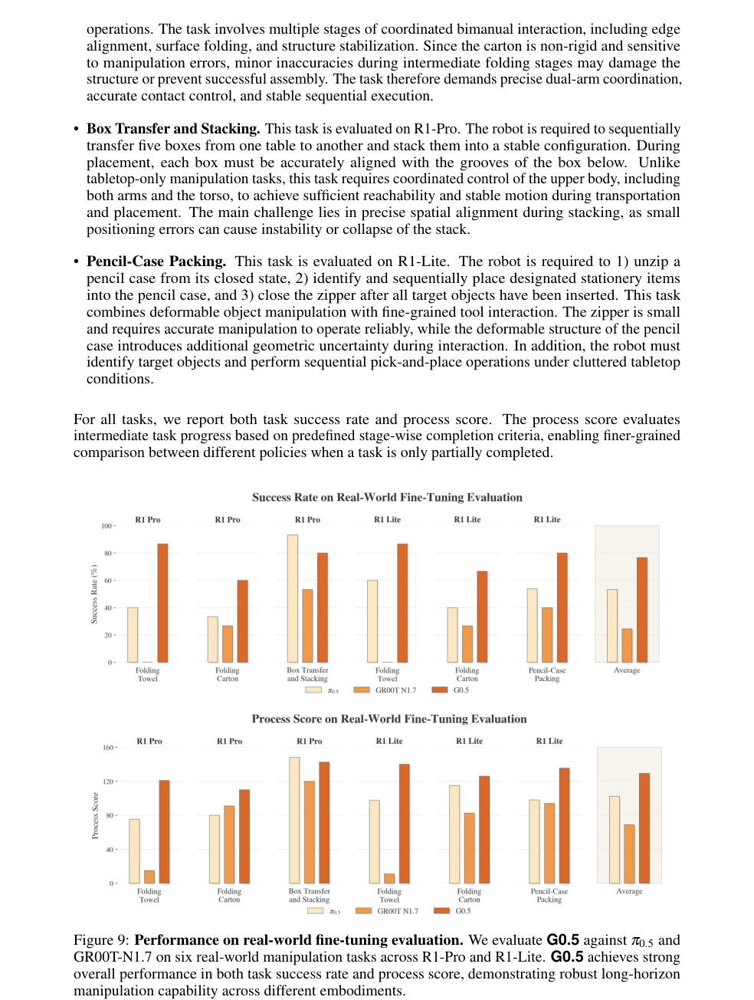
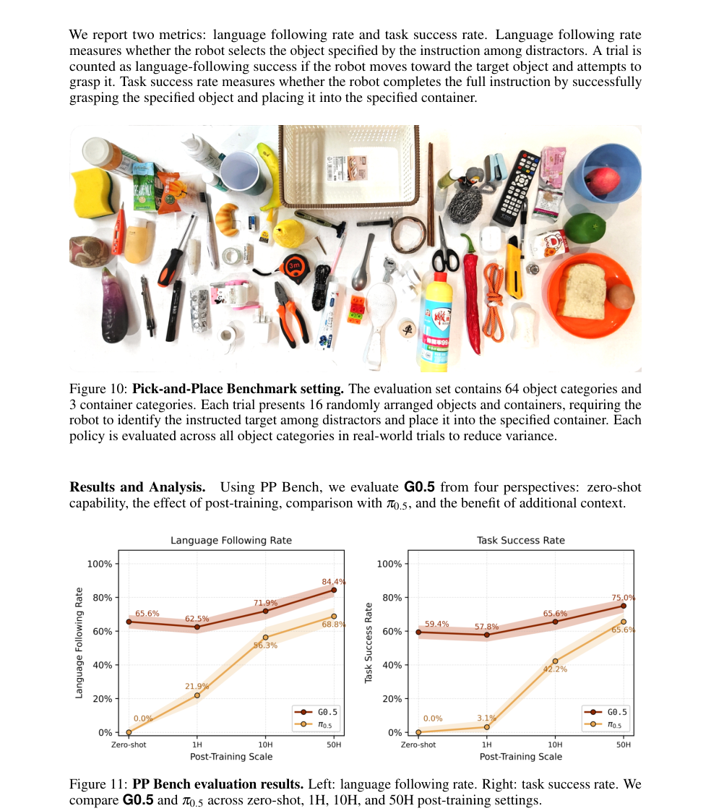

> Galaxea G0.5 的核心立场是把 VLM 重新变成 actor：不用 VLM 只做 encoder 再接 flow / diffusion action expert，而是让单个 autoregressive decoder 在同一 token stream 里生成 reasoning tokens 和 action tokens。ActionCodec 解决跨机器人动作离散化，原生 CoT 让推理直接参与动作生成，visual memory 支持长时序闭环控制。

# 论文概览

论文：**Galaxea G0.5 Technical Report**  
作者：Galaxea Team  
本地 PDF：`raw/Galaxea_G0_5.pdf`

资源：

- Project Page：<https://opengalaxea.github.io/G05/>
- GitHub：<https://github.com/OpenGalaxea/GalaxeaVLA>
- Hugging Face：<https://huggingface.co/OpenGalaxea/G05>

一句话总结：

> G0.5 是一个基于 Qwen3.5 2B 的 autoregressive VLA：把多视角图像、语言指令、embodiment id、proprioception、CoT、action codes 全部串成同一个自回归序列，用 next-token prediction 同时训练推理和动作，在 DROID、LIBERO、RoboTwin、BEHAVIOR-1K、真实 R1-Lite/R1-Pro、Pick-and-Place 等多类评测上超过 VLM-as-encoder baselines。

# 背景：为什么要回到 VLM-as-Actor

VLA 架构大致有两条路线：

| 路线 | 代表 | 核心做法 | 问题 |
| --- | --- | --- | --- |
| VLM-as-Actor | RT-2、OpenVLA、早期 AR action token 方法 | VLM 直接生成 action tokens。 | 高频控制时 action token 太多，速度和成本高。 |
| VLM-as-Encoder | $\pi_0$、$\pi_{0.5}$、GR00T、SmolVLA | VLM 输出 hidden states / KV cache，单独 action expert 用 flow / diffusion 生成连续动作。 | VLM 退化成上下文 encoder，推理、CoT、prompt steering 对动作只通过压缩条件间接影响。 |

主流 VLA 近年偏向 VLM-as-encoder，因为 action expert 可以一次输出连续 action chunk，效率更好。但 G0.5 认为这会牺牲 VLM 的核心能力：

- VLM 本来会语言推理、分解任务、识别对象、做 in-context adaptation；
- 如果动作由外部 expert 生成，VLM 的 reasoning 只能变成 conditioning；
- prompt 对动作粒度、场景外处理、长时序策略的影响被压缩。

G0.5 的选择是：

> 保留 VLM 自回归生成能力，但重新设计 action tokenization，把动作 token 数降下来。

# 模型接口：一个序列里同时推理和行动

G0.5 初始化自 Qwen3.5 2B VLM。输入包括：

- 多视角 RGB 历史观测；
- embodiment identifier，例如 R1-Pro / R1-Lite；
- 自然语言任务指令；
- proprioceptive state；
- prompt template，决定是否输出 CoT。

输出是一个 unified autoregressive sequence：

1. 先可选输出 CoT：subtask、bbox、trace、action hint；
2. 再输出 action tokens；
3. action tokens 由 ActionCodec 解码成连续控制；
4. 按 chunk 执行动作，并从新观测闭环 replanning。



Fig.1 展示了 G0.5 的接口：同一个 decoder 先生成任务分解和 bounding boxes，再继续生成 left/right control、gripper 等 action token group。闲置的控制组可以直接不生成，而不是 padding。

# 方法

## 1. 单一自回归训练目标

G0.5 把输入输出都序列化成同一条 token sequence。



序列分成两段：

| 段落 | 内容 | 是否计算 loss |
| --- | --- | --- |
| conditioning segment | images、embodiment、task、state、prompt，以 user-side chat tokens 包装。 | 不计算 loss |
| generative segment | CoT span + action codes，以 assistant-side chat tokens 包装。 | 计算 next-token loss |

训练目标是普通交叉熵：

$$
\mathcal{L}(\theta)
=
-
\sum_{i\in G}
\log p_\theta(x_i|x_{1:i-1})
$$

其中 $G$ 是 generative segment 的 token 索引。

关键点是：

> CoT 和 action codes 都是同一个 decoder 生成的 token，没有额外 regression loss，也没有单独 action expert 的蒸馏目标。

## 2. Cross-Embodiment ActionCodec

跨机器人动作 tokenization 的难点是：

1. 不同机器人 DoF、形态、控制频率不同；
2. 直接 flatten action vector 会把不同身体部位混在一起；
3. 高维高频动作如果逐维逐时刻离散化，token 数会爆炸；
4. 离散 token 如果不连续，相邻动作可能映射到完全不同 token，训练噪声大。

G0.5 采用结构化动作分组：

```text
<left_control> | <left_gripper> | <right_control> | <right_gripper> | <lower_body>
```

统一成 27 维 action space：

```text
left_control(9) + left_gripper(1)
+ right_control(9) + right_gripper(1)
+ lower_body(7)
```

每个 motion part padding 到共享维度，再用 residual vector quantization（RVQ）训练 ActionCodec。生成时只输出 active DoF groups：

- 左臂在动，输出 left_control；
- 右臂闲置，右臂 token group 可以直接 drop；
- 有 lower body 的 embodiment 才输出 lower_body group。



Fig.3 展示了这个结构化 tokenization：异构机器人动作先按身体部件对齐，再共享同一个 action vocabulary。

## 3. Native Chain-of-Thought

G0.5 的 CoT 不是单独模块，而是 action generation stream 的一部分。

CoT targets 包括：

| CoT token | 含义 |
| --- | --- |
| `Subtask:` | 当前原子子任务，例如 pick up the towel。 |
| `BBox:` | 任务相关物体的 bounding boxes。 |
| `Trace:` | 2D gripper landing / end-effector trace。 |
| `ActionHint:` | frame-level gripper/action hint。 |

训练时每个 robot sample 随机选择一种 CoT format，包括 no-CoT baseline、subtask、bbox、trace、action hint 等组合。评估时可以通过 prompt 控制是否输出某类 CoT。

论文强调：CoT 不只是训练时辅助监督，而是直接进入动作生成上下文。因此模型可以在推理时先 grounding / planning，再继续生成 action tokens。

## 4. Visual Memory

长时序 mobile manipulation 不是 Markov 的：单帧图像可能被手臂遮挡，也看不到之前失败尝试或物体状态变化。

G0.5 使用 visual memory：

- 在 Vision Transformer 中每 4 层插入 factorized spatial-temporal attention；
- 先跨空间 patches 混合，再跨时间帧混合；
- 输入 6 帧，间隔 1 秒，覆盖约 5 秒历史；
- 最后一层丢弃历史 tokens，控制推理 latency；
- 训练时随机 drop 历史帧，避免过拟合 temporal trajectory；
- proprioception 用连续 state embedding，而不是离散文本 token。

# 预训练数据

G0.5 单阶段预训练，混合 robot demonstrations 和 web-scale VQA。

## 机器人数据

机器人数据覆盖 14 种 embodiments，包括真实和仿真平台。所有数据都映射到统一 27 维 action space。



Fig.4 / Fig.5 展示了：

- 不同 embodiment 在预训练数据中的占比；
- action verbs 和 object nouns 的长尾分布；
- 高频动作集中在 pick、place、move、put 等通用操作；
- 物体集中在家庭和桌面实体，同时保留长尾技能和物体。

## 自动标注

为了生成 CoT supervision，G0.5 构建自动标注 pipeline：

- rule-based temporal segmentation 找 action segment 和 keyframe；
- Gemini 3、Doubao Seed 2.0 Pro 等多模态模型生成 action hints、atomic tasks、episode-level instructions；
- foundation model + SAM3 tracking 生成物体 bbox 和 segmentation masks；
- 通过 forward kinematics 得到末端执行器 3D trajectory，再投影到 head camera 平面形成 2D trace。

## Web / VQA co-training

为了保留 VLM 能力，G0.5 同时混入约 100M VQA：

- 约 50M generic web VQA；
- 约 50M embodied VQA；
- 约 5M in-house robot-scene VQA annotations。

VQA 和 action samples 按 1:4 混合，都用同一个 next-token cross-entropy。

# 实验结果

论文用 7 类设置验证 G0.5：

1. real-world fine-tuning on R1-Lite / R1-Pro；
2. BEHAVIOR-1K Challenge；
3. zero-shot DROID；
4. Pick-and-Place language-following benchmark；
5. LIBERO；
6. RoboTwin 2.0；
7. SimplerEnv-Bridge。

## 1. 标准模拟 benchmark



主要结果：

- Bridge-SimplerEnv：G0.5 平均 87.3；
- RoboTwin 2.0：G0.5 平均 93.3；
- LIBERO：G0.5 平均 98.9；
- DROID zero-shot：G0.5 82.5。

这些结果说明：虽然 G0.5 是 AR action token 模型，但在标准仿真和 zero-shot 机器人数据上并不输给 VLM-as-encoder + action expert 路线。

## 2. BEHAVIOR-1K 长时序任务



BEHAVIOR-1K Challenge 包含 50 个长时序家庭 mobile manipulation tasks。G0.5 的结果：

- 1 epoch post-training：Task Success Score 0.2904；
- 4 epochs post-training：Task Success Score 0.3136；
- 超过 $\pi_{0.5}$ 4 epochs 的 0.2626；
- 超过 challenge 第一名 RLC 的 0.2605。

论文认为优势主要来自：

- structured action decomposition 适合 mobile manipulation；
- 原生 CoT 帮助长时序任务分解和 grounding；
- visual memory 帮助处理遮挡、失败恢复和长 horizon。

## 3. 真实机器人 fine-tuning



在 R1-Lite / R1-Pro 上，G0.5 与 $\pi_{0.5}$、GR00T-N1.7 对比。总体上：

- G0.5 平均成功率 76.7%；
- $\pi_{0.5}$ 为 53.3%；
- GR00T-N1.7 为 24.4%。

这说明预训练 backbone 在真实双臂场景上迁移有效。

## 4. Pick-and-Place language following



Pick-and-Place benchmark 覆盖 64 个物体类别和 3 个容器类别，重点测语言跟随和执行可靠性。

G0.5 的特点：

- zero-shot language following 已经较强；
- post-training 后 language following 和 task success 都继续提升；
- 相比 $\pi_{0.5}$，G0.5 在语言跟随和任务成功率上更稳定。

这支持论文的核心主张：VLM 直接作为 actor 时，语言能力更容易传导到动作。

# 和 VLM-as-Encoder 的区别

| 维度 | VLM-as-Encoder + Expert | G0.5 VLM-as-Actor |
| --- | --- | --- |
| 动作生成 | 独立 flow / diffusion action expert | VLM decoder 直接生成 action tokens |
| 训练目标 | VLM 和 action expert 常分离 | CoT 与 action 共用 next-token loss |
| prompt steering | 通过压缩条件间接影响 expert | prompt 直接进入 action generation context |
| CoT | 常是外部模块或辅助监督 | 原生 token stream 的一部分 |
| 跨 embodiment | 多靠 action-space adapter / padding | ActionCodec 共享 vocabulary + active DoF groups |
| 推理 | expert 输出连续 action chunk | AR token 生成 + chunk decode + closed-loop replanning |

G0.5 并不是否认 flow / diffusion action expert 的价值。它也保留可选 flow-matching head 作为 inference accelerator。但主张是：

> foundation VLA 的核心能力应留在自回归 VLM backbone，而不是被压缩给外部 action expert。

# 局限

- Prompt-driven behavior control 目前主要是 qualitative probe，论文没有系统量化。
- AR 生成虽然通过 ActionCodec 减少 token，但高频控制 latency 仍可能是工程挑战。
- 自动标注依赖多模态模型和 SAM3 tracking，标注噪声可能影响 CoT supervision。
- 评估覆盖很多 benchmark，但不同 benchmark 的训练数据、后训练 epoch 和 baseline 设置仍需仔细比较。
- Flow-matching head 只作为 optional accelerator，没有作为主要路线深入展开。

# 总结

Galaxea G0.5 的价值在于重新打开了 VLM-as-Actor 这条路线：

1. 用 cross-embodiment ActionCodec 解决 AR action token 过长和跨机器人动作不统一的问题；
2. 用 native CoT 把任务分解、物体 grounding、动作 hint 直接接入 action generation；
3. 用 visual memory 支持长时序闭环；
4. 用 robot demonstrations + web/VQA co-training 保持 VLM 能力；
5. 在多类仿真、真实机器人和长时序 benchmark 上证明 AR VLA 仍然可以扩展。

一句话：

> G0.5 不是把 VLM 接到一个动作专家上，而是让 VLM 自己继续当会推理、会记忆、会行动的 actor。

## 附录：PDF 解析与图表抽取自检

- PDF 已成功读取：标题、摘要、章节结构、公式、Figure 和 Table 均可解析。
- 已抽取关键图表：Fig.1、Fig.2、Fig.3、Fig.4/5、Table 1/2/3、Table 4、Fig.9、Fig.10/11。
- 使用图片裁剪的复杂图表：模型接口、token sequence template、action tokenization、预训练数据分布、仿真结果表、BEHAVIOR-1K、真实机器人、Pick-and-Place。
- 已检索 GitHub、Hugging Face 和项目页。

## 索引信息

> 类别：论文笔记 / 机器人控制 / VLA / Autoregressive Action  
> 索引标签：#Galaxea #G05 #VLA #AutoregressiveAction #ActionTokenizer #ChainOfThought #VisualMemory #RobotLearning #EmbodiedAI
