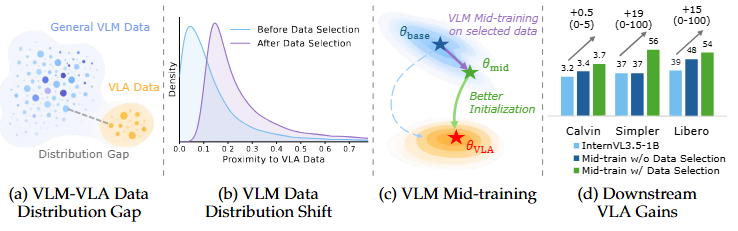
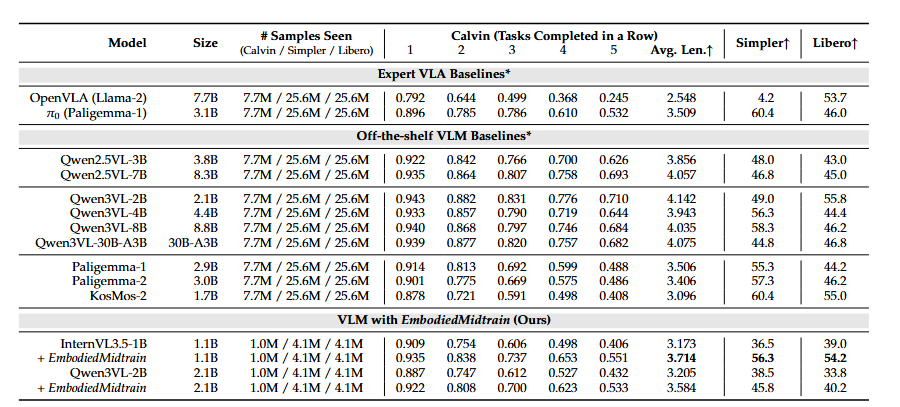

> vqa 数据对 vlm 的中训练对最终的 VLA 提升有限  
> 用数据分布洗一下 vqa 数据就好啦


# 背景
## 三种训练方法

| 阶段 | 核心任务 | 数据量 | 数据特征 | 本文的贡献 |
| :--- | :--- | :--- | :--- | :--- |
| **Pretrain** | 学习基础表征 | 极大 (Billion级) | 杂乱、通用 | 提供初始的视觉/语言能力 |
| **Midtrain** | **分布对齐** | 中等 (Million级) | **精选**、领域相关 | **筛选出最接近 VLA 分布的 VLM 数据** |
| **Post-train** | 任务执行 | 较小 (K/M级) | 专用 (Action数据) | 最终的动作生成微调 |

**本文的核心观点是**：如果直接从 Pretrain 跳到 Post-train，由于数据分布差异太大，模型很难一下适应。通过 **Mid-training** 筛选出“懂空间、懂逻辑”的通用数据先练一练，能给模型一个更好的“起跑点”。


## 三个目标vla数据集

根据论文的实验结果（Table 1）和数据集描述（Section 5.1），我为你整合了这三个机器人数据集的对比信息，并详细列出了 **EmbodiedMidtrain（本文方法）** 带来的性能增幅：

| 数据集 | 数据性质 | 任务类型 | 训练样本规模 (本文用量) | 核心挑战 | **本文性能增幅 (对比原始 1B 模型)** |
| :--- | :--- | :--- | :--- | :--- | :--- |
| **Calvin (ABC-D)** | 仿真 | 连续 5 个子任务的长程序列 | **1.0M** | 未见场景 (Split D) 的泛化 | **+0.54 Avg. Len** (3.173 → 3.714) |
| **SimplerEnv Bridge** | **Real-to-Sim** | 4 种随机化桌面操控任务 | **4.1M** | 从真实数据迁移至仿真的鲁棒性 | **+19.8% 成功率** (36.5% → 56.3%) |
| **LIBERO-10** | 仿真 | 10 种复杂逻辑长程任务 | **4.1M** | 具身推理与知识迁移 | **+15.2% 成功率** (39.0% → 54.2%) |


# 方法

## 训练流程 
### 整体流程
每个模型最后都在vla任务上按如下流程微调

### 微调的核心逻辑
模型采用的是**端到端（End-to-End）的全参数微调**。它将 VLM 模型适配成 VLA（视觉-语言-动作）模型。
*   **输入**：单视角的图像（不使用机器人状态信息）。
*   **输出**：机器人的控制动作序列（Action Chunk）。
*   **可训练参数**：**全参数微调**（Full fine-tuning），不冻结 VLM。
*   **训练步数**：16,000 步。
*   **Batch Size**：全球总批大小为 256（32 per-device × 2 gradient accumulation × 4 GPUs）。


## 数据分布采样 


```
通过训练一个分类器，从vlm数据集里采样一部分和vla更相似的数据
```

### 模型架构
该模型非常轻量，其核心是一个在**冻结的 VLM 特征**之上训练的二分类器。
- **输入特征：** 提取 VLM 最后一层隐藏状态（last hidden state）作为特征表示 $\phi(x)$。
- **结构：** 在特征之上添加一个可学习的**线性层**（Linear Layer），最后接一个 **Sigmoid** 激活函数。
- **公式表达：** $s(x) = \sigma(f(\phi(x)))$，其中 $s(x)$ 即为样本 $x$ 属于 VLA 领域的预测概率分数。

### 训练标签与数据分配
训练被建模为一个**领域成员归属问题**（domain-membership problem）：
- **正样本（Positive）：** 来自目标 VLA 语料库（如机器人操作轨迹数据）的样本，标签设为 **1**。
- **负样本（Negative）：** 来自原始 VLM 候选池（如一般的图像描述数据）的样本，标签设为 **0**。
- **采样策略：** 在训练过程中，从 VLM 候选池和 VLA 目标数据中进行**平衡采样**（balanced manner），以防止模型偏向数量更多的 VLM 数据。

### 训练目标（损失函数）
使用**二元交叉熵损失（Binary Cross-Entropy Loss, BCE）**作为优化目标：
$$L_{cls} = -E_{y \sim D_{VLA}} [\log s(y)] - E_{x \sim D_{VLM}} [\log (1 - s(x))]$$
通过最小化这个损失，模型学习区分两类数据的分布特征。论文指出，当该分类器达到最优时，其输出 $s^*(x)$ 会单调递增于密度比 $\frac{p_{VLA}(x)}{p_{VLM}(x)}$，从而能有效衡量 VLM 样本与 VLA 领域的对齐程度。

### 训练细节
- **训练对象：** 冻结底层 VLM，只训练顶部线性分类层，因此训练成本很低。
- **采样方式：** 从 VLM 候选池和 VLA 目标数据中做平衡采样，避免分类器被规模更大的 VLM 数据带偏。
- **训练设置：** Batch size 为 128；使用早停法，当验证准确率达到 90% 时停止。
- **实际样本量：** 通常 75 到 100 个 step 即停止，实际见过约 9,600 到 12,800 个样本，属于万级训练量。
- **训练后用途：** 用这个轻量分类器给整个 VLM 候选池打分，并筛出约 120 万个最像 VLA 领域的数据。
- **候选池来源：** 包括 LAION-400M 子集、CC-12M、LLaVA-Instruct-665k 等，总规模至少是千万级。

# 实验结果



```
比较的是**三种不同的“起跑方式”**在最终机器人表现上的差异
```

## 专家级 VLA 基准 (Expert VLA Baselines)


## 标准 VLM 微调基准 (Off-the-shelf VLM Baselines)


## 本文方法：加了“中段训练”的提升 (Ours)
这部分是对比的核心，作者分成了两组：
*   **基础版本 (Base)**：例如 `InternVL3.5-1B`（第一行）。它和上面的 Qwen 一样，直接从通用预训练进入机器人微调。
*   **中段训练版本 (+ EmbodiedMidtrain)**：这是本文的方法。在进入机器人微调之前，先用“洗出来”的 1.2M 优质 VLM 数据练了一次（即 Mid-training），然后再进行机器人微调。

---


## 核心结论
1.  **Mid-training 极度高效**：你可以看到 `InternVL3.5-1B + EmbodiedMidtrain` 在只有 1B 参数且机器人微调样本极少（1.0M/4.1M）的情况下，**全面超越了** 同样训练量的基础版本。
2.  **小胜大**：这个加了中段训练的 1.1B 模型，甚至在 Calvin 和 SimplerEnv 任务上打败了比它大 7 倍的 `OpenVLA (7.7B)`。
3.  **不只是“抢跑”**：如果你看表中的数据增幅，`InternVL3.5-1B` 加上 Mid-training 后，成功率几乎**翻倍**（SimplerEnv 从 36.5 提升到 56.3），这说明中段训练让模型“开窍”了。

## 索引信息

> 类别：论文笔记 / 机器人控制 / VLA  
> 索引标签：#EmbodiedMidtrain #VLA #VLM #Midtrain #机器人控制 #数据筛选 #分布对齐

