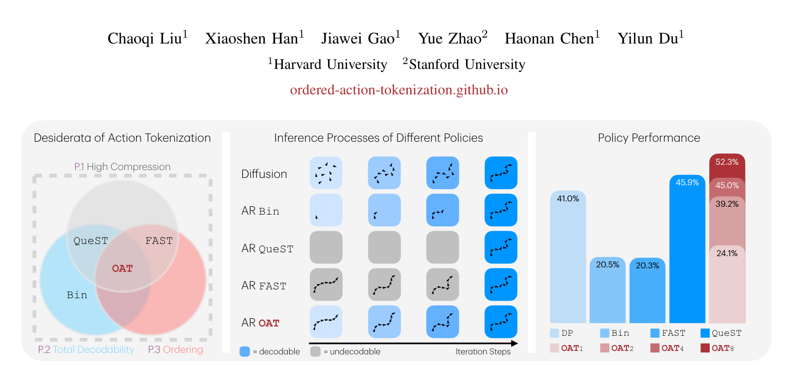
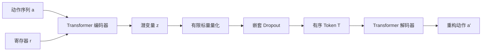
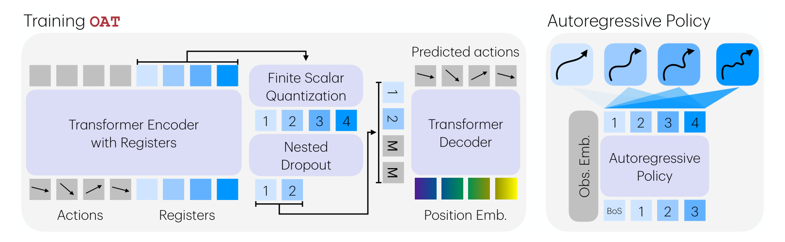
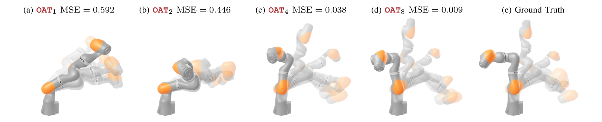
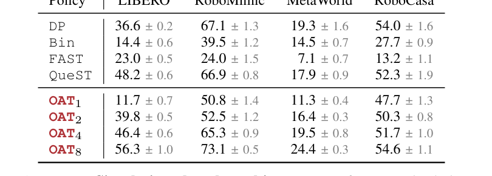
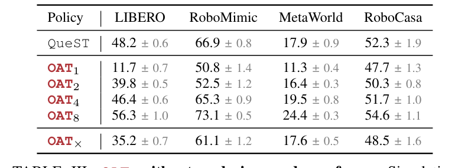
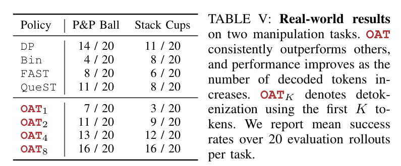

> 给机器人连续动作设计一种“适合自回归模型”的离散 token：既压缩、又总能解码、还具备从左到右的粗到细顺序，因此可以像语言模型一样逐 token 生成动作，并支持随时提前停止。

# 背景

来源：`raw/OAT Ordered Action Tokenization.pdf`

论文：**OAT: Ordered Action Tokenization**  
作者：Chaoqi Liu, Xiaoshen Han, Jiawei Gao, Yue Zhao, Haonan Chen, Yilun Du  
机构：Harvard University, Stanford University  
项目页：ordered-action-tokenization.github.io

## 问题：连续动作如何变成适合 AR policy 的 token？

机器人动作本质上是连续、高维、多步的 action chunk。自回归策略要像语言模型一样预测下一个 token，就必须先把连续动作变成离散 token 序列。

已有做法都有明显缺陷：

| 方法 | 优点 | 问题 |
| --- | --- | --- |
| Bin | 总能解码，概念简单 | token 太长，训练和推理都慢，缺少语义顺序 |
| FAST | 压缩率高，有频率上的粗到细结构 | BPE 后可能生成无法还原成固定动作矩阵的 token 序列 |
| QueST / learned latent | 压缩率高，总能解码 | token 空间无序，不适合 next-token prediction |

作者提出 action tokenization 应同时满足三个条件：

- **P.1 High Compression**：token 序列要短，降低 AR 预测长度。
- **P.2 Total Decodability**：任意 token 序列都必须能解码成合法动作，避免执行时崩溃。
- **P.3 Ordering**：token 要有从左到右的因果顺序，早期 token 表示粗动作，后续 token 逐步细化。

Fig.1 说明 OAT 同时满足压缩、可解码和有序三点；同时展示了 OAT 的 prefix decoding 能力：少量 token 先给出粗动作，更多 token 再逐步细化动作质量。

# 方法

## 方法总览

OAT 是一个 learned action tokenizer。它把连续 action chunk 编码成一串有序离散 token，再由 decoder 还原为连续动作。

核心 pipeline：

1. 输入连续 action chunk。
2. Transformer encoder 同时读取动作和一组 learnable register tokens。
3. Register 聚合动作时序信息，形成瓶颈 latent。
4. 使用 FSQ（Finite Scalar Quantization）把 latent 离散化成 token。
5. 通过 nested dropout 和 causal register attention 强制 token 形成从粗到细的顺序。
6. Decoder 根据 token prefix 也能还原动作，因此支持 anytime inference。

Fig.3 展示了 OAT 训练与 AR policy 推理：左边是 tokenizer 学习，右边是 AR policy 逐 token 生成，并可从任意 prefix 解码动作。

## Tokenization 与 Detokenization

动作 tokenization 定义为：

$$
T: a_{1:H_a} \rightarrow T_{1:H_l}
$$

其中 $a_{1:H_a}$ 是连续动作块，$T_{1:H_l}$ 是离散 token 序列。

Detokenization 定义为：

$$
T^{-1}: T_{1:H_l} \rightarrow a_{1:H_a}
$$

**寄存器（Registers）**理解为一种**特殊的、可学习的占位符向量（Learnable Embeddings）**。

在 OAT 的编码器中，寄存器是独立于输入动作序列的 $H_l$ 个向量。

*   **本质**：它们确实是**可学习的参数**（像词表里的 Embedding 一样），在训练过程中自动学习如何从原始动作中提取特征。
*   **作用（瓶颈机制）**：在 Transformer 进行注意力计算时，这些寄存器 Token 会去“观察”所有的动作数据，并把关键信息吸收到自己内部。

#### **输入端：$H_a \times D_a$（原始动作块）**
*   **$H_a$ (Action Horizon)**：**动作的时间步长**。例如，机器人一次计划未来 32 个动作，那么 $H_a = 32$。
*   **$D_a$ (Action Dimension)**：**每个时间步的控制维度**。比如一个 7 自由度的机械臂（位置、姿态、夹爪），那么 $D_a = 7$。
*   **总数据量**：$32 \times 7 = 224$ 个浮点数。

#### **输出端：$H_l \times D_l$（压缩后的潜变量）**
*   **$H_l$ (Latent Horizon / Token Horizon)**：**压缩后的 Token 序列长度**。这是 OAT 的核心参数。论文中通常设为 8。即：用 8 个 Token 来代表原来的 32 个动作。
*   **$D_l$ (Latent Dimension)**：**每个潜变量向量的维度**。这决定了每个 Token 携带信息的“宽度”，通常设为 4，以便后续进行有限标量量化（FSQ）。

OAT 的关键要求是：$T^{-1}$ 必须是 total function。也就是说，不管 AR policy 生成了什么 token 序列，都应该能得到一个合法动作，而不是像 FAST 那样可能因为 token 长度不匹配导致无法 reshape。

## Register + FSQ：压缩连续动作

OAT 使用 learnable register tokens 作为动作序列的压缩槽位。Transformer encoder 读取动作序列和 registers，最终只保留 register latent 作为动作表示。

随后使用 FSQ 将 register latent 离散化。相比大型 codebook，FSQ 更简单稳定，也能形成一个适合 AR policy 预测的离散空间。
**有限标量量化 (Finite Scalar Quantization, FSQ)** 是 OAT 将连续的神经向量转换为离散 Token 的核心步骤。

简单来说，FSQ 的作用是：**把一组浮点数映射到一个预定义的、有限的整数坐标网格中。**

1.  **限制范围 (Bounding)**：通过激活函数（如 $tanh$）将每个浮点数限制在 $[-1, 1]$ 之间。
2.  **量化 (Quantizing)**：为每个维度指定一个“等级数量（Levels）”。
    *   比如第 1 维给 8 个等级，第 2 维给 5 个，第 3 维给 5 个，第 4 维给 5 个（论文中的配置 $[8, 5, 5, 5]$）。
    *   FSQ 会把 $[-1, 1]$ 均匀切分成对应的份数，将浮点数“四舍五入”到最近的那个点上。
3.  **索引化 (Indexing)**：
    *   因为每个维度的等级是确定的，这 4 个整数的组合可以唯一映射成一个**整数索引（Token ID）**。
    *   在上面的例子中，总共可能的组合数（词表大小）就是 $8 \times 5 \times 5 \times 5 = 1000$。

## Nested Dropout：强制粗到细排序

OAT 最关键的设计是 nested dropout。训练时随机保留前 $K$ 个 token，并把后面的 token 替换为 mask：

$$
\hat{z}_{1:H_l} \leftarrow \hat{z}_{1:K} \oplus \langle MASK \rangle_{K+1:H_l}
$$

这样 decoder 必须学会只用 prefix 也尽量重建动作。结果是：

- 前几个 token 被迫保存最重要的全局动作结构；
- 后续 token 保存细节修正；
- token 顺序自然变成“先粗后细”。

Fig.2 直观展示了 prefix decoding：OAT1 只能恢复粗动作，OAT2/OAT4 逐步细化，OAT8 接近 ground truth。这正是 ordered token space 的核心证据。

## Causal Register Attention：让 register 也符合自回归顺序

除了 nested dropout，OAT 还对 register-register attention 加 causal mask：

- action tokens 可以自由互相 attention；
- register tokens 可以看所有 action tokens；
- 第 $i$ 个 register 只能看 $j \le i$ 的 register。

这让 register 之间也形成从左到右的信息流，进一步匹配 next-token prediction 的归纳偏置。

## AR OAT Policy：支持 anytime action generation

AR policy 按如下分解预测动作 token：

$$
p(T_{1:H_l} \mid o_{1:H_o}) = \prod_{i=1}^{H_l} p(T_i \mid T_{<i}, o_{1:H_o})
$$

推理时可以只生成前 $K$ 个 token，然后把后面 padding 成 mask，再解码：

1. 生成 token prefix $T_{1:K}$。
2. 用 mask 补齐尾部。
3. 调用 $T^{-1}$ 解码成 action chunk。

因此 OAT 可以在推理成本和动作质量之间做 anytime trade-off：低延迟场景用少量 token，追求精细动作时生成更多 token。

## 在 VLA 模型里的运用

### 1. 架构逻辑：OAT 就像是“词表”和“翻译机”

在 VLA 模型中，OAT 并不是直接替换 VLM 的 Embedding 层，而是为 VLM 定义了它要预测的**目标（Target）**。

*   **输入端 (VLM)**：输入图像序列和文本指令，经过视觉编码器和语言 Backbone，输出一个隐藏特征向量。
*   **预测端 (VLA)**：VLM 的隐藏特征经过一个线性层，去预测 OAT 定义的那些 **Token ID**。
*   **执行端 (OAT Decoder)**：当 VLM 生成了这些 Token ID 后，把它们交给 **OAT 的 Decoder**，解压成一段连续动作。

可以把 OAT 理解成动作侧的“词表”和“翻译机”：Encoder 把连续动作翻译成离散动作词，Decoder 再把离散动作词翻译回机器人能执行的连续控制量。论文默认设置里，$H_a=32$、$H_l=8$，也就是把未来 32 步动作压缩成 8 个有序 token。

### 2. 训练策略：通常是“分两步走”

根据论文的 pipeline，OAT tokenizer 先用动作数据学好，再作为下游自回归策略的离散动作空间。放进 VLA 时，可以理解成 **VLM 和 OAT 的编码器/解码器通常不是一起训练的**。

#### **第一阶段：预训练 OAT（学“动作语言”）**
*   **目标**：训练一个能把动作压缩再尽量还原的“动作翻译机”。
*   **做法**：只用动作数据（Action-only data）训练 OAT 的 Encoder、FSQ 和 Decoder。
*   **结果**：训练好后，**固定（Freeze）**住 OAT。

#### **第二阶段：训练 VLA 策略（学“大脑决策”）**
*   **目标**：让 VLM 学会根据图像和指令预测出正确的 OAT Token。
*   **做法**：
    1.  把人类演示的连续动作通过 **OAT Encoder** 变成 Token。
    2.  用这些 Token 作为标签，去监督训练 VLM。
    3.  在这个阶段，OAT 的 Encoder 只是一个“打标签工具”，VLA 真正预测的是离散的 Token ID。

### 3. 为什么不一起训练（End-to-End）？
虽然理论上可以一起训练，但分步训练有巨大的工程优势：

1.  **解耦复杂性**：VLM 已经很大了（比如 7B 参数），如果再加上 OAT 的重构误差和 FSQ 梯度的不稳定因素，训练极难收敛。
2.  **动作重用**：一个练好的 OAT Tokenizer 可以适配不同的 VLA 模型（比如从 7B 换到 1B 的模型，不需要重新定义动作空间）。
3.  **计算效率**：VLM 只需要处理离散分类任务，这在深度学习中是最成熟、最高效的训练目标。

### 4. 完整的推理链条 (Pipeline)
当你部署这个 VLA 模型时，过程如下：

1.  **观察**：摄像头拍一张图，加上指令“拿球”。
2.  **大脑决策 (VLM)**：输出 8 个数字（例如 `[42, 105, 8, 99, 12, 5, 88, 30]`）。
3.  **动作生成 (OAT Decoder)**：把这 8 个数字给 OAT Decoder。
4.  **执行**：Decoder 输出一个 $32 \times 7$ 的矩阵，交给机器人底层控制器执行。

这里的关键是：OAT 不负责理解图像或语言，它负责把 VLA 的动作输出变成一种更短、更稳定、更适合自回归预测的“动作语言”。由于 OAT token 有粗到细的顺序，模型也可以先生成少量 token 得到粗动作，再生成更多 token 补充精细控制。

# 实验结果

## 仿真基准：OAT8 整体最强

论文在 LIBERO、RoboMimic、MetaWorld、RoboCasa 四类仿真 benchmark 上比较 DP、Bin、FAST、QueST 和 OAT。

Table I 的核心结论：

- Bin 因为 token 序列太长，表现很差。
- FAST 压缩不错，但不可解码问题影响策略稳定性。
- QueST 是强 baseline，但无序 token 限制了 AR 建模。
- OAT 随 decoded token 数增加表现单调提升，OAT8 在多个 benchmark 上最好。

## Ordering 是关键：没有 nested dropout 会明显退化

Table III 比较了正常 OAT 和去掉 ordering 机制的 OAT×。OAT× 明显低于 OAT4/OAT8，说明性能提升不是单纯来自 learned tokenizer，而是来自 token ordering 对自回归学习的帮助。

## 真实机器人：prefix 越长，动作越精细

Table V 在 Pick & Place Ball 和 Stack Cups 上验证了 sim-to-real。OAT8 达到最高成功率。作者还观察到：OAT token 数越多，动作越平滑；OAT<4 常能接近成功，但缺少精细插入或放置所需的细节。

## 工程启发

- OAT 适合给 VLA 系统提供离散动作接口。
- 它不一定替代 diffusion / flow action head，也可以作为辅助监督、规划接口或中间动作抽象。
- prefix-based decoding 暗示未来可以做 adaptive depth：简单动作少生成 token，复杂接触任务多生成 token。

## 局限

- 当前部署时 autoregressive depth 仍是固定的，没有在线估计动作复杂度。
- 对复杂接触任务，短 prefix 可能只能产生粗动作，精细控制仍需要更多 token。
- OAT 的优势依赖 ordered token space；如果 ordering 学不好，AR policy 可能退化到普通 latent tokenizer 的问题。

# 总结

OAT 的贡献不是简单“把动作压缩成 token”，而是把动作 token 设计成适合自回归预测的结构化语言：短、可解码、有顺序。这个顺序让机器人动作可以像语言一样从左到右生成，先生成粗计划，再生成细节修正，从而同时获得高性能和灵活推理。

## 索引信息

> 类别：论文笔记 / 机器人控制 / Action Tokenization  
> 索引标签：#OAT #ActionTokenization #VLA #机器人控制 #AutoregressivePolicy #FSQ #NestedDropout #PrefixDecoding
