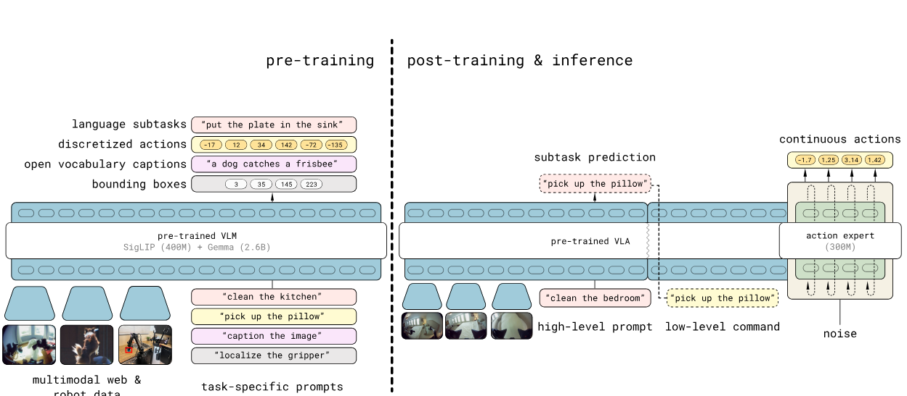
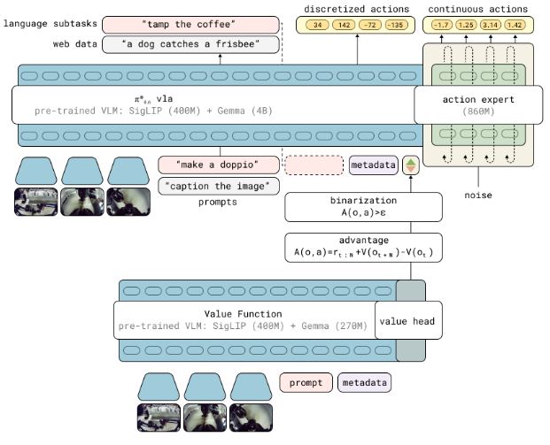

# PI 0 方法

# PI 0.5 方法


```
两阶段方案，旨在先让模型“见多识广”，再让它“精通家务”。
```
总结流程图：
**[海量异构数据]** $\xrightarrow{\text{离散Token训练 (28万步)}}$ **[具备常识的预训练模型]** $\xrightarrow{\text{成功案例+连续动作微调 (8万步)}}$ **[$\pi_{0.5}$ 最终模型]**

---

## 第一阶段：预训练 (Pre-training) —— 建立通用认知
这一阶段的重点是**规模化**和**知识对齐**。模型被当作一个标准的自回归 Transformer（类似于 GPT）来训练，进行“下一个 Token 预测”。

*   **数据量与时长**：进行了 28 万步（280k gradient steps）的梯度下降训练。
*   **任务形式**：所有的输入（图像、指令）和输出（文本回复、动作）都被统一为离散的 **Token**。
    *   **动作处理**：使用 **FAST 动作编码器**将连续的机器人动作压缩成离散的 Token。
*   **混合数据源 (Co-training)**：
    *   **移动机械臂 (MM)**：约 400 小时的真实家庭操作数据。
    *   **非移动机器人 (ME)**：在更多样家庭中收集的单/双臂固定操作数据。
    *   **实验室跨具身数据 (CE)**：各种机器人形态在受控环境下的任务。
    *   **高层任务拆解 (HL)**：练习将“打扫房间”拆解为“捡起瓶子”等中间步骤。
    *   **网络数据 (WD)**：包含图像描述、视觉问答等，让模型获得常识。


---

## 第二阶段：后训练 (Post-training) —— 专家化与精细控制
在模型拥有了广泛的知识后，这一阶段的目标是让它在家庭场景中变得更稳、更准。

*   **新增组件**：引入了一个名为**“动作专家” (Action Expert)** 的小型 Transformer 模块。
*   **训练目标切换**：从单纯的“离散 Token 预测”转向**联合训练**：
    1.  **继续预测 Token**：保留模型说人话、拆解任务的能力。
    2.  **流匹配 (Flow Matching)**：让动作专家学习生成**连续的动作序列**。**VLM是打开的**。
*   **数据策略**：
    *   **质量筛选**：只保留**成功的、高效的（短的）**移动操作片段。
    *   **加入语言示教 (VI)**：引入专家通过实时语言指令指挥机器人的数据（约占 11%）。
*   **训练时长**：额外进行了 8 万步（80k steps）训练。

---

## 最终推理流程 (Inference Phase)
训练完成后，机器人在实际工作时的逻辑是**层级化**的：

1.  **想 (High-Level)**：接收高层指令（如“收拾厨房”），模型先输出一段**文本 Token**（子任务，如“把勺子放进抽屉”）。
2.  **做 (Low-Level)**：将图片、原始指令和刚刚生成的“子任务文本”一起输入。此时，**动作专家**模块启动，通过 10 步去噪推理（Denoising），输出一段平滑的**连续动作块**（Action Chunk）。
3.  **执行**：机器人以 50Hz 的频率，通过简单的 PD 控制器执行这些动作。

# PI 0.6 方法

```
本文提出的 **RECAP** 方法是一个将强化学习（RL）与视觉-语言-动作模型（VLA）相结合的通用训练流程。它通过三个核心步骤的循环迭代，使模型能够从经验、纠错和自主练习中持续改进。
```
---

## 1. 核心训练三部曲 (Subroutines)

整个流程建立在三个可以重复运行的子程序之上：

*   **数据收集 (Data Collection)**：
    机器人执行任务，记录轨迹。数据来源包括：
    1.  **自主尝试 (Autonomous Rollouts)**：机器人根据当前策略自行尝试，并标记成功或失败。
    2.  **人类干预 (Expert Interventions)**：专家在机器人出错时介入并提供正确的动作演示。

*   **价值函数训练 (Value Function Training)**：
    训练一个基于 VLM 的“裁判”模型。它学习预测在给定当前观测 $o_t$ 和指令 $\ell$ 的情况下，还需要多少步才能完成任务。训练采用分类方式，将剩余步数离散化为 201 个 bin（桶）。
*   **优势条件化策略训练 (Advantage-Conditioned Training)**：
    利用裁判计算出的优势 $A$（实际回报减去预期价值），为每个动作打上“正向(Positive)”或“负向(Negative)”的优势指示器标签 $I_t$。模型在训练时会将这个指示器作为文本输入的一部分。 

---

## 2. 训练阶段划分

RECAP 的训练分为两个主要阶段：

### 阶段 A：大规模预训练 (Pre-training)
在此阶段，研究者在包含数万小时机器人演示的海量离线数据集上运行上述流程。
1.  首先训练一个**通用的价值函数** $V_{pre}$。
2.  然后训练**通用策略模型** $\pi^*_{0.6}$。该模型学会根据指令和“优势标签”来预测动作。此时模型已经具备了理解“什么是高效动作”的基础能力。

### 阶段 B：特定任务的迭代改进 (Specialization & Iteration)
针对具体的下游任务（如煮咖啡、叠衣服），流程如下：
1.  **SFT 初始化**：在目标任务的人类演示数据上微调 $\pi^*_{0.6}$，得到初始专才策略。
2.  **闭环迭代**：
    *   **收集数据**：用当前策略在真实机器人上跑几百个回合。
    *   **更新裁判**：将新收集的数据并入数据集，重新微调价值函数。
    *   **更新选手**：根据新裁判打出的优势标签，重新微调策略模型。


---

## 3. 关键算法逻辑 (Algorithm 1)

如下表所示，训练流程通过不断扩展数据集 $D_\ell$ 来提升性能：

| 步骤 | 动作内容 | 核心目的 |
| :--- | :--- | :--- |
| **Step 1-2** | 全局预训练 | 训练具备“优势感知识别”能力的通用 VLA 模型。 |
| **Step 3-5** | 任务初始化 | 让模型学会该任务的基本操作（模仿学习）。 |
| **Step 6-10** | **自主迭代循环** | 通过实战数据区分高效与低效动作，实现性能翻倍。 |

这种流程最大的优势在于，它将复杂的强化学习策略优化转化为了极其稳定的**监督学习（Supervised Learning）**任务，非常适合参数量巨大的 VLA 模型。 

## AR和Diffusion
无论是在 **阶段 A（预训练）** 还是 **阶段 B（特定任务迭代）**，AR（自回归）和 Diffusion（流匹配）都是**同时存在且并行训练**的。

---

### 1. 每一轮训练中的角色分配

无论是预训练一个通用的选手，还是在微调一个叠衣服的专才，模型 $\pi^*_{0.6}$ 的训练始终遵循以下结构：

#### **自回归部分 (AR)**
*   **训练目标**：高层子任务文本（如“抓取衣服”）和离散化的动作 Token。
*   **作用**：负责“脑子”的部分，决定下一步该干什么。
*   **优势标签的接入**：`Advantage: Positive/Negative` 也是通过 AR 的方式输入给模型的 Token。

#### **流匹配/扩散部分 (Diffusion-based)**
*   **训练目标**：具体的、连续的机器人关节角度和夹爪控制数值。
*   **作用**：负责“肌肉”的部分，决定手该怎么丝滑地动。
*   **优势标签的控制**：动作专家会根据 AR 部分提供的隐含向量（其输入包含了优势指示器）来生成不同质量的轨迹。

---

### 2. 两个阶段的训练侧重点

虽然两个阶段都用到了 AR 和 Diffusion，但它们的**数据输入**和**标签状态**略有不同：

| 训练阶段 | AR 的训练内容 | Diffusion 的训练内容 | 优势标签 ($I_t$) 的状态 |
| :--- | :--- | :--- | :--- |
| **阶段 A：预训练** | 在数万小时的多任务数据上学习文本推理和动作 Token。 | 在大规模数据上学习通用的抓取、移动等基础物理能力。 | **混合状态**：根据 $V_{pre}$ 算出的优势，给数据打上 $I=T/F$ 标签。 |
| **阶段 B1：SFT 初始化** | 学习特定任务（如咖啡机操作）的专用指令和步骤。 | 学习该任务所需的精密动作（如精准对齐滤杯）。 | **固定状态**：由于是纯演示数据，通常**固定设为 $I=True$**，强制模型模仿人类。 |
| **阶段 B2：闭环迭代** | 学习从失败中恢复的文本逻辑（如“没抓稳，重抓”）。 | 学习如何通过微调动作提高效率（比如移动得更快）。 | **动态状态**：根据最新微调的 $V_\ell$ 重新给自主尝试的数据打分。 |


### 3. Stop Gradient 到底停在哪？


| 模块 | 预测目标 | 采用技术 | 梯度是否修改 VLM 主干？ |
| :--- | :--- | :--- | :--- |
| **VLM 主干** | 文本、子任务、离散动作 $a^\ell$ | **AR (自回归)** | **是**（直接训练） |
| **动作专家** | 连续物理动作 $a$ | **Diffusion (流匹配)** | **否**（被 Stop Gradient 拦截） |

是的，**它们训练所用的“真值”（Ground Truth）是同一套动作，但表现形式不同。**

在每一帧训练数据中，机器人实际执行的关节角度、夹爪开合等物理数值是确定的。模型会把这一套物理数值同时喂给 AR 路和 Diffusion 路进行训练。

### 4.具体学的是啥

*   **数据来源一致**：对于数据集中的任何一条轨迹，其动作序列都是唯一的。
*   **处理方式不同**：
    *   **AR 路**：将连续的物理数值通过 **FAST 分词器** 进行“量子化”，变成几个离散的数字（Token）。比如关节转动 30.5 度，可能被编码为编号为 `502` 的 Token。
    *   **Diffusion 路**：直接保留 30.5 这个**连续的浮点数值**。
*   **目标一致**：模型被要求在给定相同的图像和指令下，AR 路要预测出 `502` 这个 Token，而 Diffusion 路要通过流匹配预测出 `30.5` 这个数值。


既然目标一致，为什么要分两路训练？这就是 **知识隔离 (KI)** 的精髓：

1.  **AR 路是为了“懂逻辑”**：
    让 VLM 预测动作 Token，不是为了用它控制机器人，而是为了**让 VLM 能够把“视觉、语言”和“物理动作”联系起来**。如果 VLM 能像写字一样“写出”动作 Token，说明它真正理解了任务的物理含义。
2.  **Diffusion 路是为了“练肌肉”**：
    Token 预测毕竟会有精度损失（因为是离散的）。Diffusion 路利用 VLM 学到的理解力，通过专门的动作专家网络，把粗糙的意图转化为极高精度的物理指令。


它们在训练时是**独立预测**的（Independent Prediction）。
*   AR 路不看 Diffusion 路的输出。
*   Diffusion 路也不看 AR 路生成的离散 Token。
它们只是像两个学生（大脑和肌肉）在面对同一张考卷（同一套物理动作数据）时，各自用自己的方式在答题。

## 索引信息

> 类别：论文笔记 / 机器人控制 / VLA  
> 索引标签：#Pi0 #Pi0_5 #Pi0_6 #VLA #机器人控制 #FlowMatching #Diffusion #RECAP #优势条件化


