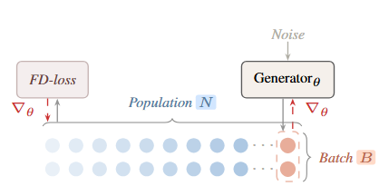
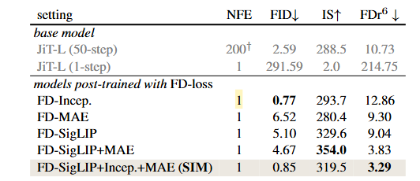

> 解决 FD 作为生成评价指标时，难以直接作为优化 loss 的数学和工程问题。核心做法是把 FD-loss 用在后训练阶段，让模型一次推理也能在 FD 指标上表现很好。

# 背景

## 数学背景：什么是 FD？
作者首先给出了 FD 的定义。假设我们有一个特征提取网络 $\phi$（比如 Inception），它把图片变成特征向量。
*   **真实图片 $R$** 的特征分布被建模为一个高斯分布，均值为 $\mu_r$，协方差为 $\Sigma_r$。
*   **生成图片 $G$** 的特征分布同理，均值为 $\mu_g$，协方差为 $\Sigma_g$。

**FD 距离公式 (2)**：
$$FD_{\phi}(R, G) = \|\mu_r - \mu_g \|^2_2 + \text{Tr} \left( \Sigma_r + \Sigma_g - 2(\Sigma_r \Sigma_g)^{1/2} \right)$$
这个公式衡量了两个高斯分布之间的距离。它由两部分组成：
1.  **均值项**：生成的图片在特征空间中心点是否对齐？
2.  **协方差项（迹）**：生成的图片的特征变化多样性（散布情况）是否与真实图片一致？

当 $\phi$ 是 Inception-v3 时，这个公式算出来的就是我们熟悉的 **FID**。 [FD Formula](https://alphaxiv.org/abs/2604.28190v1?page=3)

---

## 核心挑战：为什么以前没人敢直接用它当 Loss？
它更像是一种**“高级调优”**：先让传统的 $L_2$ 损失带模型进门（学会画出东西），再让 FD-loss 负责最后的一公里对齐（让画出来的东西分布更真实、更像真实世界的数据集）。

### 挑战 A：统计不稳定性 (Small-batch instability)
*   **标准评估**需要约 **50,000** 张图片才能准确估计均值和协方差。
*   **训练 Batch** 通常只有 **64 到 1024**。
*   **矛盾点**：Inception 特征是 2048 维的。如果你的 Batch 只有 1024，那么样本数甚至还不如特征维度多，此时计算出来的协方差矩阵（$2048 \times 2048$）是严重欠采样的、不准确且不稳定的。用这么乱的指标去指导模型训练，效果会变差。 [Statistical Challenges](https://alphaxiv.org/abs/2604.28190v1?page=4)

### 挑战 B：计算不可行性 (Computational infeasibility)
*   如果你想在训练时为了保证准确性而强行使用 50,000 张图片来算一个 Loss，这意味着你需要对这 5 万张图同时进行反向传播。
*   这会瞬间撑爆任何 GPU 的显存。

---

## 为什么 FD-loss 适合后训练（而非从零训练）？

虽然理论上可以用 FD-loss 从头训练模型，但在实际操作中，它更适合作为“精炼器”，原因如下：

### 监督信号的强弱差异
*   **从零训练需要“点对点”指导**：在初始阶段，生成模型需要学习图像的底层结构（如边缘、纹理）。扩散模型（Diffusion）或流匹配（Flow Matching）使用的 **$L_2$ 样本级损失**提供了极强的、每个像素点的监督信号。
*   **FD-loss 是“全局”指导**：FD-loss 只要求生成的“这一堆”图片的均值和协方差对齐。对于一个完全没训练过的模型（输出全是随机噪声），仅仅告诉它“你的均值不对”很难让它学会画出一只猫。

### 学习效率与计算成本
*   **特征提取的开销**：FD-loss 需要将图像输入到 Inception 或 SigLIP 等预训练网络中提取特征。在漫长的从零训练过程中（通常需要数百万次迭代），每一步都跑这些重型特征网络会显著增加计算成本。
*   **后训练的优势**：后训练通常只需要 50-100 个 epoch，在已经具备基本生成能力的模型上进行微调，性价比极高。

---

# 方法

## 解耦与数学原理

### 估计分布：样本容量与估计方差
这部分对应数学中的**大数定律**和**样本统计量**。

*   **数学原理**：为了估计一个分布的参数（如均值 $\mu$ 和协方差 $\Sigma$），样本量 $N$ 必须足够大。
*   **具体到 FD**：FD 公式中包含协方差矩阵 $\Sigma_g$。如果特征维度 $d=2048$，数学上要求样本量 $N$ 必须远大于 $d$，否则计算出的协方差矩阵是**秩亏（Rank-deficient）**的，且估计方差极大。
*   **解耦的作用**：通过引入历史样本（Queue）或累积统计量（EMA），我们将估计分布的有效样本量从 $B$（当前 Batch，如 1024）提升到了 $N$（总种群，如 50000）。
    *   **数学公式表达**：$\mu_g = \frac{1}{N} \left( \sum_{i \in \text{Batch}} \phi(x_i) + \sum_{j \in \text{History}} \phi(x_j) \right)$。
    *   这保证了 Loss 函数的**数值（Value）**是准确且平滑的，不会因为单个 Batch 的随机性而产生剧烈抖动。

---

### 计算导数：链式法则与半梯度（Semi-gradient）
这部分对应数学中的**微积分链式法则**和**随机梯度下降（SGD）**。

*   **数学原理**：在全量梯度下降中，我们需要对所有 $N$ 个样本求导。但在解耦方案中，我们应用了一个**“截断”**技巧。
*   **具体操作**：
    *   我们将生成特征分为两部分：当前 Batch 的特征 $f_{now}$（保留梯度轨迹）和历史特征 $f_{history}$（使用 `.detach()` 截断梯度）。
    *   **求导过程**：
        $$\nabla_\theta Loss = \frac{\partial Loss}{\partial \mu_g} \cdot \frac{\partial \mu_g}{\partial \theta} + \frac{\partial Loss}{\partial \Sigma_g} \cdot \frac{\partial \Sigma_g}{\partial \theta}$$
    *   由于 $f_{history}$ 是常数，$\frac{\partial f_{history}}{\partial \theta} = 0$。因此，**梯度的重担全部落在当前 Batch 的样本上**。
*   **解耦的作用**：
    *   **显存节省**：数学上，我们只需要存储当前 Batch 的激活值用于反向传播。
    *   **方向引导**：虽然梯度只来自 $B$ 个样本，但由于 $\frac{\partial Loss}{\partial \mu_g}$ 等项是基于 $N$ 个样本的全局统计量计算出来的，因此这个梯度方向是指向“全局分布改进”的方向，而不仅仅是改进当前这几个样本。

## 工程实现

### 核心思想：解耦 (Decoupling)
为了解决小 batch 估算 FD 不准的问题，作者提出：
*   **估算分布时**：使用一个非常大的“样本窗口”（比如最近生成的 50,000 张图的特征）。
*   **计算梯度时**：**只针对当前 batch 的图片求导**。
*   **为什么可行？** 那些来自过去 batch 的特征被视为常数（通过 `.detach()` 处理），它们的存在只是为了让均值 $\mu$ 和协方差 $\Sigma$ 的估计更稳健。

---

### 两种实现方式
作者提供了两种追踪大样本统计量的方法：

*   **队列版 (Queue-based)**：
    *   维护一个先进先出的队列，存储之前 batch 的特征。
    *   计算 FD 时，把“队列里的旧特征（无梯度）”和“当前 batch 的新特征（有梯度）”拼在一起算。
*   **EMA 版 (EMA-based) —— 推荐方案**：
    *   不存特征，而是维护一阶矩（均值）和二阶矩（特征的平方和）的**指数移动平均 (EMA)**。
    *   更新公式：$mu_g = \beta \cdot mu_{old} + (1-\beta) \cdot mu_{batch}$。
    *   **优点**：非常节省内存，且 β=0.999 时效果最好。

---

### 多表示组合损失
由于不同的特征模型（如 Inception vs. MAE）计算出来的 FD 绝对值差异巨大（有的可能是 1.0，有的可能是 100.0），直接相加会导致某个模型主导训练。

作者提出了**归一化公式**：
$$L_{\phi_i} = \frac{FD_{\phi_i}(R, G)}{sg(FD_{\phi_i}(R, G)) + c}$$
*   **$sg(\cdot)$ (stop-gradient)**：对分母不求导。
*   **作用**：这个操作强行把每个模型的 Loss 缩放到 **1.0 左右**。
*   **结果**：这样就可以用相等的权重 ($w_i = 1$) 简单地把多个模型的损失加在一起，实现多维度优化。

# 实验结论

**FD-loss 可以将原本需要多次迭代（Multi-step）才能生成好图像的模型，“改造”成为只需要一步（One-step）就能生成高质量图像的模型。**

**NFE** 的全称是 **Number of Function Evaluations**（网络函数调用次数）。
*   在生成模型中，它代表生成一张图片需要让神经网络“运行”多少次。

作者使用不同的特征空间（Inception, MAE, SigLIP 等）对该模型进行了 50 个 epoch 的微调，使其适应一步生成：
*   **FD-Incep.**: 在 Inception 空间优化后，1 步生成的 FID 降到了 **0.77**，甚至超过了原先 200 步的效果。
*   **FD-SIM (组合空间)**: 结合了 SigLIP、Inception 和 MAE。虽然 FID (0.85) 略高于纯 Inception，但在作者提出的更全面的指标 **$FDr_6$ (3.29)** 上表现最好。 

## 索引信息

> 类别：论文笔记 / 视觉生成 / 评价指标  
> 索引标签：#FDLoss #FID #视觉生成 #后训练 #分布对齐 #一步生成
