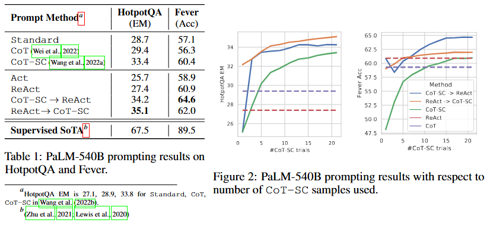

# 概述
```
语言是大模型生成的空间，action是agent执行的内容。react方法，通过question->thought->act...通路把action和语言空间合在一起了
通过自举方法：让大模型产生通路，小模型学习，提升了能录
```
# 方法
## react
### 1. 构造 Prompt（初始化）

首先，给模型提供 1-2 个完整的“人类示范轨迹”。这个 Prompt 的结构长这样：

> **Question:** \[示例问题]

> **Thought 1:** 我需要先搜 X，再找 Y。

> **Action 1:** Search\[X]

> **Observation 1:** \[从维基百科返回的真实内容]

> **Thought 2:** 根据搜索结果，我知道了...

> ...（直到完成）

### 2. 模型生成：Thought + Action

当你输入一个新问题时，模型会模仿上面的格式开始预测：

* **模型输出：** 首先输出一行 `Thought 1: [思考内容]`，紧接着输出一行 `Action 1: Search[关键词]`。

* **停止生成：** 这里的关键是，当模型输出完 `Action` 后，程序会**强制停止生成**（通常识别到关键词 "Action" 或特定的换行符）。

### 3. 环境介入：Observation

程序解析模型刚刚输出的 `Action 1`。

* 如果 Action 是 `Search[Milhouse]`，代码会自动调用外部 API（如维基百科搜索）。

* **获取反馈：** API 返回搜索结果文本。

* **更新上下文：** 将 `Observation 1: [API返回的内容]` 拼接到当前的对话历史末尾。

### 4. 循环：迭代直到结束

现在，上下文变成了 `Question + Thought 1 + Action 1 + Observation 1`。

* **再次输入模型：** 将更新后的全文本再次喂给 PaLM。

* **模型输出：** 此时模型看到上一步的 `Observation`，会接着生成 `Thought 2` 和 `Action 2`。

* **终止符：** 直到模型生成 `Action: Finish[答案]`，整个流程结束。

### 实际设置

#### 1. ReAct 与 CoT-SC 的协同 (Methods)
由于 ReAct 强于事实获取但受限于结构，而 CoT（思维链）强于逻辑推理但易产生幻觉，作者提出了两种融合策略S：
*   **ReAct $\to$ CoT-SC：** 如果 ReAct 在规定步数内（HotpotQA 7步，FEVER 5步）没找到答案，则切换回 CoT-SC（带自一致性的思维链）。
*   **CoT-SC $\to$ ReAct：** 如果 CoT-SC 生成的多个答案中，多数答案的占比不足一半（说明模型对自己内部知识不自信），则切换到 ReAct 去外部查证。

#### 2. 自举微调 (Finetuning)
使用强大的 PaLM-540B 生成约 3,000 条结果正确的 ReAct 轨迹。去微调较小的模型（如 PaLM-8B/62B）。

## 结果
**将 ReAct（外部检索）与 CoT（内部推理）结合，能达到最佳效果。**

### 图 1：
1.  **推理支持行动 (ReAct > Act)：** 在两个任务中，ReAct 都优于单纯的 Act 模式。这说明加入“思考轨迹”能显著提升搜索质量和答案合成的准确性。
2.  **外部知识 vs 内部知识：** 在 FEVER 任务中，ReAct (60.9) 显著超过了 CoT (56.3)。这是因为事实验证极度依赖外部事实，CoT 容易产生幻觉。而在 HotpotQA 中，CoT 略高，说明内部推理在某些复杂逻辑下仍有优势。
3.  **协同效应最强：** 表现最好的是将 ReAct 和 CoT-SC 结合的“回退（Back-off）”策略。这种方法兼顾了模型的“内部逻辑能力”和“外部事实获取能力”。 

---

### 图 2：随 CoT-SC 采样次数增加的性能变化
*   **趋势：** 随着采样次数（从 1 到 20）的增加，所有方法的表现都有所提升。
*   **混合方法的优势：** 绿线和紫线（ReAct 与 CoT 的组合方法）始终位于最上方。


