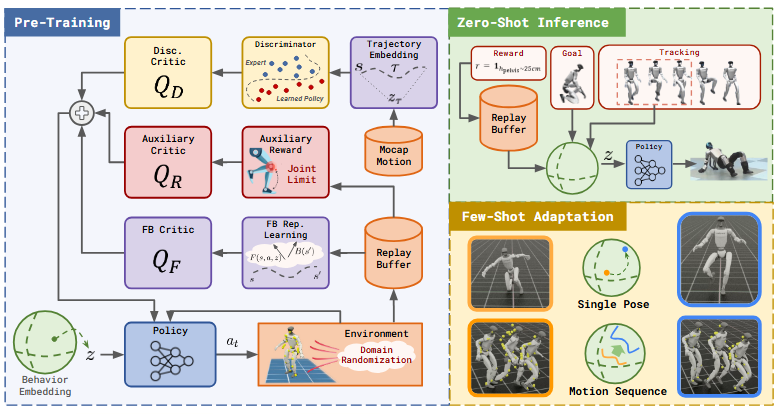



## 概述
```
本文是做运动控制，希望机器人的动作和目标动作一致，并不是做生成动作。
前向 
反向
Q函数
```
## 实验设置

### 硬件
根据 **Unitree G1** 的标准机械结构，这 **29 个自由度（DoF）** 通常按以下方式分布：

| 身体部位      | 自由度分布                                         | 小计     |
| --------- | --------------------------------------------- | ------ |
| **双腿**    | 每腿 6 DoF：髋部（3：屈伸/外展内收/旋转）+ 膝盖（1）+ 脚踝（2：屈伸/翻转） | 12     |
| **双臂**    | 每臂 7 DoF：肩部（3）+ 肘部（1）+ 腕部（3）                  | 14     |
| **腰部/躯干** | 3 DoF：躯干与骨盆连接处的俯仰、滚转和偏航                       | 3      |
| **总计**    |                                               | **29** |


### 算法
这些数字来自 **Unitree G1 人形机器人的物理构型**，具体计算如下：

#### 1. 当前观测 $o_t \in \mathbb{R}^{64}$

| 传感器数据                            | 维度     | 说明                                     |
| -------------------------------- | ------ | -------------------------------------- |
| 关节位置偏差 $q_t - \bar{q}$           | **29** | 29个关节的位置相对于名义位置 $\bar{q}$ 的偏移          |
| 关节速度 $\dot{q}_t$                 | **29** | 29个关节的角速度                              |
| 根部角速度 $\omega_t^{\text{root}}/4$ | **3**  | 躯干（root）的旋转角速度（roll/pitch/yaw），除以4进行缩放 |
| 投影重力 $g_t$                       | **3**  | 重力向量在机器人本体坐标系中的投影（3维方向向量）              |
| **总计**                           | **64** | $29 + 29 + 3 + 3 = 64$                 |

#### 2. 历史观测 $o_{t,H} \in \mathbb{R}^{93 \cdot H + 64}$

历史状态包含 **过去 $H$ 步** 的观测-动作序列：

* 序列构成：$\{o_{t-H}, a_{t-H}, o_{t-H+1}, a_{t-H+1}, \ldots, a_{t-1}, o_t\}$
* 共包含 $(H+1)$ 个观测（从 $t-H$ 到 $t$）和 $H$ 个动作（从 $t-H$ 到 $t-1$）

维度计算：

$$
(H+1) \times 64 + H \times 29 = 64H + 64 + 29H = \mathbf{93H + 64}
$$

其中：

* **93** = 64（单步观测）+ 29（单步动作）
* **+64** = 当前观测 $o_t$（当 $H$ 个历史时间步的动作和观测都被计入后，还需要加上最新的一步观测）

***

**注**：论文中 $H=4$（历史长度），因此实际输入维度为 $93 \times 4 + 64 = 436$ 维。这与网络架构表（Table 2）中观测变量的维度描述一致。

## 索引信息

> 类别：论文笔记 / 机器人控制  
> 索引标签：#机器人 #运动控制 #UnitreeG1 #观测空间 #自由度 #强化学习

