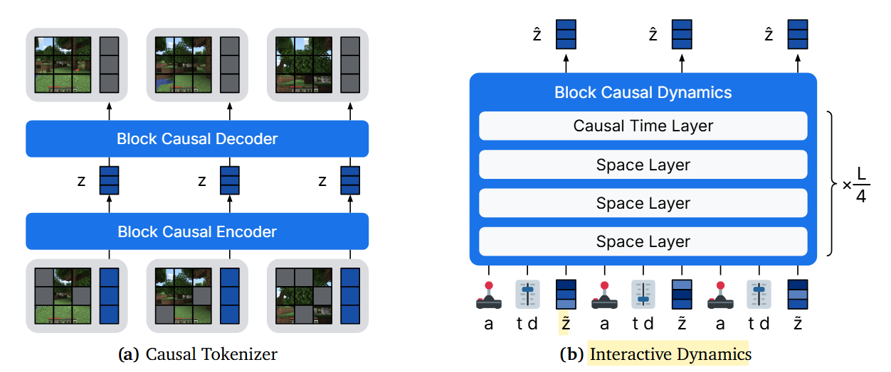

# Training Agents Inside of Scalable World Models

```
高精度世界模型 + 离线强化学习 第一个挖到钻石的模型！ 数据利用效率也更高。
```

# 方法


## 流程 

1. 训练图像编解码器
2. 训练policy 和  reward head
3. 联合训练所有 （在想象里训练）

## 一阶段：图像编码 VAE + Causal Tokenizer

L(𝜃) = LMSE (𝜃) + 0.2 LLPIPS (𝜃) 


## 一阶段：Interactive Dynamic

模型如何将不同模态的信息（视觉、动作、控制参数、计算内存）**统一映射到一个 Transformer 能够理解的向量序列中**。

*   **输入 (Inputs):**
    *   **$S_z$：** 当前帧（或过去帧）的图像表示令牌。
    *   **$S_r$：** 寄存器令牌（专门用来存储**全局上下文信息**）
    *   **$\tau, d$：** 噪声水平和步长（告诉模型现在要去多少噪声，跨多大步）。
    *   **动作编码：** 包含鼠标、键盘等操作。
*   **输出 (Outputs):**
    *   **$\hat{z}_1$：** 这是该时间步对应的**干净表示 (Clean Representation)**。
    *   **注意：** 因为模型是自回归运行的，预测出的干净 $\hat{z}_1$ 会经过分词器的解码器变成下一帧图像，或者作为下一时刻的历史信息重新输入。


*   **过程:**
    1. 先把真实的视频帧通过训练好的 Causal Tokenizer 编码，得到干净的表示 $z_1$。
    2. 根据扩散模型（流匹配）的公式，将 $z_1$ 与纯高斯噪声 $z_0$ 进行混合：
$$
\tilde{z} = (1 - \tau) z_0 + \tau z_1
$$

    3. 这里的 $\tau$ 是训练时随机采样的信号水平。

+ short cut去训
+ 噪声越多 权重越低

## 二阶段：用bc学 reward 和 policy
L(𝜃) = − 𝐿∑︁ 𝑛=0 ln 𝑝𝜃 (𝑎𝑡+𝑛 | ℎ𝑡 ) − 𝐿∑︁ 𝑛=0 ln 𝑝𝜃 (𝑟𝑡+𝑛 | ℎ𝑡 ) 

## 三阶段：在想象中学习
在 Dreamer 4 中，**想象训练**是指智能体完全脱离真实环境，在世界模型构建的“模拟器”中通过自我演练来进化策略。

### 3.1 Value Head的训练：

#### 1. 想象训练的具体过程

想象训练是一个在“脑海”中不断重复的循环，包含以下步骤：

1.  **初始化 (Initialization)：** 从真实数据集中随机抽取一段历史上下文（Context），作为想象的起点。
2.  **滚动预测 (Rollout)：** 
    *   **策略选择：** 策略头根据当前状态 $s_t$ 产生一个动作 $a_t$。
    *   **世界演变：** 动力学模型根据 $s_t$ 和 $a_t$ 预测下一个状态 $s_{t+1}$。
    *   **指标预测：** 奖励头（Reward Head）预测这一步能拿到的奖励 $r_t$。
3.  **轨迹生成：** 重复上述过程直至达到预设的想象步数（Horizon），形成一条包含“状态-动作-奖励-价值预测”的虚拟轨迹。
4.  **策略优化：** 利用这些虚拟轨迹，通过 PMPO 算法更新策略头，通过 TD 学习更新价值头。

---

#### 2. 价值头的训练过程

价值头的训练采用了**时间差分学习 (TD-learning)**：

1.  **输入：** 想象轨迹中的状态 $s_t$。
2.  **输出分布：** 价值头使用 **symexp twohot** 编码输出。这种特殊的输出层能让模型稳健地学习跨越多个数量级的数值（比如从 0.1 到 10000），而不会因为数值剧变导致训练崩溃。
3.  **损失函数：** 最小化预测分布与目标 $\lambda$-回报之间的负对数似然损失 (Negative Log-Likelihood)：
    $$L(\theta) = - \sum_{t=1}^T \ln p_\theta(R^\lambda_t | s_t)$$
4.  **作用：** 训练好的价值头能够为策略头提供“全局视野”。即使当前的动作没有即时奖励 $r_t$，只要它能导向未来价值更高的状态，价值头也会给策略正向反馈，这对于挖钻石这种超长程任务至关重要。
5.  真值：**未来长期收益的折现总和** $$R^\lambda_t = r_t + \gamma c_t [ (1 - \lambda) v_t + \lambda R^\lambda_{t+1} ]$$

### Actor Head的训练：


#### 1. 智能体令牌 (Agent Tokens)
在预训练阶段，世界模型只学视频预测。到了这一步，研究者向 Transformer 序列中插入了**智能体令牌 (Agent Tokens)**：
*   **输入：** 任务嵌入 (Task Embeddings)，例如“去挖钻石”。
*   **输出：** 通过 MLP 预测**策略 (Policy)**、**奖励 (Reward)** 和 **价值 (Value)**。
*   **地位：** 智能体令牌被视为一种新的“模态”，与其他图像、动作令牌交织在一起。
*   **单向关注：** 智能体令牌可以关注（看到）图像、动作等所有信息；
*   **不可逆关注：** 图像和动作令牌**绝对不能**关注智能体令牌。
*   **理由：** 如果世界模型能看到“任务目标”，它可能会为了迎合目标而“产生幻觉”（例如：因为任务是挖钻石，模型就在预测中凭空变出一颗钻石）。限制注意力确保了**未来预测只受动作影响，而不受任务意图的影响**。


---

#### 2. 强化学习目标：PMPO 算法
在“想象”中训练时，Dreamer 4 使用了 **PMPO (Preference Matching Policy Optimization)** 算法，而不是传统的 PPO。

#### **公式 11 解析：**
$$L(\theta) = \frac{1 - \alpha}{|D^-|} \sum_{i \in D^-} \ln \pi_\theta(a_i | s_i) - \frac{\alpha}{|D^+|} \sum_{i \in D^+} \ln \pi_\theta(a_i | s_i) + \dots$$

*   **符号化优势 (Sign-based Advantage)：** PMPO 不看奖励的具体数值大小，只看正负。
    *   **$D^+$ (正集)：** 表现比预期好的状态。模型会**增加**这些动作的概率。
    *   **$D^-$ (负集)：** 表现比预期差的状态。模型会**减少**这些动作的概率。
*   **优势：** 这种方法对奖励的幅度不敏感，不需要进行复杂的归一化，非常适合 Minecraft 这种奖励尺度变化巨大的环境。

---


#### 3. 价值头在 PMPO 损失里的位置
PMPO 算法通过**优势函数 (Advantage)** 的正负号来决定是对动作进行“奖”还是“惩”。

> PMPO uses the **sign of the advantages** $A_t = R^\lambda_t - v_t$ and ignores their magnitude.

*   **$A_t = R^\lambda_t - v_t$：** 这里的 $v_t$ 就是价值头的输出。
*   **分类标准：** 
    *   如果 $A_t \ge 0$（即实际回报好于预期价值），该状态进入 $D^+$ 集合。
    *   如果 $A_t < 0$（即实际回报差于预期价值），该状态进入 $D^-$ 集合。

**结论：** 如果没有价值头 $v_t$，你就无法计算优势 $A_t$，也就无法确定哪些状态属于 $D^+$ 或 $D^-$，公式 (11) 就没法算了。


---

### 4. 行为先验 (Behavioral Prior)
公式 11 的最后一部分是 **KL 散度项**：
*   它强制当前的策略 $\pi_\theta$ 不要偏离**先验策略 (Prior)** 太远。
*   **先验策略**是从人类玩家数据中学到的（行为克隆）。这保证了智能体在想象中探索时，依然保持类似人类的、合理的行为，而不是陷入无意义的随机动作。


# 其他
## short cut

### 1. 核心思想：多参数条件化
传统的扩散模型只根据**噪声水平 $\tau$**（信号强度）来预测如何去噪。而 Shortcut Models 额外引入了一个参数：**请求的步长 $d$**。
*   网络函数变为 $f_\theta(x_\tau, \tau, d)$。
*   这意味着模型不仅知道现在的噪声有多大，还知道你希望它这“一跳”跳多远。

### 2. 训练机制：递归蒸馏 (Bootstrapping)
模型通过两种损失函数进行训练，从而学习如何处理不同大小的“跳转”：

*   **微观训练（底层）：** 对于最小的步长 $d_{min}$（例如 $1/64$），它使用标准的流匹配损失（Flow Matching Loss），学习指向清晰数据 $x_1$ 的方向。
*   **宏观训练（自举/蒸馏）：** 对于较大的步长 $d > d_{min}$，它使用**自举损失（Bootstrap Loss）**。
    *   **原理：** 它先用模型自己预测两个连续的“半步”（步长为 $d/2$）。
    *   **目标：** 让模型直接预测的一整个大步（步长 $d$），等于那两个半步合起来的结果。
    *   **公式：** $v_{target} = \text{sg}(b' + b'')/2$。这里通过 `sg`（stop gradient）停止梯度，确保模型是向着更精细的预测方向对齐。

### 3. 采样策略：2的幂次方
在训练时，步长 $d$ 不是随机取的，而是按照 **2 的幂次方**（如 $1, 1/2, 1/4, \dots, 1/K_{max}$）进行采样。
*   **信号水平 $\tau$** 也会在与步长匹配的网格上采样。
*   这种分层采样保证了模型在各种跨度下都能得到充分训练。

### 4. 为什么它更快？
*   **无离散化误差：** 传统的扩散模型在每一步都会产生一点点偏离目标的误差，步数越少误差越大。而 Shortcut Models 在训练时就已经学会了预测“这一跳的终点”，因此即使步长很大，它也能准确落在目标路径上。
*   **极高效率：** 在实践中，这种模型只需要 **2 或 4 个前向传播步骤** 就能生成高质量样本，而普通扩散模型通常需要 64 步以上。

---
