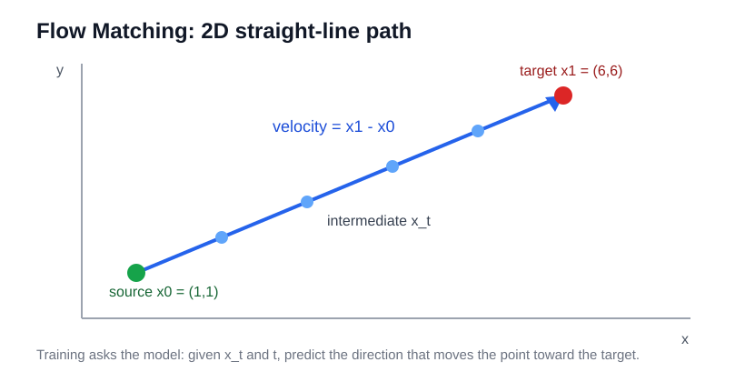

> Flow Matching 的直觉很简单：从容易采样的 source distribution 出发，把 source 点和 target 数据点连成一条路径；训练模型在任意中间位置和时间 $t$ 上预测“下一步该往哪里走”的速度方向，采样时就从噪声出发沿这个速度场一步步走到数据分布。

# 背景

来源：**Flow Matching in 5 Minutes**  
作者：wh / nrehiew  
本地原文：`raw/Flow Matching in 5 Minutes _ wh.html`  
网页：<https://nrehiew.github.io/blog/flow_matching/>

这篇文章不是论文，而是一篇 Flow Matching 直觉入门博客。它想解释的问题是：

> 生成模型如何把一个容易采样的分布，变成一个复杂的数据分布？

在 generative modeling 里，我们通常有两个分布：

| 分布 | 含义 |
| --- | --- |
| $p_{\text{source}}$ | 容易采样的分布，例如 Gaussian noise。 |
| $p_{\text{target}}$ | 数据分布，例如真实图片。 |

目标是：从 $p_{\text{source}}$ 采一个点，然后通过一系列连续变换，让它变成看起来像从 $p_{\text{target}}$ 采出来的样本。

# 数学背景：ODE、SDE 和 PDE

微分方程（differential equation）本质上是在描述**连续变化过程**。微分方程不是 Diffusion Policy 的小变种；它是 diffusion / flow 生成模型的理论语言。但 Diffusion Policy 工程实现里，通常体现为离散 denoising steps，而不是显式解 SDE/ODE。它关心的问题通常是：

> 如果我知道一个系统“当前在哪里”以及“当前变化速度是多少”，能不能推出它未来会怎么变化？

在物理里，微分方程可以描述物体运动、流体流动、热扩散；在控制里，可以描述机器人状态随控制量如何变化；在概率和生成模型里，可以描述样本点或概率分布如何从一种状态连续变成另一种状态。

放到生成模型里，微分方程的角色就是：

> 描述一个样本或一整个分布，如何从 source distribution 连续演化到 target distribution。

Flow Matching、Diffusion、Score-based Model 里经常会看到三类 differential equation：

| 名称 | 全称 | 描述对象 | 直觉 |
| --- | --- | --- | --- |
| ODE | Ordinary Differential Equation | 单个样本点的确定性运动轨迹 | 给定当前位置和时间，下一步往哪里走是确定的。 |
| SDE | Stochastic Differential Equation | 单个样本点的随机运动轨迹 | 在确定性漂移之外，每一步还会加入随机噪声。 |
| PDE | Partial Differential Equation | 整个分布密度随时间如何变化 | 不跟踪单个点，而是描述一片概率云怎么流动。 |

## ODE：确定性轨迹

ODE 的基本形式是：

$$
\frac{dx_t}{dt}
=
v(x_t,t)
$$

这里：

- $x_t$ 是时间 $t$ 时样本所在的位置；
- $\frac{dx_t}{dt}$ 是这个点的瞬时速度；
- $v(x_t,t)$ 是速度场，告诉你当前位置和当前时间下该往哪里走。

如果初始点 $x_0$ 和速度场 $v$ 都确定，那么整条轨迹也是确定的。Flow Matching 的采样过程通常就可以理解成解一个 ODE：

$$
dx_t
=
v_\theta(x_t,t)\,dt
$$

离散代码里的：

```python
current = current + step_size * prediction
```

就是对这个 ODE 做数值积分。

## SDE：带随机噪声的轨迹

SDE 在 ODE 的基础上加入随机项：

$$
dx_t
=
f(x_t,t)\,dt
+
g(t)\,dW_t
$$

这里：

- $f(x_t,t)\,dt$ 是确定性漂移项，表示平均往哪里走；这里的 f 和 ODE 里的 v 都表示确定性速度场；SDE 只是额外加了随机噪声项 g(t)dW_t，所以通常把 f 叫 drift。
- $g(t)$ 控制噪声强度；
- $dW_t$ 是 Brownian motion / Wiener process 的随机增量。

直觉上，SDE 的每一步既有“按模型方向走”，也有“随机抖一下”。所以即使初始点一样，每次采样路径也可能不同。

Diffusion 模型常用 SDE 来描述加噪和去噪过程。像 [[rl-flow_grpo]] 里把 deterministic flow ODE 改成 SDE，也是为了给生成过程引入随机探索，方便在线 RL。

## PDE：分布密度的演化

ODE / SDE 关注单个样本点怎么动。PDE 关注的是整个概率分布 $p_t(x)$ 怎么随时间变化。

如果大量粒子都按速度场 $v_t(x)$ 运动，那么分布密度满足 continuity equation：

$$
\frac{\partial p_t(x)}{\partial t}
+
\nabla \cdot \left(p_t(x)v_t(x)\right)
=
0
$$

这里：

- $p_t(x)$ 是时间 $t$ 的概率密度；
- $\frac{\partial p_t}{\partial t}$ 表示密度随时间变化；
- $\nabla \cdot (p_t v_t)$ 表示概率质量如何流入 / 流出某个区域。

如果是带随机噪声的 SDE，对应的分布演化通常会写成 Fokker-Planck equation。它也是 PDE，描述噪声如何让概率云扩散。

可以这样记：

```text
ODE / SDE：看一个样本点怎么走。
PDE：看整个分布怎么流动。
```

Flow Matching 的训练看起来是在学每个点的速度 $v_\theta(x_t,t)$，但它真正想实现的是让整个 source distribution 沿着这个速度场流成 target distribution。

# 2D 直觉：从一个点走到另一个点

文章先用二维点解释。

假设 source 点是：

$$
x_0=(1,1)
$$

target 点是：

$$
x_1=(6,6)
$$

最简单的路径是直线。总位移是：

$$
x_1-x_0
=
(6,6)-(1,1)
=
(5,5)
$$

如果一步到达，就直接走 $(5,5)$。如果分 5 步走，每一步可以走：

$$
(1,1)
$$



这就是 Flow Matching 的核心直觉：不是一次从噪声变成数据，而是在连续时间上学习每个位置该往哪个方向走。

# 中间点：为什么要输入时间 $t$

把路径时间归一化到 $[0,1]$。任意中间点可以用线性插值表示：

$$
x_t
=
(1-t)x_0
+
t x_1
$$

例如第 3 / 5 步：

$$
t=\frac{3}{5}
$$

则：

$$
x_t
=
\left(1-\frac{3}{5}\right)(1,1)
+
\frac{3}{5}(6,6)
=
(4,4)
$$

注意，$(4,4)$ 既不像直接从 source distribution 采出来的点，也不像 target distribution 里的真实数据点。它是两者之间的“中间状态”。

因此模型需要同时知道：

1. 当前点 $x_t$ 在哪里；
2. 当前时间 $t$ 是多少；
3. 在这个状态下应该往哪个方向移动。

# 方法：学习速度场

Flow Matching 要学的是一个速度场：

$$
v_\theta(x_t,t)
$$

它的输入是中间点 $x_t$ 和时间 $t$，输出是当前位置应该移动的方向和大小。

在直线插值例子里，真实速度很简单。因为：

$$
x_t
=
(1-t)x_0
+
t x_1
$$

对 $t$ 求导：

$$
\frac{dx_t}{dt}
=
x_1-x_0
$$

也就是说，训练目标就是让模型预测 source 到 target 的方向：

$$
v_\theta(x_t,t)
\approx
x_1-x_0
$$

对应到代码直觉：

```python
t = torch.rand(1)
intermediate_t = (1 - t) * source + t * target
direction = target - source

prediction = model(intermediate_t, t)
loss = ((direction - prediction) ** 2).mean()
loss.backward()
```

这就是 flow matching 的 supervised learning 形式：给模型一个中间点和时间，让它回归真实速度。

# 为什么单条路径能学到整体分布

实际训练时，我们没有完整的 $p_{\text{target}}$，只有从数据分布采样出来的数据点。训练通常是：

1. 从 source distribution 采一个 $x_0$；
2. 从数据集采一个 target 样本 $x_1$；
3. 随机采一个时间 $t$；
4. 构造中间点 $x_t=(1-t)x_0+t x_1$；
5. 让模型预测速度 $x_1-x_0$。

看起来模型只学了很多 pairwise trajectory，但这些路径的期望会形成一个整体 velocity field。模型不是记住每一条路径，而是在大量样本上学习一个平均意义上的速度场：

> 给定当前点和时间，朝哪个方向走最可能把 source 分布推向 target 分布。

这也解释了为什么路径可能相交但训练仍然可行：模型学习的是条件路径在整体分布上的聚合效果，而不是单条样本路径的死记硬背。

# 采样：从噪声沿速度场走到数据

训练好后，采样过程反过来使用模型：

1. 从 source distribution 采一个初始点；
2. 从 $t=0$ 开始；
3. 每一步用模型预测速度；
4. 按小步长更新当前点；
5. 走到 $t=1$，得到 target-like sample。

代码直觉：

```python
source = torch.randn(1)
current_position = source

for step in range(NUM_STEPS):
    t = (step + 1) / NUM_STEPS
    prediction = model(current_position, t)
    current_position = current_position + (1 / NUM_STEPS) * prediction
```

连续形式可以理解成求解 ODE：

$$
\frac{dx_t}{dt}
=
v_\theta(x_t,t)
$$

Flow Matching 模型学到的就是这个 ODE 的速度函数。

# 高维情况

二维点只是直觉。图像生成里，点不再是 $(x,y)$，而是高维张量：

$$
x \in \mathbb{R}^{H \times W \times 3}
$$

source 可以是 Gaussian noise，target 是真实图片。Flow Matching 要做的是：

> 在图像空间中学习一个速度场，把噪声样本连续推到图片分布。

这和 diffusion 的直觉很接近：都是从噪声走向数据。区别在于 Flow Matching 直接学习连续路径上的 velocity field，而不是一定要用 score / denoising 形式来描述。

# 和扩散模型的关系

这篇文章没有深入比较 diffusion 和 flow matching，但可以从直觉上这样理解：

| 方法 | 学什么 | 采样怎么走 |
| --- | --- | --- |
| Diffusion / Score-based Model | 学 denoising 或 score，知道如何从带噪点回到数据。 | 从噪声开始逐步去噪。 |
| Flow Matching | 学 velocity field，知道当前点和时间下该往哪里移动。 | 从 source 开始沿 ODE / flow 走到 target。 |

Flow Matching 的好处是训练目标很直接：构造 source-target 之间的中间点，然后回归真实速度。

# 总结

这篇文章给 Flow Matching 的解释可以压缩成一句话：

> 先把 source 点和 target 点连成路径，再训练模型预测路径上每个中间点的速度方向；采样时从 source 出发，沿模型预测的速度场一步步走到 target distribution。

关键概念：

- $p_{\text{source}}$：容易采样的起点分布；
- $p_{\text{target}}$：数据分布；
- $x_t=(1-t)x_0+t x_1$：source 和 target 的中间点；
- $\frac{dx_t}{dt}=x_1-x_0$：直线路径上的真实速度；
- $v_\theta(x_t,t)$：模型学习的速度场；
- 采样：从 source 出发，沿 $v_\theta$ 积分到 target。

这也是理解 [[rl-flow_grpo]] 的基础：Flow-GRPO 之所以能对 flow matching 模型做 RL，是因为 flow model 的生成过程本身可以看成一条从噪声到样本的连续 trajectory。

## 索引信息

> 类别：基础概念 / 视觉生成 / Flow Matching  
> 索引标签：#FlowMatching #Diffusion #GenerativeModel #ODE #VelocityField #ImageGeneration
