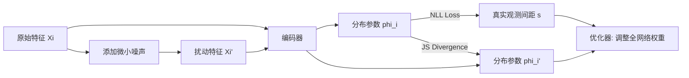

> 训练一个网络映射环境 $\to$ 安全标准 $\to$ 违规程度（即危险）的关系 在任意环境下可以都可以知道当前的危险程度 

# 原理

## 概率转换
这个公式是 GSSM 风险量化逻辑的核心，它利用统计学中的**极值理论**将“物理间距”转化为了“概率风险”。

$$p(s, n|X) = (Pr(S > s|X))^n$$

---

### 1. 公式理解

*   **$S$**：是一个**随机变量**，代表在某种特定背景下，两个道路使用者之间可能出现的“间距”。
*   **$s$**：是当前时刻**实际测量到**的具体间距数值（例如：1.5米）。
*   **$X$**：代表**交互背景（Context）**。这不仅仅是一个数字，而是一个包含天气（如下雨）、路面状况、车辆当前速度、历史轨迹等信息的集合。
*   **$n$**：代表**冲突强度**，也可以理解为“观测次数”。它描述了在 $n$ 次类似的交互中，当前这个间距 $s$ 能够维持其“最小值”地位的频次。
*   **$Pr(S > s | X)$**：这是一个**条件概率**，表示：在背景 $X$ 下，随机发生一次交通交互，其产生的间距 $S$ **大于**当前实测间距 $s$ 的概率。
    *   例如：如果在雨天（$X$），99.9% 的车距都保持在 1.5米（$s$）以上，那么这个概率就是 0.999。
*   **$p(s, n|X)$**：这是最终的**目标概率**，表示：在背景 $X$ 下，连续进行 $n$ 次独立的观测，所有这 $n$ 次观测的间距都**依然大于** $s$ 的概率。换句话说，它是 $s$ 作为这 $n$ 次观测中“最小值”的概率边界。

---

### 2. 环境到安全标准
1.  **假设：** 间距大于当前 $s$ 的概率为 $P = Pr(S > s | X)$。
2.  **连乘：** 观测 $n$ 次，所有间距都大于 $s$ 的概率是 $P^n$。
3.  **寻找强度：** 我们想知道，观测多少次（$n$ 等于多少），这个概率会掉到一半（0.5）？这意味着在这个强度下，当前的 $s$ 有 50% 的可能性成为这 $n$ 次观测中的最小值。
4.  **解方程：**
    $$P^n = 0.5$$
    $$\ln(P^n) = \ln 0.5$$
    $$n \ln P = \ln 0.5$$
    $$n = \frac{\ln 0.5}{\ln P}$$
5.  **最终分值：** 为了把这个可能非常巨大的 $n$ 变成人类好理解的分数，取对数：$M = \log_{10} n$。

在 GSSM 模型中，**$M$ 代表风险等级（Risk Level）**。

你可以把它类比为地震的“震级”：它是一个**对数刻度**，用来衡量当前这个驾驶行为在当前环境下到底有多“极端”。

以下是 $M$ 的三个维度的含义拆解：

### 3.M 物理含义：罕见程度&风险等级
从数学上讲，$M = \log_{10} \hat{n}$。这里的 $\hat{n}$ 是指：在完全相同的交通背景下，你需要观测多少次交互，才能遇到一次像现在这么近（或更近）的间距。

*   **$M = 0$**：表示这是一个**中位数**行为。即在相同的路况下，有一半的人比你离得近，一半的人比你离得远。这通常是安全的。
*   **$M = 3$**：代表这种行为非常罕见。在 1,000 次类似的交互中，只有 1 次会像你现在这么近。这通常意味着已经处于危险边缘。
*   **$M = 4$**：极度危险。10,000 次类似交互中才出现一次的极端行为。

> 当 $s$ 小于背景 $X$ 下的中位间距时，对应的 $M$ 较大，碰撞风险更高。特别是当 $s = 0$ 时，$M$ 为无穷大，表示发生了真实的碰撞。

## 概率分布推导

### 1. 核心任务：参数化概率分布
在之前的定义中，风险取决于 $Pr(S > s|X)$。为了让计算机能够处理这个概率，我们需要知道间距 $s$ 服从什么样的统计分布。
*   **目标：** 用一个参数集 $\phi(X)$ 来描述间距的累积分布函数 $F_S(s; \phi(X))$。
*   **可训练性：** 只要我们确定了分布的形式，神经网络就可以通过学习来预测这些参数 $\phi(X)$，从而使风险量化变得可计算。

---
### 2. 关键假设：对数正态分布 (Lognormal Distribution)
作者根据先前的研究，假设在特定的交互背景 $X$ 下，道路使用者之间的间距 $s$ 服从**对数正态分布**。

*   **分布参数：** 包含两个参数：均值 $\mu$ 和方差 $\sigma^2$。神经网络的任务就是输出这两个值：$\hat{\phi}(X) = (\hat{\mu}(X), \hat{\sigma}^2(X))$。

#### 公式 (3)：概率密度函数 (PDF)
$$f_S(s; \phi(X)) = \frac{1}{s\sqrt{2\pi\hat{\sigma}^2(X)}} \exp \left( - \frac{(\ln s - \hat{\mu}(X))^2}{2\hat{\sigma}^2(X)} \right)$$
这代表了在背景 $X$ 下，不同间距 $s$ 出现的可能性大小。

#### 公式 (4)：参数化后的 GSSM
这是将分布公式代入原始风险定义后得到的最终公式：
$$GSSM(s, X) = \log_{10} \left[ \frac{\ln 0.5}{\ln \left( \frac{1}{2} \left[ 1 - \text{erf} \left( \frac{\ln s - \hat{\mu}(X)}{\sqrt{2\hat{\sigma}^2(X)}} \right) \right] \right)} \right]$$

*   **$\text{erf}(z)$ (高斯误差函数)：** 这是一个标准的数学函数，用于计算正态分布下的累积概率。
*   **逻辑闭环：**
    1.  输入背景 $X$ 到神经网络。
    2.  网络输出该背景下的“安全模板”参数 $\mu$ 和 $\sigma$。
    3.  将实测间距 $s$ 连同这些参数代入公式 (4)。
    4.  输出最终的风险得分。

---
这部分内容介绍了如何将理论上的 GSSM 公式转化为一个**可训练的参数化模型**。通过引入概率分布假设，研究者可以让神经网络学会如何根据不同的交通背景（$X$）来自动调节风险评估的标准。

# 训练过程 

## 1. 完整的训练流程图：

---

## 2. 网络结构 (Network Architecture)

GSSM 采用了专为交通上下文设计的**多分支编码器-解码器结构**。

### 1. 三分支编码器 (Multi-branch Encoders)
为了处理异构的输入数据，模型设置了三个平行的编码器：
*   **当前分支 ($g_C$)：** 处理即时状态 $X_C$（如速度、相对位置等）。
*   **环境分支 ($g_E$)：** 处理类别特征 $X_E$（如天气、光照、路面）。使用 **Embedding 层** 将这些离散类别转换为连续向量。
*   **历史分支 ($g_T$)：** 处理时间序列 $X_T$（过去 2.5 秒的轨迹）。
这些特征经过各自的编码器后生成隐藏表达（$\theta_C, \theta_E, \theta_T$），最后由**解码器 (Decoder)** 统一处理，输出分布参数 $\phi(X)$：

$$\phi(X) = g_D([\theta_C; \theta_E; \theta_T])$$

### 2. 解码器与输出层
*   **特征融合：** 将三个分支的隐藏表达 $\theta$ 拼接起来。
*   **参数预测：** 解码器（由全连接层组成）输出两个关键值：$\hat{\mu}(X)$ 和 $\hat{\sigma}^2(X)$。
*   **模型规模：** 整个模型约有 **88.5 万个参数**（< 0.9M），推理速度极快。在 NVIDIA A100 上，**每毫秒可处理约 40,000 次交互查询**，完全满足自动驾驶的实时性需求。

> 这种模型参数不足 90 万，对于现代深度学习来说相当小……该模型在 25 毫秒内可计算一千次交互。 [计算效率](https://alphaxiv.org/abs/2505.13556v5?page=25)

---

# 实验结果 

作者在 **2,591 起真实的事故和近乎事故**（来自 SHRP2 数据库）上验证了模型。

### 1. 检测准确性：全面超越基准
GSSM 在各项指标上均显著优于传统的物理指标（如 TTC2D、ACT）。

| 指标 | **GSSM** | ACT | TTC2D |
| :--- | :--- | :--- | :--- |
| **AUPRC (准确性得分)** | **0.900** | 0.824 | 0.818 |
| **高召回率下的精准度 (Recall $\geq$ 90%)** | **0.814** | 0.795 | 0.674 |

### 2. 预警及时性：黄金 2.6 秒
*   **中值提前时间 (mTTI)：** GSSM 能在碰撞发生前 **2.6 秒** 发出警报。
*   **预警稳定性：** 相比于 ACT 和 TTC2D，GSSM 的预警时间分布更集中（置信区间更窄），意味着它在不同场景下的表现更稳健。

<!-- Bar Chart: GSSM 与传统指标的准确性对比 (AUPRC) -->

### 3. 不同交互场景的泛化能力
GSSM 在各种复杂的交互中都保持了极高的准确率，尤其是传统指标难以处理的侧向和路口冲突。

*   **追尾 (Rear-end)：** AUPRC 0.858
*   **相邻车道 (Adjacent lane)：** AUPRC 0.771
*   **路口穿越/转弯 (Crossing/Turning)：** AUPRC 0.747
*   **合并 (Merging)：** AUPRC 0.865

> GSSM 在所有交互场景中，在以安全为重点的检测准确性方面都明显更有效。这在追尾之外的冲突中尤为突出。 [场景表现](https://alphaxiv.org/abs/2505.13556v5?page=16)

## 索引信息

> 类别：论文笔记 / 自动驾驶安全 / 风险评估  
> 索引标签：#GSSM #自动驾驶 #风险评估 #安全指标 #极值理论 #交通交互 #事故预警

