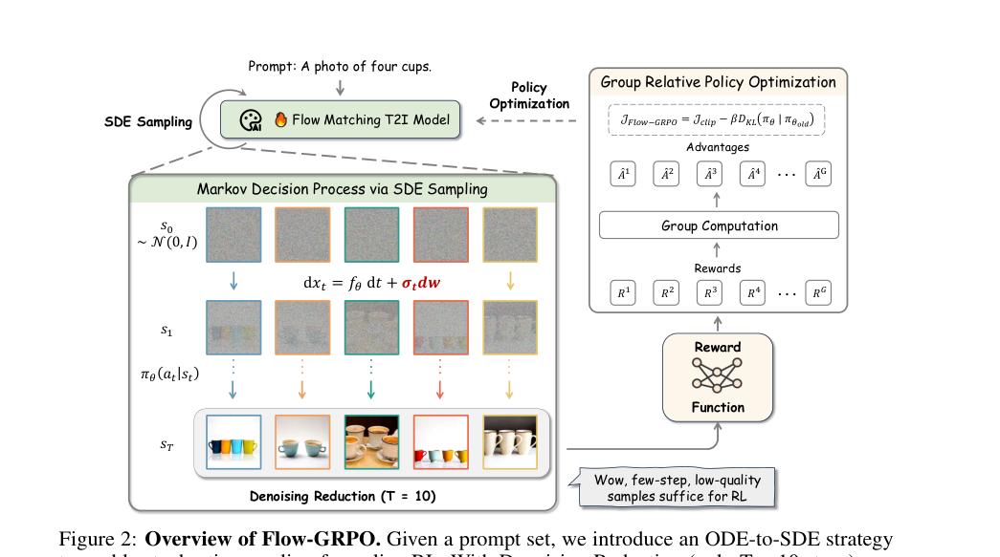
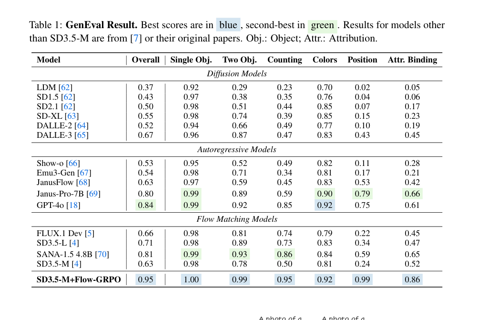
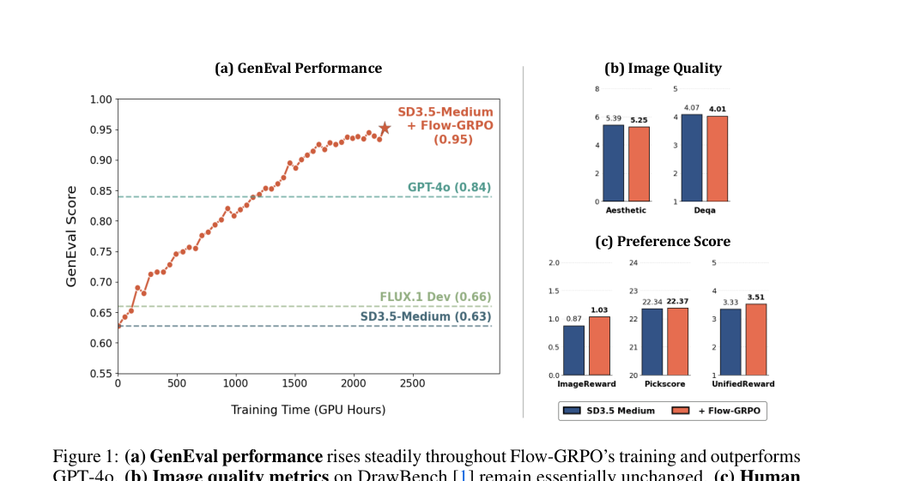
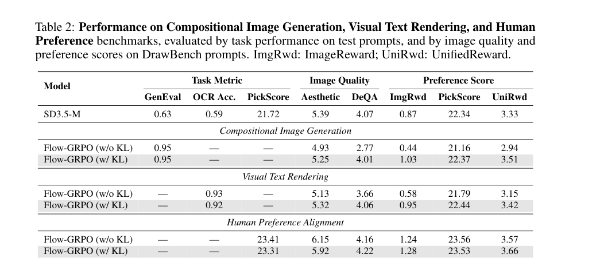
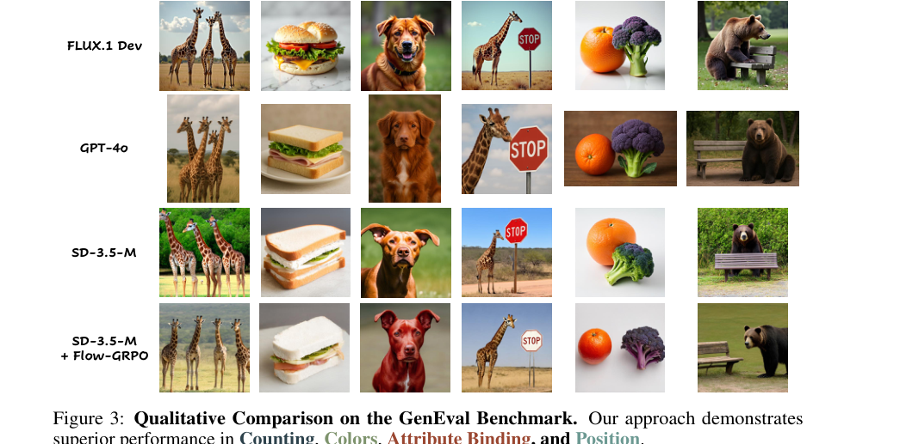
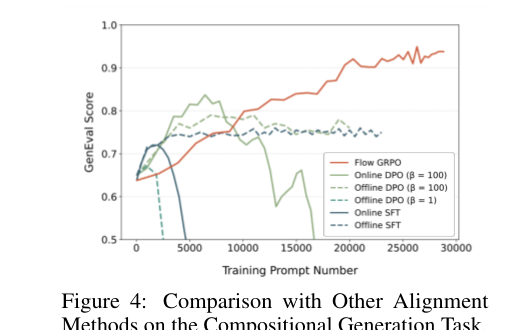
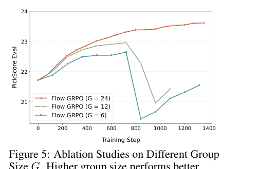
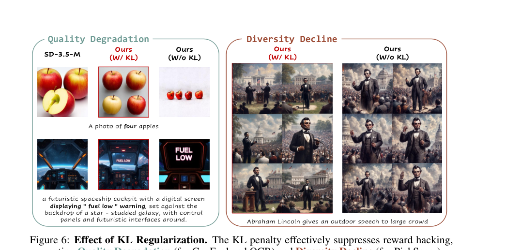
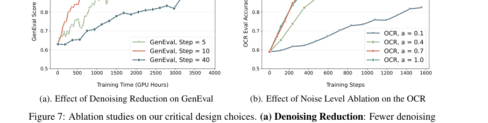

> Flow-GRPO 的核心是把原本确定性的 flow matching 采样过程改造成可随机探索的 SDE 过程，然后用 GRPO 在生成样本的 reward 上做在线 RL 更新，从而把偏好、组合约束、文字渲染能力真正写进 flow model 的参数里。

# 论文概览

论文：**Flow-GRPO: Training Flow Matching Models via Online RL**  
作者：Jie Liu, Gongye Liu, Jiajun Liang, Yangguang Li, Jiaheng Liu, Xintao Wang, Pengfei Wan, Di Zhang, Wanli Ouyang  
机构：MMLab CUHK, Tsinghua University, Kling Team / Kuaishou Technology, Nanjing University, Shanghai AI Laboratory  
本地 PDF：`raw/Flow-GRPO Training Flow Matching Models via Online RL.pdf`

资源：

- arXiv：<https://arxiv.org/abs/2505.05470>
- GitHub：<https://github.com/yifan123/flow_grpo>
- Hugging Face Paper：<https://huggingface.co/papers/2505.05470>
- 会议：公开信息显示为 NeurIPS 2025

一句话总结：

> 这篇论文把 LLM 里常用的 GRPO 搬到 flow matching 图像生成模型上，通过 ODE-to-SDE 引入随机探索，再用 group-relative reward 更新模型，使 SD3.5-M 在 GenEval 上从 0.63 提升到 0.95，并显著改善文字渲染和人类偏好对齐。

# 背景：为什么 flow model 做在线 RL 不直接？

Flow matching 模型现在是许多图像、视频生成系统的核心。它和 diffusion 一样从噪声生成样本，但常用的 rectified flow / probability flow ODE 是确定性的：

$$
dx_t = v_t\,dt
$$

给定同一个初始噪声和 prompt，ODE 轨迹是确定的。这个特点对高质量采样很好，但对在线 RL 不友好。

在线 RL 需要探索：

1. 对同一个 prompt 采样一组不同结果；
2. 用 reward function 给这些结果打分；
3. 比较组内好坏，得到 advantage；
4. 更新模型，让高 reward 轨迹概率上升。

如果 flow model 只有确定性 ODE，GRPO 需要的 trajectory probability、随机采样和组内探索都不自然。因此，Flow-GRPO 的第一个关键动作就是：

> 把确定性 ODE 改写成边缘分布等价的 SDE。

# 方法总览

Flow-GRPO 有三块核心设计：

1. **Denoising as MDP**：把多步生成过程看成一个 MDP。
2. **ODE-to-SDE**：把确定性 flow 采样改成带噪声的随机过程，让 GRPO 可以采样和计算概率比。
3. **Denoising Reduction**：训练时只用 10 步低质量但有 reward 信号的样本，推理时仍用 40 步高质量采样。



Fig.2 展示了完整 pipeline：对同一个 prompt 采样一组图片，reward function 给每张图打分，组内标准化得到 advantage，再用 GRPO 更新 flow matching 模型。

# 核心方法精读

## 1. Flow matching：从噪声到图片的速度场

Rectified Flow 把数据样本 $x_0$ 和噪声 $x_1$ 线性连接：

$$
x_t = (1-t)x_0 + tx_1
$$

模型学习速度场：

$$
v_\theta(x_t,t)
$$

训练目标是让模型预测从数据到噪声之间的方向：

$$
\mathcal{L}(\theta)
=
\mathbb{E}_{t,x_0,x_1}
\left[
\|v - v_\theta(x_t,t)\|^2
\right],
\quad
v=x_1-x_0
$$

直观理解：

- $x_1$ 是噪声；
- $x_0$ 是真实图片；
- $x_t$ 是中间状态；
- $v_\theta$ 告诉模型下一步该往哪里走，才能从噪声变成图像。

## 2. Denoising as MDP：把生成过程改写成 RL 轨迹

Flow-GRPO 把 denoising 过程看成一个 MDP。

对应关系：

- **状态 $s_t$**：当前 prompt、时间步 $t$、当前 noisy image $x_t$。
- **动作 $a_t$**：模型预测下一步的 denoised sample $x_{t-1}$。
- **policy $\pi_\theta(a_t \mid s_t)$**：flow model 在当前状态下给出的下一步采样分布。
- **transition**：从 $x_t$ 走到 $x_{t-1}$。
- **reward**：只在最后生成图片 $x_0$ 后给出，例如 GenEval score、OCR accuracy、PickScore。

这一步的意义是：把图像生成从“采样算法”变成“多步决策过程”，这样才能套用 policy optimization。

## 3. GRPO：不用 value model 的组内相对优势

GRPO 的核心不是给每个样本预测一个 value，而是对同一个 prompt 采样一组结果，然后用组内 reward 标准化。

给定 prompt $c$，模型采样 $G$ 张图片：

$$
\{x_0^i\}_{i=1}^{G}
$$

每张图都有 reward：

$$
R(x_0^i,c)
$$

第 $i$ 张图的 advantage 定义为：

$$
\hat{A}_t^i
=
\frac{
R(x_0^i,c) - \mathrm{mean}(\{R(x_0^i,c)\}_{i=1}^{G})
}{
\mathrm{std}(\{R(x_0^i,c)\}_{i=1}^{G})
}
$$

简单来说：

- 比同组平均更好的图片，advantage 为正；
- 比同组平均更差的图片，advantage 为负；
- 不需要额外训练 value network。

Flow-GRPO 的目标类似 PPO / GRPO 的 clipped objective：

$$
J_{\text{Flow-GRPO}}(\theta)
=
\mathbb{E}
\left[
\frac{1}{G}
\sum_{i=1}^{G}
\frac{1}{T}
\sum_{t=0}^{T-1}
\min
\left(
r_t^i(\theta)\hat{A}_t^i,
\mathrm{clip}(r_t^i(\theta),1-\epsilon,1+\epsilon)\hat{A}_t^i
\right)
-
\beta D_{KL}(\pi_\theta \| \pi_{\mathrm{ref}})
\right]
$$

其中概率比是：

$$
r_t^i(\theta)
=
\frac{
p_\theta(x_{t-1}^i \mid x_t^i,c)
}{
p_{\theta_{\mathrm{old}}}(x_{t-1}^i \mid x_t^i,c)
}
$$

这个目标的直觉是：提高组内高 reward 生成轨迹的概率，降低低 reward 轨迹的概率，同时用 KL 保持模型别偏离原始模型太远。

## 4. ODE-to-SDE：为什么必须引入随机性？

原始 flow ODE 是：

$$
dx_t = v_t\,dt
$$

它是确定性的，不适合 GRPO。Flow-GRPO 把它转成保持相同边缘分布的 reverse-time SDE：

$$
dx_t
=
\left(
v_t(x_t)
-
\frac{\sigma_t^2}{2}\nabla \log p_t(x_t)
\right)dt
+
\sigma_t dw
$$

对于 rectified flow，论文进一步写成：

$$
dx_t
=
\left[
v_t(x_t)
+
\frac{\sigma_t^2}{2t}
\left(
x_t + (1-t)v_t(x_t)
\right)
\right]dt
+
\sigma_t dw
$$

最后用 Euler-Maruyama 离散化：

$$
x_{t+\Delta t}
=
x_t
+
\left[
v_\theta(x_t,t)
+
\frac{\sigma_t^2}{2t}
\left(
x_t + (1-t)v_\theta(x_t,t)
\right)
\right]\Delta t
+
\sigma_t\sqrt{\Delta t}\epsilon
$$

其中 $\epsilon \sim \mathcal{N}(0,I)$。

这一步解决两个问题：

- 生成过程有随机性，可以探索；
- 每一步转移变成 Gaussian，可计算概率比和 KL。

## 5. Denoising Reduction：训练时少步，推理时多步

标准 SD3.5-M 推理用 40 步 denoising。在线 RL 要反复采样一组图片，如果每次都 40 步，成本太高。

Flow-GRPO 的做法是：

- 训练采样：用 10 步 SDE，样本质量较低但 reward 仍有区分度；
- 推理采样：仍用 40 步，保持最终图像质量。

这点非常工程化。它说明 RL 训练不一定需要完美样本，只需要样本之间的相对 reward 能提供学习信号。

# 主要实验结果

## 结果 1：GenEval 从 0.63 提升到 0.95



Table 1 是主结果。SD3.5-M 原始 GenEval overall 是 0.63，Flow-GRPO 后提升到 0.95，超过 GPT-4o 的 0.84。

提升最明显的项包括：

- Counting：0.50 → 0.95；
- Position：0.24 → 0.99；
- Attribute Binding：0.52 → 0.86；
- Two Objects：0.78 → 0.99。

这说明 Flow-GRPO 对组合生成特别有效：数量、空间关系、属性绑定都被 reward 明确优化到了。



Fig.1 说明训练过程中 GenEval 持续上升，同时 DrawBench 上图像质量和 preference score 基本保持，不是简单牺牲画质刷指标。

## 结果 2：文字渲染和人类偏好也提升



Table 2 比较三类任务：

- Compositional Image Generation；
- Visual Text Rendering；
- Human Preference Alignment。

结论：

- OCR accuracy 从 0.59 提升到约 0.92；
- PickScore 从 21.72 提升到约 23.31；
- 有 KL 的版本能保持更好的 image quality 和 preference 指标；
- 无 KL 虽然 reward 高，但容易质量下降或多样性坍缩。

## 结果 3：定性效果更符合 prompt



Fig.3 展示了 GenEval prompt 下的定性对比。Flow-GRPO 在 object count、color、attribute binding、position 上更准确。

# 消融分析

## Q1：Flow-GRPO 比其他 alignment 方法强在哪里？



Fig.4 比较 SFT、Flow-DPO、online DPO 等方法。Flow-GRPO 持续领先。

原因在于：

- SFT 只选最高 reward 样本做监督，利用信号较粗；
- DPO 只用 chosen / rejected pair；
- GRPO 利用一组样本的相对 reward，更新更稳定；
- online 采样让模型不断在自己的新分布上改进。

## Q2：group size 为什么重要？



Fig.5 显示 group size 越大越稳定。$G=24$ 明显优于 $G=12$ 和 $G=6$。

原因是 GRPO 的 advantage 来自组内标准化。组太小，均值和方差估计不准，advantage 噪声大，训练容易 collapse。

## Q3：KL 如何防 reward hacking？



Fig.6 展示了 KL regularization 的作用：

- 没有 KL 时，模型可能刷高特定 reward，但画质下降或多样性坍缩；
- 有 KL 时，模型仍能提升任务 reward，同时保持接近原始模型的分布。

这和 RLHF / RLVR 中的 KL 约束很类似：reward 不是完美的，必须限制模型别跑到 reward model 的漏洞里。

论文特别指出：KL regularization 不等同于 early stopping。合适的 KL 可以达到无 KL 版本的高 reward，同时保持质量，只是训练更慢。

## Q4：Denoising Reduction 为什么可行？



Fig.7(a) 显示，训练时从 40 步降到 10 步，能显著加快收敛，而且最终 GenEval 分数不差。5 步不总是更好，可能因为样本太差，reward 信号不稳定。

直觉是：GRPO 不需要训练样本完美，只要组内样本能分出好坏即可。10 步生成的图虽然低质量，但足够让 reward function 排序。

## Q5：SDE noise level 如何影响探索？

Fig.7(b) 显示，噪声系数 $a$ 太小会限制探索，训练慢；增大到 0.7 后效果更好；继续增大可能破坏图像质量，导致 reward 失效。

这说明 ODE-to-SDE 的噪声不是越大越好，而是在“探索”和“保持生成分布可用”之间取平衡。


# 与 QGF 的区别

| 方法 | 优化发生在哪里 | 是否更新模型参数 | 需要什么信号 | 适合场景 |
| --- | --- | --- | --- | --- |
| Flow-GRPO | 训练时 | 更新 flow model / LoRA 参数 | reward function / VLM judge / rule reward | 把偏好或任务能力写进模型 |
| QGF | 推理时 | 不更新 policy 参数 | critic $Q(s,a)$ 的梯度 | 部署时临时提高动作质量 |

一句话：

> Flow-GRPO 是“训练时 RL 微调 flow model”，QGF 是“测试时用价值函数引导 flow policy”。

它们都利用 flow / diffusion 的多步生成结构，但目标不同：

- Flow-GRPO 关心长期训练后的模型能力提升；
- QGF 关心不改模型权重时，如何在推理时选出更高价值动作。

# 在 VLA / 机器人里的启发

虽然本文实验是 T2I，但方法对机器人 flow action head 也有启发。

## 架构逻辑

如果 VLA 的动作头是 flow matching policy，可以把 Flow-GRPO 理解成动作头的在线 RL 微调方法：

```text
视觉/语言/状态输入
        ↓
Flow action head 生成一组 action chunk
        ↓
reward / critic / success detector 打分
        ↓
GRPO 计算组内 advantage
        ↓
更新 flow action head 参数
```

## 和 QGF 的工程选择

- 如果你不能或不想更新大模型参数，只想部署时临时改善动作，可以用 QGF 类方法。
- 如果你有在线环境、仿真器或自动 reward，并希望模型本身变强，可以考虑 Flow-GRPO 类方法。
- 如果 reward 很容易被 hack，必须加 KL、行为约束或多指标监控。

# 局限

- 论文主要在 T2I 上验证，不是机器人控制或真实 VLA。
- Flow-GRPO 依赖 reward function 质量。GenEval / OCR 是较明确 reward，人类偏好 reward 更容易有偏。
- 在线 RL 采样成本仍然高，虽然 Denoising Reduction 大幅缓解。
- KL 需要调。过强会限制学习，过弱会 reward hacking 或 diversity collapse。
- 视频和机器人任务有更长 horizon，credit assignment 会更难。

# 总结

Flow-GRPO 解决了 flow matching 模型做在线 RL 的两个关键障碍：

1. **确定性 ODE 没法自然探索**：通过 ODE-to-SDE 引入随机性，同时保持边缘分布一致。
2. **在线采样太贵**：通过 Denoising Reduction 用少步低质量样本训练，推理时仍用完整高质量采样。

实验上，它让 SD3.5-M 在 GenEval 上从 0.63 提升到 0.95，OCR 从 0.59 提升到 0.92，并在 PickScore 对齐上获得稳定收益。更重要的是，论文展示了在线 GRPO 不只适用于 LLM，也可以迁移到 flow matching 这类连续生成模型。

## 附录：PDF 解析与图表抽取自检

- PDF 已成功读取：标题、作者、摘要、章节结构、公式、Figure、Table 均可解析。
- 已抽取关键图表：Fig.1、Fig.2、Fig.3、Fig.4、Fig.5、Fig.6、Fig.7、Table 1、Table 2、Table 3、Table 4。
- 使用图片裁剪的复杂图表：方法总览、主结果表、定性图、alignment 对比、KL 消融、denoising/noise 消融、泛化表。
- 公式已用 MathJax 形式重写。
- 已检索 arXiv、GitHub、Hugging Face Paper 和 NeurIPS slides 信息。

## 索引信息

> 类别：论文笔记 / Flow Matching / Online RL / GRPO / Text-to-Image Alignment  
> 索引标签：#FlowGRPO #GRPO #FlowMatching #OnlineRL #TextToImage #ODEtoSDE #DenoisingReduction #RewardHacking #KLRegularization
