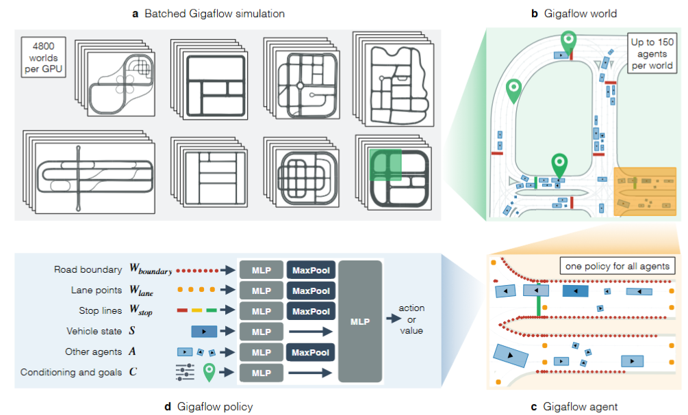
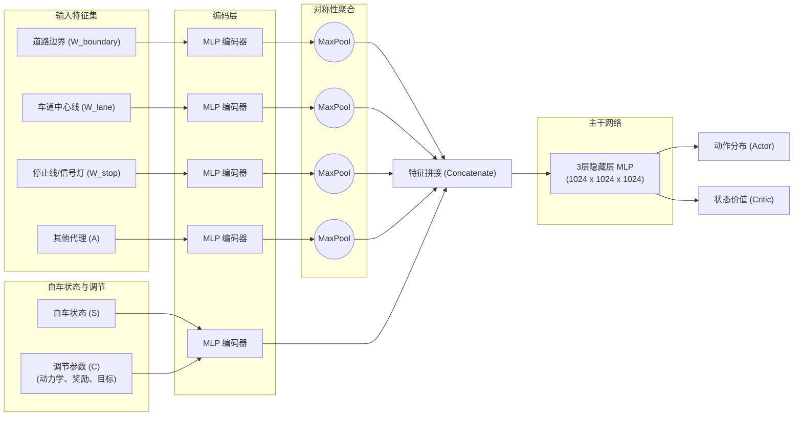

> 基于全矢量化的高速仿真，通过“自我对弈”积累了 16 亿公里里程；训练不共享参数的 Actor-Critic 模型，利用 1% 最大优势值为阈值的“优势过滤”优化 PPO 更新，最终以单一通用策略在多个基准榜单实现零样本（Zero-shot）性能夺冠。

# nuplan上其他方法的背景

## nuPlan 基准测试（Challenge 3 闭环反应式评分）对比

在 **Table A5** 中，论文列出了几个主要的竞争对手及其得分：

*   **GIGAFLOW (本论文方法)**：**93.8 ± 0.11**
*   **Diffusion-ES (Yang et al., 2024)**：**92.2**
*   **PDM-Hybrid (Dauner et al., 2023)**：**92.1**
*   **IDM (基准模型)**：**77**

## PDM-Hybrid (Dauner et al., 2023) 介绍

**PDM-Hybrid** 是 2023 年 nuPlan 挑战赛的冠军方案，由图宾根大学团队提出。它的核心思想极具颠覆性：它挑战了自动驾驶中“端到端深度学习优于规则模型”的假设，证明了**规则模型在闭环驾驶（Closed-loop）中依然具有更强的鲁棒性**。

### 1. 核心架构：规则与学习的混合
PDM-Hybrid 由三个模块组成：
*   **PDM-Closed (规则核心)**：这是车辆行驶的“安全基石”。它使用 **IDM (Intelligent Driver Model)** 进行纵向控制，通过车道图搜索选择中心线。它会生成 15 条不同的候选轨迹（通过调整不同的目标速度和侧向偏移），并在模拟器中进行快速打分，选择最优轨迹。这一步几乎是纯规则的。 
*   **PDM-Open (预测增强)**：这是一个简单的多层感知机（MLP），仅根据当前车辆状态和道路中心线预测 8 秒内的路径。它存在的唯一目的是为了在 open-loop 评估中获得高分。 
*   **PDM-Hybrid (混合机制)**：为了兼顾“安全驾驶”和“模仿人类”，它在短时间内（前 2 秒）完全信任 PDM-Closed 的规则输出，仅对 2 秒后的远端路点（Waypoints）应用学习到的偏移修正。

### 2. 为什么它能赢？
它揭示了 nuPlan 评测的一个悖论：**模仿任务（Open-loop）与驾驶任务（Closed-loop）是错位的**。许多端到端学习模型虽然能很好地模仿人类轨迹，但在模拟器中稍有偏差就会冲出道路。PDM-Hybrid 依靠规则模型确保不出路、不撞车，再用轻量级 MLP 修正轨迹使其看起来更像人类。

---

## Diffusion-ES (Yang et al., 2024) 的方法论

**Diffusion-ES** 并不是纯粹的“一趟前向传播”的神经网络，它带有明显的**测试时优化（Test-time Optimization）**环节。

### 1. 并非纯 NN Base，包含优化循环
与 PDM-Hybrid 这种直接输出或简单打分的架构不同，Diffusion-ES 是一种**基于采样的优化算法**：
*   **生成式先验**：它首先使用一个扩散模型（Diffusion Model）作为轨迹生成的“建议器”（Proposer）。这个神经网络负责生成符合人类驾驶分布、且具备多样性的潜在轨迹。
*   **ES 优化循环**：关键点在于 **ES (Evolutionary Strategies，进化策略)**。它在推理阶段会进行多次迭代优化，通过 ES 算法不断调整轨迹，使其在给定的**代价函数（Cost Function）**下达到最优。

### 2. 后处理与代价函数
它确实依赖于精细设计的代价函数，这在某种意义上就是其“后处理”逻辑。这些代价函数通常包含：
*   **硬约束**：碰撞规避（Collision avoidance）、道路边界（Road boundaries）。
*   **软约束**：驾驶舒适度（加速度/加加速度限制）、进度（Progress）以及与人类驾驶习惯的匹配度。

> **结论**：Diffusion-ES 的本质是“**生成式模型 + 启发式搜索/优化**”。虽然核心轨迹分布是由神经网络（Diffusion）学到的，但最终执行的轨迹是经过多次迭代优化选出的。因此，它并不是一个直接端到端输出且无后处理的过程，而是一个典型的**带预测约束的优化问题**。

---

# GIGAFLOW

GIGAFLOW 的网络结构采用了 **Deep Sets** 架构，其核心设计理念是：**用同一个紧凑的神经网络控制模拟器中的所有角色（车辆、行人、自行车）**。这种“一个网络通吃所有”的设计是其能够实现大规模并行化和自我对弈（Self-play）的关键。

以下是基于论文描述及 **Figure 2d** 绘制的结构图：

## 网络结构

### GIGAFLOW 策略网络架构示意图

---

### 结构要点

1.  **单策略架构 (Single Reactive Policy)**：
    *   所有的动态代理（汽车、卡车、行人等）都通过同一个参数化策略 $\pi$ 控制。

2.  **置换不变性 (Permutation Invariance)**：
    *   由于周围的车辆、地图点数量不固定，网络对每种观察类型使用小型 MLP 进行编码，然后通过 **MaxPool（最大池化）** 聚合。这保证了无论输入多少个路点或多少辆车，输出特征长度都是固定的。

3.  **条件调节 (Conditioning $C$)**：
    *   同一个网络如何区分“我是卡车”还是“我是行人”？答案是输入中的 **Conditioning**。
    *   $C_{dynamics}$ 告诉网络车辆的尺寸、转向半径；$C_{reward}$ 告诉网络它是“谨慎”还是“激进”。

4.  **规模与参数**：
    *   主干网络由 3 层 1024 维的 MLP 组成。
    *   整个模型非常紧凑，Actor 和 Critic 合计仅有 **600 万个参数**，这保证了极高的推理效率。

## 训练步骤

### 1. 整体训练循环

1.  **初始化**：设置模型参数 $\Theta$ 和优势阈值的移动平均衰减率 $\beta$。
2.  **收集数据**：Actor 根据当前策略输出动作，GIGAFLOW 执行 0.3 秒物理仿真。
3.  **计算奖励**：仿真器根据碰撞、出路、到达目标、闯红灯、舒适度、速度等规则计算 reward，并用该 agent 随机采样到的 $\alpha$ 权重加权。
4.  **写入 Buffer**：保存状态转移和 reward；为节省内存，只存世界状态，不存完整 observation。
5.  **估计优势**：Critic 计算价值 $V(s_t)$，再得到 GAE 优势 $\hat{A}^{GAE}$。
6.  **优势过滤**：根据当前最大优势的移动平均设置阈值 $\eta$，丢弃低优势样本，只保留最有训练价值的时刻。
7.  **PPO 更新**：用过滤后的样本更新 Critic 和 Actor，通常训练 3 个 epoch。
8.  **学习率退火**：按 cosine schedule 调整学习率，进入下一轮迭代。

---

### 2. Rollout：数据收集
在每一轮训练开始前，系统首先进行大规模采样。
*   **动作执行**：Actor 根据当前的参数 $\theta_{old}$ 输出动作。
*   **环境交互**：GIGAFLOW 模拟器执行这些动作，记录状态转移 $(s_t, a_t, r_t, s_{t+1})$。
*   **数据存储**：由于数据量巨大，为了节省内存，**只存储世界状态**，不存储完整的观察结果（因为观察结果可以在训练时实时重建）。

---

### 3. Reward：由仿真器真实计算

GIGAFLOW 的奖励不是网络预测值，而是在仿真器运行过程中由物理反馈和规则判定直接计算出来。

#### 奖励组成
*   **物理检测奖励**：如 $R_{collision}$（是否撞车，基于 AABB 检测）、$R_{off-road}$（是否出路面，基于多边形判定）。
*   **任务达成奖励**：如 $R_{goal}$（是否到达路点，基于距离判定）。
*   **合规性奖励**：如 $R_{stop-line}$（是否闯红灯，基于停止线判定）。
*   **动力学奖励**：如 $R_{comfort}$（加速度和 Jerk 是否超标，基于动力学方程）。
*   **$R_{velocity}$（速度对齐奖励）**：鼓励车辆保持流动，而不是停在原地。作者发现这能显著加速训练初期的收敛，并减少“死锁（Gridlock）”情况。
*   **$R_{timestep}$（时间惩罚的开关）**：通常 RL 会用每步 -1 来逼车开快。但 GIGAFLOW 规定：**车停下时，不扣分。** 这样 AI 就学会了在红灯前“耐心等待”，而不是为了少扣分而冒险冲卡。 

#### 奖励权重随机化

*   **为什么要随机化？**：如果所有车的奖励权重都一样，那大家都会开得一模一样（比如都特别保守）。
*   **如何注入？**：$\alpha_{(\cdot)}$ 权重通过 conditioning 输入给策略网络。
*   **结果**：通过随机化权重（并将这些权重作为 `Conditioning` 输入模型），同一个网络训练出了**一整个光谱的驾驶行为**：
    *   有的车 $R_{collision}$ 权重低 $\rightarrow$ 变成**“路怒症”**，疯狂切入。
    *   有的车 $R_{reverse}$ 权重低 $\rightarrow$ 变成**“调头达人”**，遇到堵塞会果断三点掉头。
    *   有的车 $R_{comfort}$ 权重低 $\rightarrow$ 变成**“暴力驾驶员”**。
*   **对自车的意义**：自车在训练时不知道周围的车是什么性格，所以它必须学会应对各种极端情况，这正是其“鲁棒性（Robustness）”的来源。 

---

### 4. Advantage Filtering：更新目标是 $|A|$ 而不是 $R$

这里有一个非常关键的概念需要澄清：**高信息量样本（high-informative samples）不等于高奖励（high reward）样本**。在强化学习中，优势值 $A$ 衡量的是“惊喜程度”，而不是“得分高低”。

*   **低价值样本（被过滤掉的）**：如果车在空旷的直路上开得很稳，它确实能持续获得很高的 $R$（居中奖励、速度奖励）。但此时 **Critic 已经能完美预测这个结果**，所以 $V \approx R$。结果是 $A = R - V \approx 0$。这种样本虽然奖励高，但对模型提升已经没有贡献了，所以被过滤掉。
*   **高价值样本（被保留的）**：是那些**“出乎意料”**的时刻。
    *   **意外的好 ($A \gg 0$)**：Actor 做出了一个神级操作躲避了碰撞，Critic 本以为会撞（预估 $V$ 很低），结果却拿到了高分。
    *   **意外的坏 ($A \ll 0$)**：Actor 犯了个蠢（比如突然转向），Critic 本以为很安全，结果撞了。
**GIGAFLOW 保留的是 $|A|$ 大的样本，即那些让模型感到“惊讶”的时刻（无论是惊喜还是惊吓）。** 

**所以，模型不是在学习如何拿高分，而是在学习如何应对那些它还没看透的情况。** 正是这种“死磕难点”的学习方式，让 GIGAFLOW 在没有见过真实数据的情况下，依然能应对人类世界的复杂交通。

### 5. Critic：价值网络更新
Critic 的目标是成为一个精准的“预言家”，预测未来的回报。

1.  **计算回报目标**：使用 $n$ 步回报或 $\lambda$ 回报（基于实际收到的奖励 $r$ 和下一状态的预估价值 $V(s_{t+1})$）。
2.  **计算损失函数**：计算均方误差（MSE）损失：
    $$L_{value} = (V_{\theta}(s_t) - \text{目标回报}_t)^2$$
3.  **梯度更新**：通过反向传播更新 Critic 的参数，使其预估值更接近实际回报。
    *   **注意**：GIGAFLOW 的 Actor 和 Critic **不共享**任何参数。

### 6. Actor：策略网络更新
Actor 的目标是优化策略以获得更高的长期奖励，同时保持训练的稳定性。

1.  **计算优势估计（GAE）**：利用此时 Critic 给出的 $V(s_t)$ 来计算优势 $A_t$。
2.  **执行优势过滤（Advantage Filtering）**：
    *   **筛选**：计算当前批次中 $A_t$ 的绝对值。
    *   **丢弃**：如果 $|A_t| < \eta$（阈值通常为当前批次最大优势的 1%），则该样本**不参与** Actor 的更新。 
3.  **计算 PPO 损失**：
    *   计算概率比率 $r_t(\theta) = \frac{\pi_{\theta}(a_t|s_t)}{\pi_{\theta_{old}}(a_t|s_t)}$。
    *   使用裁剪（Clipped）目标函数：
        $$L_{clip} = \min(r_t(\theta)A_t, \text{clip}(r_t(\theta), 1-\epsilon, 1+\epsilon)A_t)$$
4.  **添加熵正则项**：为了防止策略过早收敛到局部最优（保持探索性），增加熵损失 $L_{entropy}$。
5.  **梯度更新**：最小化最终损失 $L_{actor} = -L_{clip} - c \cdot L_{entropy}$。

## 索引信息

> 类别：论文笔记 / 自动驾驶安全 / 自我博弈  
> 索引标签：#GIGAFLOW #nuPlan #SelfPlay #自动驾驶 #强化学习 #仿真 #优势过滤