> QGF 的核心思想是：不要在训练时把 flow policy 硬接到 RL actor-critic 里优化，而是先用稳定的 BC / flow matching 训练一个行为策略，再在测试时用 critic gradient 引导 denoising 过程，让同一个 flow policy 生成更高价值的动作。

# 论文概览

论文：**Test-Time Gradient Guidance of Flow Policies in Reinforcement Learning**  
作者：Zhiyuan Zhou, Andy Peng, Charles Xu, Qiyang Li, Tobias Springenberg, Kevin Frans, Sergey Levine  
机构：UC Berkeley, Physical Intelligence  
本地 PDF：`raw/Test-Time Gradient Guidance of Flow Policies in Reinforcement Learning.pdf`

资源：

- arXiv：<https://arxiv.org/abs/2606.11087>
- arXiv HTML：<https://arxiv.org/html/2606.11087>
- GitHub：<https://github.com/zhouzypaul/qgf>
- Project / OpenReview / Conference：未找到公开项目信息或正式接收信息。

一句话总结：

> 这篇论文提出 QGF（Q-Guided Flow）：在推理时把 Q 函数梯度加到 flow policy 的 denoising velocity 上，从而不用重新训练 actor，也能让 BC flow policy 朝高价值动作移动。


# 背景：为什么 flow policy 做 RL 很难？

Flow / diffusion policy 在 imitation learning 里很强，因为它们可以表示复杂、多峰的连续动作分布。比如一个机器人看到同一个状态时，可能有多种合理动作：从左边绕、从右边绕、先抓再推等。单峰 Gaussian policy 很难表达这些模式，而 flow / diffusion policy 更自然。

但问题在于：**这些模型好训的是 BC，不好训的是 RL。**

在普通 RL actor-critic 里，actor 会直接优化 critic：

$$
\nabla_\theta Q(s, \pi_\theta(s))
$$

如果 policy 是单步 Gaussian，这个梯度可以通过 reparameterization trick 直接传回 actor。但 flow / diffusion policy 不是一步输出动作，而是从噪声开始，经过多步 denoising 才得到动作。

这带来两个问题：

1. **训练时反传很重**：要把 Q 的梯度穿过完整 denoising chain，成本高、方差大、不稳定。
2. **critic 不认识中间 noisy action**：如果直接在中间步骤 $a_t$ 上问 $Q(s,a_t)$，critic 只在干净动作上训练过，容易给出错误梯度。

因此本文问了一个更工程化的问题：

> 能不能把 flow policy 的训练保持为稳定的 supervised BC，然后把 reward optimization 推迟到 test time 做？

# 方法总览：Q-Guided Flow

QGF 的 pipeline 分成训练和推理两部分。

训练阶段：

1. 用离线数据训练一个 reference flow policy $\hat{\pi}(a \mid s)$。
2. 这个 policy 只做行为克隆，不直接最大化 Q。
3. 用 IQL 或其他 value learning 方法训练一个 critic $Q(s,a)$。
4. policy 和 critic 分开训练，避免 actor-critic 联合训练的不稳定。

推理阶段：

1. 从高斯噪声 $a_0 \sim \mathcal{N}(0,I)$ 开始生成动作。
2. 每个 denoising step 都先用 flow velocity 估计如何向干净动作移动。
3. 在当前 noisy action 处做一个“一步 Euler 近似”，估计它最终会 denoise 到的干净动作 $\hat{a}_1$。
4. 在 $\hat{a}_1$ 上计算 critic gradient $\nabla_{\hat{a}_1} Q(s,\hat{a}_1)$。
5. 把这个 Q 梯度加到 flow velocity 上，引导 denoising 朝更高价值动作移动。

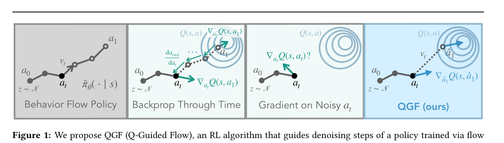

Fig.1 展示了三种思路的差异：BPTT 要穿过完整 denoising chain，noisy-gradient 直接在 $a_t$ 上问 Q，QGF 则先把 $a_t$ 近似成干净动作 $\hat{a}_1$，再在干净动作空间上取 Q 梯度。

> IQL 全称是 Implicit Q-Learning，是一种 offline RL 里的 value learning 方法。只用离线数据集里的动作训练 Q 函数，不需要从当前 policy 采样新动作。这对 offline RL 很重要，因为离线场景没有环境交互，如果 critic 去评估数据外动作，很容易产生错误高估。

# 核心方法精读

## 1. KL-regularized RL：为什么可以用 Q 梯度引导策略？

论文从行为正则化 RL 的目标开始：

$$
J(\pi_\theta)
=
\mathbb{E}_{\tau \sim \pi_\theta}
\left[
\sum_{t=0}^{\infty} \gamma^t r(s_t,a_t)
\right]
-
\beta
\mathbb{E}_{s \sim d_{\pi_\theta}(s)}
\left[
D_{KL}(\pi_\theta(\cdot \mid s) \| \hat{\pi}(\cdot \mid s))
\right]
$$

这里 $\hat{\pi}$ 是 reference behavior policy，也就是 BC 训练出来的 flow policy。

这个目标的闭式解可以写成：

$$
\pi(a \mid s)
\propto
\hat{\pi}(a \mid s)
\cdot
\exp(Q(s,a))^{1/\beta}
$$

直观理解：

- $\hat{\pi}(a \mid s)$：动作不能离数据分布太远；
- $\exp(Q(s,a))$：高价值动作应该被放大；
- $\beta$：控制“跟随数据”与“追求高 Q”的权衡。

如果对两边取 log 再对动作求梯度，就得到：

$$
\nabla_a \log \pi(a \mid s)
=
\nabla_a \log \hat{\pi}(a \mid s)
+
\frac{1}{\beta}\nabla_a Q(s,a)
$$

这就是 QGF 的理论直觉：原始 flow policy 的 score / velocity 负责保持动作像数据，Q 梯度负责把动作往高 reward 方向推。

## 2. Flow policy：动作不是一步生成，而是一步步 denoise

Flow matching 模型学习一个 time-dependent velocity field：

$$
v_\theta(x,t)
$$

它把简单噪声分布 $p_0=\mathcal{N}(0,I)$ 逐步运输到目标数据分布 $p_1=p(x)$。在策略里，目标数据就是数据集里的动作。

训练目标是：

$$
\mathcal{L}_{FM}(\theta)
=
\mathbb{E}_{t,x_0,x_1}
\left[
\|v_\theta(x_t,t) - (x_1-x_0)\|_2^2
\right]
$$

其中：

$$
x_t = (1-t)x_0 + tx_1
$$

在机器人动作里可以理解为：

- $x_0$：随机噪声动作；
- $x_1$：数据集里的真实动作；
- $x_t$：从噪声到真实动作之间的中间 noisy action；
- $v_\theta$：告诉模型从当前位置往哪个方向走，最终能变成真实动作。

## 3. 为什么不能直接用 noisy action 上的 Q 梯度？

最直接的 guidance 写法是：

$$
\nabla_{a_t} \log \pi(a_t \mid s)
\approx
\nabla_{a_t} \log \hat{\pi}(a_t \mid s)
+
\frac{1}{\beta}
\nabla_{a_t} Q(s,a_t)
$$

问题是 $a_t$ 是中间 noisy action，不是环境真正会执行的动作。critic $Q(s,a)$ 训练时看到的是干净动作，也就是最终 action，不是 denoising 中间态。

所以 $\nabla_{a_t}Q(s,a_t)$ 有两个风险：

- **OOD input**：critic 没学过 noisy action，输出和梯度都不可靠；
- **invalid action**：中间 $a_t$ 可能根本不是合法可执行动作。

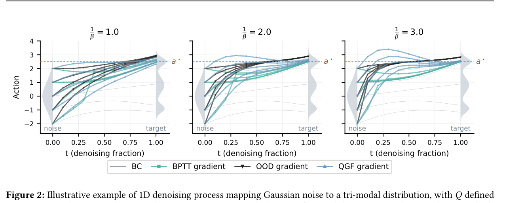

Fig.2 用一维 toy example 展示了这个问题。直接用 OOD gradient 会把 flow 引到错误模式，而 QGF 和 BPTT 更接近最优动作。

## 4. 为什么不直接 BPTT 穿过完整 denoising chain？

更原则的做法是：既然 noisy action $a_t$ 最后会经过 ODE 变成干净动作 $a_1$，那就定义：

$$
Q(s,a_t) := Q(s, ODE(a_t))
$$

然后计算：

$$
\nabla_{a_t}Q(s,ODE(a_t))
$$

这就要把 Q 的梯度从最终动作 $a_1$ 一路反传回中间动作 $a_t$，也就是 BPTT。

BPTT 的问题：

- 计算贵；
- 要存整条 denoising chain；
- 对噪声很敏感；
- 梯度方差高，test-time guidance 容易不稳定。

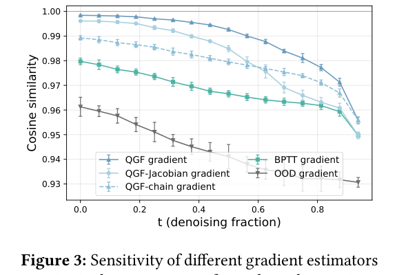

Fig.3 比较不同 gradient estimator 对噪声扰动的敏感性。QGF 的 cosine similarity 更接近 1，说明同一个状态下轻微扰动动作，梯度方向仍然稳定；BPTT 和带 Jacobian 的变体更敏感。

## 5. QGF 的核心近似：一步 Euler 到干净动作

QGF 的关键是：不完整跑 denoising chain，也不在 noisy action 上问 Q，而是做一个 cheap approximation。

给定当前 denoising step 的 noisy action $a_t$，用当前 velocity field 估计它一步走到最终干净动作的位置：

$$
\hat{a}_1
=
a_t + v_\theta(s,a_t,t)\cdot(1-t)
$$

这就是“一步 Euler 近似”：假设当前速度方向在剩余时间里大致有效，于是从 $t$ 一步走到 $1$。

然后在这个近似干净动作上计算 Q 梯度：

$$
g = \nabla_{\hat{a}_1}Q(s,\hat{a}_1)
$$

最后把它加到 flow velocity：

$$
a_{t+\delta}
=
a_t
+
\delta
\left(
v_\theta(s,a_t,t)
+
\frac{1}{\beta}g
\right)
$$

这就是 QGF。

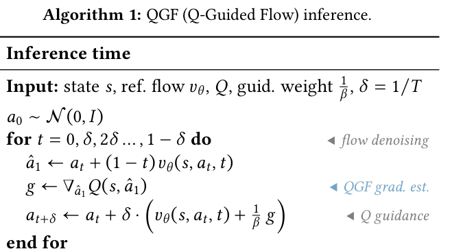

Algorithm 1 是完整推理流程。注意它只在 inference time 做，不更新 policy 参数。

## 6. 为什么丢掉 Jacobian 反而更好？

严格地说，$\hat{a}_1$ 是 $a_t$ 的函数，所以链式法则应该包含 Jacobian：

$$
\nabla_{a_t}Q(s,\hat{a}_1)
=
\left(
\frac{\partial \hat{a}_1}{\partial a_t}
\right)^\top
\nabla_{\hat{a}_1}Q(s,\hat{a}_1)
$$

但 QGF 直接把 Jacobian 近似成 identity：

$$
J \approx I
$$

这看起来很粗糙，但实验上更好。论文的解释是：真实 Jacobian 需要对 flow velocity 求导，在 early denoising step 中非常不稳定，会放大噪声。把它当成 identity 反而得到更低方差、更稳的 guidance。

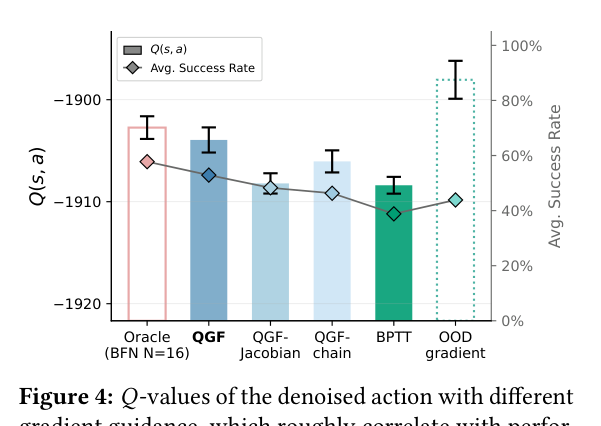

Fig.4 显示，QGF 在 gradient-based optimizer 里能产生更高 Q 的最终动作，并且接近 best-of-N oracle；但 OOD gradient 虽然能骗出更高 Q，实际性能差，因为它可能在 exploit critic。

# 实验结果

## 结果 1：QGF 超过已有 test-time 方法，接近最强 train-time 方法

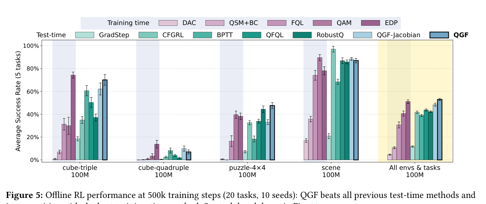

Fig.5 是主结果。实验在 OGBench 的 20 个 offline RL 任务上进行，动作使用 action chunking，动作维度更高。

对比方法分两类：

- **test-time 方法**：BFN、GradStep、QFQL、BPTT、CFGRL、RobustQ、QGF-Jacobian；
- **train-time 方法**：FQL、EDP、QAM、DAC、QSM+BC 等。

结论：

- QGF 明显超过已有 test-time guidance 方法；
- QGF 超过 QGF-Jacobian，说明不用 Jacobian 更好；
- QGF 和最强 train-time baseline 竞争，甚至略优；
- QGF 的 policy 训练仍然只是标准 BC / flow matching，没有训练时 actor-critic 优化。

## 结果 2：QGF 比 Best-of-N 省很多 test-time compute

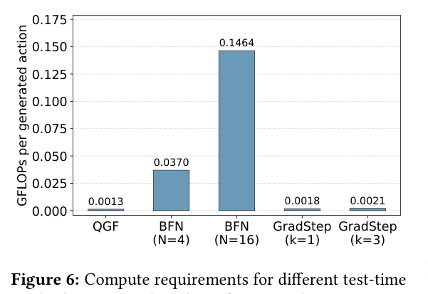

Fig.6 比较推理 FLOPs。Best-of-N 要完整生成多个 action，再用 critic 选最好的，所以成本随 $N$ 线性增加。QGF 只是在每个 denoising step 多算一个 Q gradient，成本低很多。

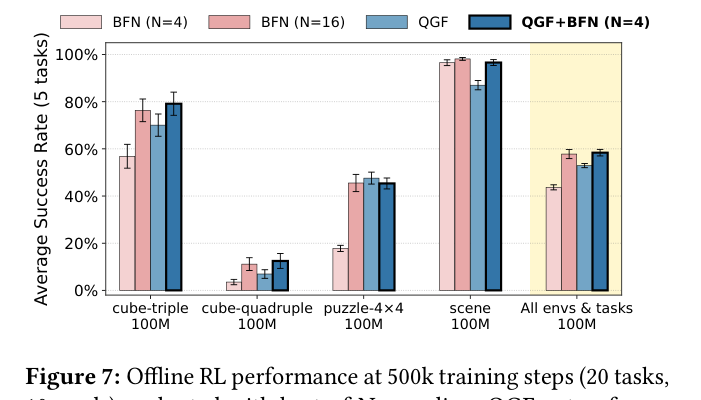

Fig.7 说明：

- QGF 单独就超过 BFN($N=4$)；
- BFN($N=16$) 用更多算力后能追上 QGF；
- QGF+BFN($N=4$) 能接近 BFN($N=16$)，但只需要更少 sample。

这说明 QGF 和 BFN 可以互补：QGF 先把单个样本质量提高，再用少量 best-of-N 做选择。

## 结果 3：越难的 goal-conditioned 任务，QGF 越有优势

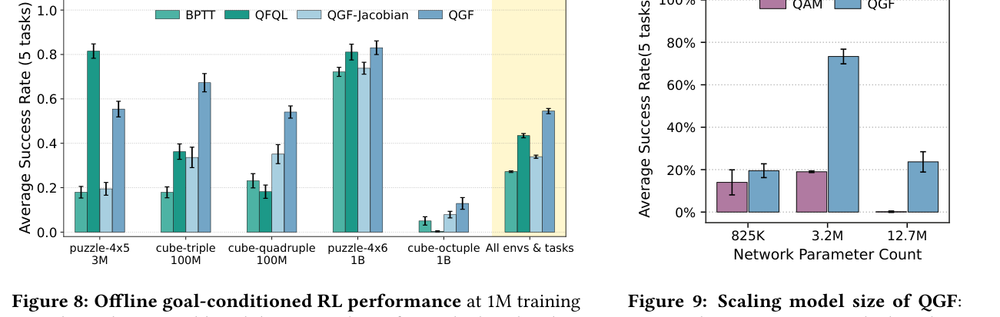

Fig.8 在更难的 goal-conditioned OGBench 上比较 BPTT、QFQL、QGF-Jacobian 和 QGF。

论文观察到：

- 在最简单的 puzzle-4x5 上，QGF 不一定最好；
- 任务变难后，QGF 持续成为最强；
- hard long-horizon tasks 中，低方差 gradient estimator 更重要。

这说明 QGF 的优势不是只来自 toy 或 easy setting，而是在长 horizon、高维 action chunk 中更明显。

## 结果 4：QGF 更能利用大模型

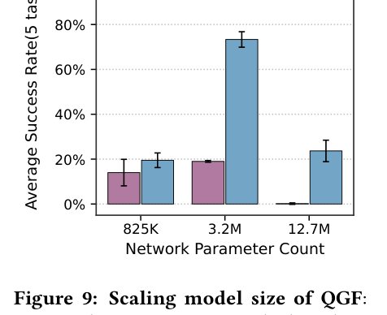

Fig.9 比较模型参数规模增加时 QGF 和 QAM 的变化。QAM 是 train-time 方法，QGF 是 test-time guidance。

结论：

- 从 825K 增加到 3.2M 参数时，QGF 有接近 4x 的性能跳升；
- QAM 没有类似提升；
- 继续增大到 12.7M 时，两者都出现 overfitting，但 QGF 受影响更小。

这符合论文主张：QGF 不在训练时用 critic 反向优化 actor，因此更少受到 actor-critic 不稳定影响，更容易享受 supervised flow policy scaling 的好处。

## 结果 5：QGF 可以搭配不同 critic

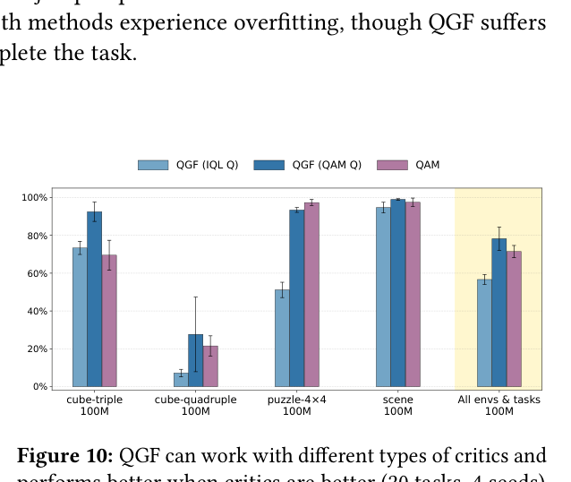

Fig.10 测试 QGF 是否依赖 IQL critic。结果显示，用 QAM-based critic 时，QGF 性能进一步提高，并且超过 QAM 自己的 policy extraction。

这说明 QGF 更像一个通用的 policy extraction / action refinement 方法：只要 critic 更好，QGF 可以直接受益。

# 与 baseline 的关键差异

| 方法 | 思路 | 问题 |
| --- | --- | --- |
| BFN | 多采样几个 action，用 critic 选最高 Q | 高维动作中很贵 |
| GradStep | 先生成干净动作，再做几步 Q gradient ascent | 只改最终动作，没有参与 denoising 过程 |
| QFQL / OOD gradient | 每步在 noisy action 上取 Q 梯度 | critic 没见过 noisy action，容易 OOD exploit |
| BPTT | 通过完整 denoising chain 反传 Q 梯度 | 贵、方差大、对噪声敏感 |
| QGF-Jacobian | 对一步近似动作使用完整 Jacobian | Jacobian 不稳定，方差更高 |
| QGF | 一步近似干净动作，在干净动作上取 Q 梯度，并忽略 Jacobian | 简单、低方差、性能最好 |
| Flow-GRPO | 训练时把 flow matching 模型转成可采样的随机过程，用 GRPO / group advantage 在线更新模型参数 | 需要在线采样和训练时 policy update，成本更高；更像 RL fine-tuning，不是纯 test-time 方法 |

Flow-GRPO 和 QGF 的核心区别在于**优化发生的时间点**。

- **Flow-GRPO**：在训练时做 RL。它把原本确定性的 flow ODE 转成带随机性的 SDE，让模型能采样一组 trajectory / denoising path，然后用 GRPO 根据相对 reward 更新 flow model 参数。它适合希望把 reward 偏好真正写进模型权重里的场景。
- **QGF**：在测试时做 guidance。它不更新 flow policy 参数，而是保留 BC / flow matching 训练好的 reference policy，只在每个 denoising step 用 critic gradient 临时修正动作生成方向。它适合已经有一个稳定 flow action head，希望部署时用 value function 提升动作质量的场景。

一句话：**Flow-GRPO 是“训练时 RL 微调 flow model”，QGF 是“推理时用 Q 梯度引导 flow policy”。**

# 在 VLA / 机器人 flow action head 里的运用

## 1. 架构逻辑：QGF 是动作生成头上的“测试时引导器”

如果一个 VLA 或机器人 foundation policy 使用 flow / diffusion action head，那么它通常长这样：

- **输入端**：视觉观测、语言指令、机器人状态；
- **预测端**：flow action head 从噪声逐步 denoise 出 action chunk；
- **执行端**：机器人执行生成的连续动作序列。

QGF 不替换视觉编码器，也不替换语言模型。它接入的是**动作生成头的 denoising 过程**：

```text
视觉/语言/状态上下文
        ↓
Flow action head 生成动作
        ↓
每个 denoising step 用 Q gradient 引导
        ↓
更高价值的 action chunk
```

可以把 QGF 理解成一个测试时的“动作修正器”：原始 flow policy 负责生成像数据的动作，critic 负责告诉它哪些动作更有价值。

## 2. 训练策略：分开训练，不端到端折腾 actor

QGF 的工程优势是训练流程很干净：

1. **训练 flow policy**：用 BC / flow matching 学习数据动作分布。
2. **训练 critic**：用 IQL、QAM critic 或其他 value learning 方法学习 $Q(s,a)$。
3. **部署时组合**：不更新 policy 参数，只在推理过程中用 Q 梯度引导动作生成。

这对大 VLA 特别重要，因为端到端 RL fine-tuning 一个大 flow action head 通常非常不稳定，也很贵。

## 3. 完整推理链条

部署时可以理解为：

1. 机器人看到图像和语言指令；
2. VLA backbone 输出状态上下文；
3. flow action head 从噪声开始生成动作；
4. QGF 在每个 denoising step 估计当前 noisy action 会到达的干净动作；
5. critic 在这个干净动作上给出梯度；
6. denoising velocity 加上 Q gradient；
7. 最终输出更高 Q 的连续 action chunk。

## 4. 为什么适合机器人

- **保留 BC 稳定性**：大规模机器人数据上先稳定模仿，不急着 RL。
- **支持多峰动作分布**：flow policy 仍然能表示多种可行动作。
- **测试时可调**：通过 guidance weight $1/\beta$ 控制“更像数据”还是“更追求高 reward”。
- **可和不同 critic 搭配**：更好的 value function 可以直接提升 QGF。
- **避免训练时 actor-critic 崩溃**：不需要把大 flow policy 在训练时反复接到 critic 上优化。

# 局限

- QGF 依赖 critic 质量。如果 Q 函数本身错了，test-time guidance 会把动作推向错误方向。
- guidance weight 需要谨慎调。过大时会把动作推离数据支持，论文 appendix 中也显示过强 guidance 会伤害性能。
- 当前验证主要是 offline RL / OGBench manipulation setting，还不是大规模真实机器人部署。
- QGF 增加了推理成本，虽然比 BFN 低很多，但仍然比普通 BC flow 多一次或多次 Q gradient。
- 对非常复杂的视觉语言条件任务，critic 如何训练、如何泛化仍是关键开放问题。

# 总结

这篇论文的核心贡献不是又提出一个训练时 actor-critic loss，而是把问题换了一个方向：

> policy 训练保持 supervised flow matching 的稳定性，reward optimization 放到 test time 做。

QGF 的关键技术点是：不要在 noisy action 上问 Q，也不要完整 BPTT 穿过 denoising chain，而是用一步 Euler 近似得到干净动作，在干净动作上取 critic gradient，再把它加到 denoising velocity 中。

实验上，QGF 超过已有 test-time 方法，接近甚至略优于强 train-time baseline，并且在更难任务、更大模型、更好 critic 下表现更有优势。这让它成为机器人 flow / diffusion action head 做 RL policy improvement 的一个很实用方向。

## 附录：PDF 解析与图表抽取自检

- PDF 已成功读取：标题、作者、摘要、章节结构、公式、Figure、Algorithm 均可解析。
- 已抽取关键图表：Fig.1、Fig.2、Fig.3、Algorithm 1、Fig.4、Fig.5、Fig.6、Fig.7、Fig.8、Fig.9、Fig.10。
- 使用图片裁剪的复杂图表：方法总览、toy guidance、梯度稳定性、主结果、BFN 对比、hard task 结果、model scaling、critic 对比。
- 公式已用 MathJax 形式重写，避免直接复制 PDF 乱码公式。
- 已检索 arXiv 和 GitHub；未找到明确公开接收信息。

## 索引信息

> 类别：论文笔记 / Offline RL / Flow Policy / Test-Time Compute / Robot Policy  
> 索引标签：#QGF #FlowPolicy #DiffusionPolicy #OfflineRL #TestTimeCompute #ValueGuidance #RobotLearning #VLA
