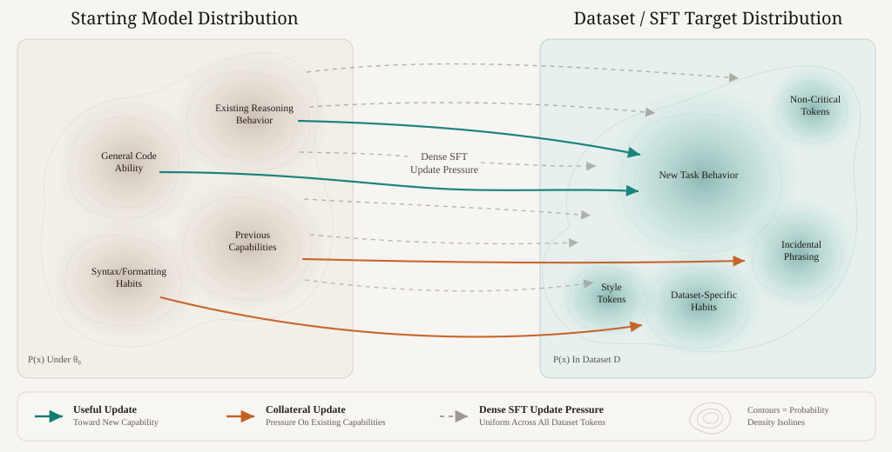
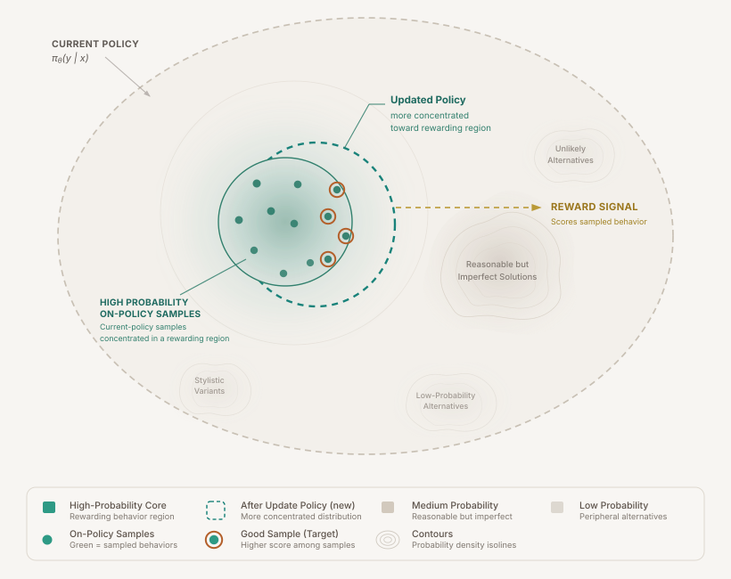
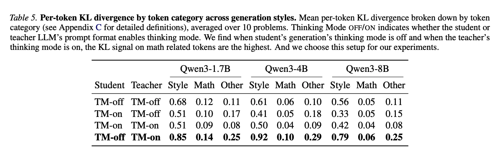
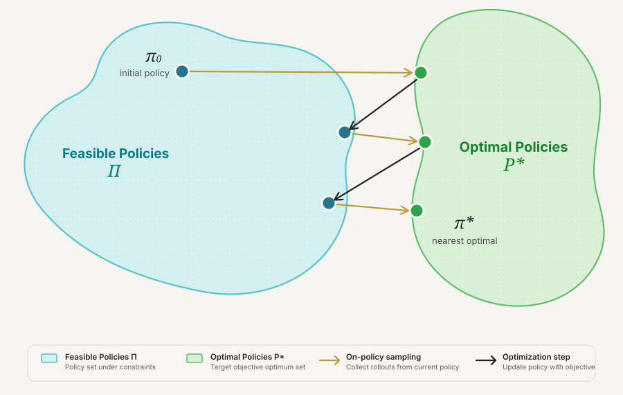
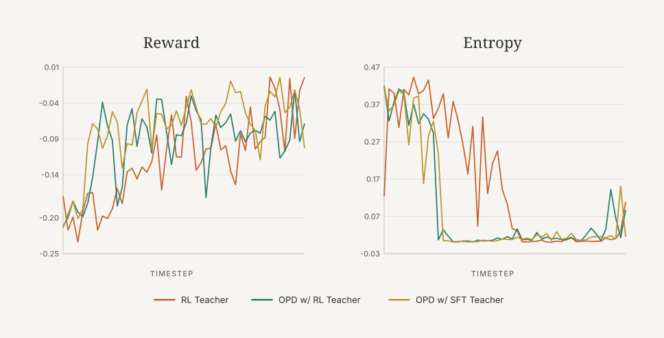
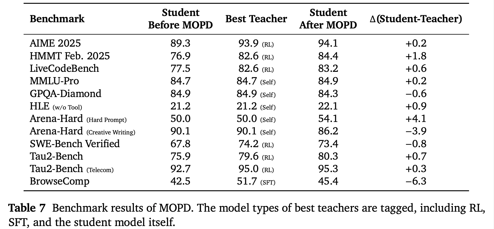

> SFT、RL 和 OPD 都是在重塑模型的输出分布。真正决定遗忘与泛化差异的，不只是监督信号强弱，而是训练数据来自哪里：外部固定数据，还是当前模型自己会访问到的 on-policy 状态。

# 背景

来源：[SFT, RL, and On-Policy Distillation Through a Distributional Lens](https://nrehiew.github.io/blog/sft_rl_opd/)  
本地原文：`raw/SFT, RL, and On-Policy Distillation Through a Distributional Lens _ wh.html`

这篇文章讨论一个很实用的问题：为什么 SFT、RL、OPD 都能提升某些能力，但它们对灾难性遗忘、泛化和训练稳定性的影响不一样？

作者给出的核心视角是：

> 语言模型是一个序列分布，后训练就是在改变这个分布的形状。

因此，不要只问“这个算法用了什么 loss”，而要问：

1. 它把模型拉向哪个目标分布？
2. 这个目标分布离当前模型有多远？
3. 训练样本来自外部数据，还是来自当前模型自己的生成分布？
4. 更新信号是稠密但有偏，还是稀疏但更接近任务目标？

# 一句话结论

SFT 像是把模型直接拉向一个外部示范分布；RL 像是在当前模型能采样到的区域里，把概率质量推向高奖励样本；OPD 则介于两者之间：它有 teacher signal，但数据来自 student 自己，因此也继承了部分 on-policy 的保守性。

# 分布视角：三种后训练方法到底在做什么？

## SFT：固定外部分布

SFT 的输入是一批已经存在的标注数据。它可能来自人工，也可能来自更强模型，但无论来源是什么，这个数据集在训练前就已经固定。

从分布角度看：

- 当前模型有自己的输出分布；
- SFT 数据定义了另一个外部目标分布；
- 交叉熵训练会直接把模型拉向这个外部分布。

这就是 SFT 容易遗忘的根源：loss 只关心“示范 token 的概率是否变高”，并不关心这些 token 是任务关键内容，还是风格、模板、偶然措辞。



这张图表达的是：SFT 的梯度压力比较“均匀”。它不只推动模型学习目标任务，也可能同时改写语法、推理风格、代码习惯等原有能力所在的分布区域。

### SFT 的适用位置

SFT 不是坏方法，它非常适合冷启动：

- 让模型学会基本指令格式；
- 让模型知道输出应该长什么样；
- 把一个预训练模型拉进可交互、可评测的区域。

但如果外部数据分布和原模型差异很大，SFT 没有内置机制要求“尽量少动原模型”，所以更容易出现灾难性遗忘。

## RL：沿当前策略的高奖励方向移动

Online RL 不一样。模型先从自己当前策略中采样，再由 reward function 打分，最后通过 policy gradient 提高高奖励样本的概率。

它的关键不是“没有目标分布”，而是目标分布不是任意外部给定的。RL 的更新只发生在当前模型自己能访问到的区域：

1. 当前模型生成样本；
2. reward 选择哪些样本更好；
3. policy update 把概率质量推向这些高奖励样本。



这张图的直觉是：RL 更像是在当前模型分布附近做局部形变。它不会像 SFT 那样对外部数据里的每个 token 都施加同等压力，而是主要更新模型自己采样到、且 reward 较高的轨迹。

### RL 的条件

RL 是否有效，很大程度取决于 reward 是否可靠：

- 在 RLVR 中，数学、代码这类任务有可验证 reward，奖励方向通常更可信；
- 在 RLHF 中，reward model 更有偏，容易出现 reward hacking 或过优化；
- outcome reward 很稀疏，导致 RL 的 credit assignment 成本很高。

## OPD：带 teacher signal 的 on-policy distillation

On-Policy Distillation（OPD）介于 SFT 和 RL 之间。

它像 SFT，因为它有 teacher distribution；student 会被训练去匹配 teacher 的 logits 或概率分布。  
它也像 RL，因为训练数据不是 teacher 生成的，而是 student 自己 on-policy 采样出来的。

可以把 OPD 理解成：

1. student 根据当前策略生成 prefix 或完整回答；
2. teacher 在 student 自己访问到的状态上给出分布指导；
3. student 通过 KL matching 学习 teacher 的偏好。

这点很关键：teacher 提供的是信号，但状态分布仍然是 student 的。

## OPSD：更细粒度，但也更有偏

文章还讨论了 On-Policy Self Distillation（OPSD）。它的 teacher 和 student 是同一个模型，只是 teacher 在计算 log probability 时拿到了 reference solution 作为 prefix，相当于拥有额外信息。

OPSD 的问题是：teacher 和 student 大多数 token 的输出很接近，真正产生高 KL 的 token 不一定是任务关键 token。



图里的 token 级 KL 分析说明：style token 或 pivot token，例如 “wait”“alright”，可能比数学概念 token 产生更高 KL。也就是说，高 KL 不一定等于高任务价值。

这让 OPSD 更像 RLHF 而不是 RLVR：信号很密集，但偏差也更大，所以需要 per-token clipping 之类的保护，避免模型因为风格 token 过度更新而 collapse。

# OPD teacher 实验：teacher 强弱不是唯一关键

作者在 Minimal Code Editing 任务上做了一个很有启发的实验。

任务是：给模型一个被破坏的函数，让它只修 bug，不要重写其他部分。这个环境能同时测试：

- **泛化**：训练用一种 corruption，测试用另一种 corruption，看模型是否真的学会“最小编辑”；
- **遗忘**：用 LiveCodeBench 检查模型的一般代码生成能力有没有下降。

作者先训练两个 teacher：

- 一个 SFT teacher；
- 一个 RL teacher。

直觉上，RL teacher 泛化更好、遗忘更少，因此用 RL teacher 做 OPD 应该明显优于 SFT teacher。但实验结果不是这样。

| Model | Pass@1 ↑ | Norm. Levenshtein ↓ | Added CC ↓ | LiveCodeBench v6 ↑ |
| --- | ---: | ---: | ---: | ---: |
| SFT teacher | 0.775 | 0.450 | 0.450 | 0.286 |
| RL teacher | 0.792 | 0.063 | 0.206 | 0.320 |
| OPD from SFT teacher | **0.800** | 0.059 | **0.206** | 0.297 |
| OPD from RL teacher | 0.787 | **0.055** | 0.228 | **0.314** |

最反直觉的结果是：

- 两个 OPD student 非常接近；
- 两个 OPD student 都显著超过 SFT teacher；
- OPD student 甚至可以略微超过 RL teacher；
- 即使用发生遗忘的 SFT teacher，OPD student 也没有继承同等程度的遗忘。

这说明 teacher 本身不是唯一关键变量。OPD 的抗遗忘能力，很大一部分来自 on-policy 数据来源：student 是在自己会访问到的状态上接受指导，而不是被迫模仿 teacher 自己的轨迹分布。

# 为什么 RL 更少遗忘？

文章梳理了几种常见解释，但作者最偏好的解释是 on-policy data。

## 解释 1：SFT 是 forward KL，RL 更像 reverse KL

`forward KL` 和 `reverse KL` 都是在衡量两个分布有多不一样，但方向不同，行为差很多。

设真实/目标分布是 `p(x)`，模型分布是 `q(x)`。

### Forward KL

$$
D_{KL}(p \| q) = \sum_x p(x)\log \frac{p(x)}{q(x)}
$$

它问的是：

> p 认为重要的地方，q 有没有覆盖到？

如果 `p(x)` 很大但 `q(x)` 很小，惩罚会非常大。所以 forward KL 会逼模型覆盖目标分布的所有模式。

直觉：**mode-covering**。

例子：目标分布有三个答案风格 A/B/C，forward KL 会希望模型三个都学到，不要漏掉任何一个。

SFT 通常更接近这个方向：数据分布里出现的 token，模型都要提高概率。

### Reverse KL

$$
D_{KL}(q \| p) = \sum_x q(x)\log \frac{q(x)}{p(x)}
$$

它问的是：

> q 自己会输出的地方，p 是否也认可？

如果 `q(x)` 很大但 `p(x)` 很小，惩罚会很大。所以 reverse KL 会让模型避免输出目标分布不支持的区域。

直觉：**mode-seeking**。

例子：目标分布有三个可行答案 A/B/C，reverse KL 可能只选择其中一个最稳的模式，把概率集中上去，而不是覆盖全部。

RL / OPD 常被用 reverse KL 的视角理解：模型主要在自己采样到的区域里移动，倾向于找到一个高 reward / 高 teacher probability 的近邻解。

## 核心区别

| 方向 | 关注点 | 行为 | 风险 |
|---|---|---|---|
| `D_KL(p || q)` forward KL | 目标分布 p 的区域有没有被 q 覆盖 | mode-covering | 为了覆盖数据，可能学到无关风格，容易冲击原能力 |
| `D_KL(q || p)` reverse KL | 模型 q 自己输出的区域是否被 p 认可 | mode-seeking | 可能 mode collapse，多样性下降 |

一句话：

> Forward KL 怕“漏掉目标数据里的模式”；Reverse KL 怕“模型跑到目标不认可的地方”。

SFT 的交叉熵目标可以看成最小化数据分布到模型分布的 forward KL：

$$
D_{KL}(p \| q_\theta)
= \sum_x p(x)\log \frac{p(x)}{q_\theta(x)}
= -H(p) + H(p, q_\theta)
$$

直观上，forward KL 更偏 mode-covering：它会努力覆盖外部数据分布里的模式。对 SFT 来说，这意味着模型可能为了拟合新数据而牺牲旧能力所在的模式。

一些工作把 RL 和 reverse KL 联系起来，认为 reverse KL 更 mode-seeking，因此更少遗忘。这个解释有用，但作者认为它不完整：现实中即使显式 KL penalty 很弱，RLVR 仍然常常表现出抗遗忘特性。

## 解释 2：SFT 有更均匀、更激进的 token 级梯度

SFT 对每个示范 token 都给监督。它不区分：

- 这个 token 是数学符号、关键代码编辑，还是任务真正需要的内容；
- 这个 token 只是风格词、连接词、模板痕迹。

如果某个 token 在原模型里概率低、模型又很确信自己不该输出它，SFT 仍然会强行拉高它的概率，这会冲击已有表示。

RL 则有一定的数据依赖正则。例如 reward 在 group 内 normalize 时，高不确定、高方差的样本组更新会更小；模型已经能稳定产生高 reward 的区域，更新会更集中。

## 解释 3：RL 参数更新更稀疏

文章引用的相关工作发现：

- RL 往往只更新模型中的较小子网络；
- SFT 的更新更 dense，也更冗余；
- 当剪掉可更新参数时，RL 性能下降更快，说明 RL 更新更集中、更关键。

这个解释对 SFT vs RL 有帮助，但它仍然不能自然解释 OPD：OPD 不是标准 RL，却也表现出类似的抗遗忘行为。

# 作者最偏好的解释：on-policy data

文章真正强调的是：on-policy 数据本身隐含了一种保守约束。

用一个极简 REINFORCE 例子理解：

1. 当前模型生成回答；
2. reward 是二值的，成功为 1，失败为 0；
3. 成功样本提供正训练信号，失败样本几乎不推动更新。

这时 reward 像一个 filter，把当前模型采样到的成功轨迹挑出来。所有能完成任务的最优策略里，on-policy 训练更倾向于找到离当前模型最近的那个最优策略。



这张图就是核心：on-policy training 不是把模型拉向任意外部目标，而是在当前模型已经会访问的区域附近，寻找最近的任务解。

因此：

- RL 少遗忘，不一定主要因为显式 KL；
- OPD 少遗忘，也不一定主要因为 teacher 很强；
- 共同点是训练数据来自当前模型自己的分布。

# 为什么 OPD student 可能超过 teacher？

这是实验中最有趣的部分之一。文章没有给出确定答案，但给了几个合理假设。

第一，OPD 的监督更有针对性。传统 distillation 常常让 student 模仿 teacher 生成的轨迹，但 student 的错误不一定是 teacher 的错误。如果训练只覆盖 teacher 轨迹，student 在自己常犯错的状态上可能得不到足够指导。OPD 则是在 student 自己的 prefix 上让 teacher 给建议。

第二，KL matching 不等于简单复制 teacher 的 greedy 输出。teacher distribution 里包含风格、不确定性、备选继续方式、推理结构等信息。匹配这个分布可能改变 student 的采样行为，使 student 的最终表现超过 teacher 自己的 sampled output。

第三，OPD 更容易带来 mode collapse。文章观察到 OPD 的 reward 提升更突然，同时 entropy 下降更剧烈，这符合 reverse KL / mode-seeking 训练会收缩分布的直觉。



这张图显示：RL 的 reward 增长更平滑，而 OPD 的 reward 突然上升，并伴随明显 entropy collapse。它既解释了 OPD 为什么能快速强化某种能力，也提示了过度收缩分布的风险。

# 为什么 RL 和 OPD 泛化更好？

文章把这个问题和 imitation learning 里的 distribution shift 联系起来。

SFT 只让模型看到 teacher 或数据集里的状态。测试时模型是自回归生成的，只要前面一步出错，就可能进入 teacher 从未访问过的状态。后续模型还要在这些陌生状态上继续生成，于是错误会累积。

RL 和 OPD 更接近 on-policy data aggregation：

- RL 直接在当前策略样本上学习；
- OPD 在 student 自己生成的 prefix 上接受 teacher 指导；
- 训练时覆盖了模型自己真实会访问的状态，因此 test-time mismatch 更小。

这解释了为什么 OPD 即使使用一个发生遗忘的 SFT teacher，也不一定继承同样程度的遗忘。

# 完整后训练流水线

文章认为开放模型常见路线是：

```text
Pretrain -> SFT -> RL -> OPD
```

每一步角色不同：

1. **Pretrain**：提供基础语言、知识和代码能力。
2. **SFT**：做格式对齐和基础指令遵循，没有这一步 RL 通常很难高效开始。
3. **RL**：适合数学、代码等 reward 相对可靠的能力专家训练。
4. **OPD**：适合把多个 expert 的能力合并进最终模型，也常用于最终 checkpoint 的能力整合。



MiMo-V2 Flash 的表格给了一个有用参考：

- 数学和代码任务更适合 RL，因为 reward 可验证；
- 创作、知识密集问答等任务更适合 distillation 或 self-distillation，因为 reward 更有偏；
- 一些最终模型通过 OPD 合并 expert 能力，最终 checkpoint 本身可能没有再经历 RL。

# 对“最佳算法”的判断

文章最后讨论了一个更大的问题：有没有一种算法，比 RL 更 compute-optimal，同时仍然能维持 capability 和 KL movement 的 Pareto frontier？

作者的判断是：这样的算法必须依赖 on-policy data。

原因是：

- RL 的 outcome reward 低偏，但太稀疏，credit assignment 成本高；
- distillation 的 token-level signal 很密集，但 teacher signal 有偏；
- SFT 简单稳定，但目标分布可能离当前模型太远；
- OPD 展示了 on-policy 数据和 dense teacher signal 结合的潜力，但仍然需要处理 bias、clipping 和 entropy collapse。

所以理想算法需要同时具备三点：

1. **distillation 的密集信号**：每个 token 或每个中间步骤都有学习信号；
2. **RL 的低偏差目标**：优化方向尽量贴近真实任务成功；
3. **on-policy 的保守移动**：训练状态来自当前模型，避免被拉向过远的外部分布。

文章没有给出具体算法，但把问题形状讲清楚了：后训练的关键不是简单在 SFT、RL、OPD 中选一个，而是在“信号密度、目标偏差、分布移动距离”之间做权衡。

# 工程启发

- SFT 适合作为冷启动和格式对齐，但不要期待它天然抗遗忘。
- RL 适合 reward 明确的任务，尤其是数学、代码、可验证推理。
- OPD 适合将专门训练过的 expert 能力合并到 student，同时减少直接 SFT 带来的分布冲击。
- 如果某个 teacher 是通过 SFT 过度训练得到的，它仍然可能作为 OPD teacher 有价值，因为 OPD 的学生不是在 teacher 轨迹上训练，而是在自己的 on-policy 状态上训练。
- OPD 需要关注 entropy collapse 和 style-token over-update，高 KL token 不一定是高价值 token。
- 后训练分析应同时看任务指标、遗忘指标、entropy、token-level KL 和训练数据的状态分布来源。

# 总结

这篇文章最重要的贡献，是把 SFT、RL、OPD 放到同一个分布塑形框架里理解。

SFT 的问题不是“监督学习不行”，而是它直接拟合外部数据，缺少靠近原模型的约束。RL 的优势也不只是“奖励更强”，而是它在当前策略采样到的区域内寻找高奖励解。OPD 的实验进一步说明，teacher 强弱不是全部，student 自己的 on-policy 数据分布才是抗遗忘和泛化的重要来源。

最终的判断是：未来更好的后训练算法，大概率要结合 OPD 的密集监督、RL 的低偏差目标，以及 on-policy training 的保守分布移动。

## 索引信息

> 类别：文章笔记 / 大模型后训练 / 分布视角  
> 索引标签：#SFT #RL #OPD #OPSD #后训练 #OnPolicy #灾难性遗忘 #分布塑形 #Distillation #RLVR
