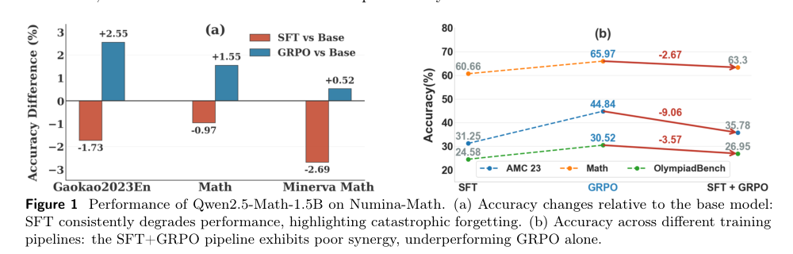
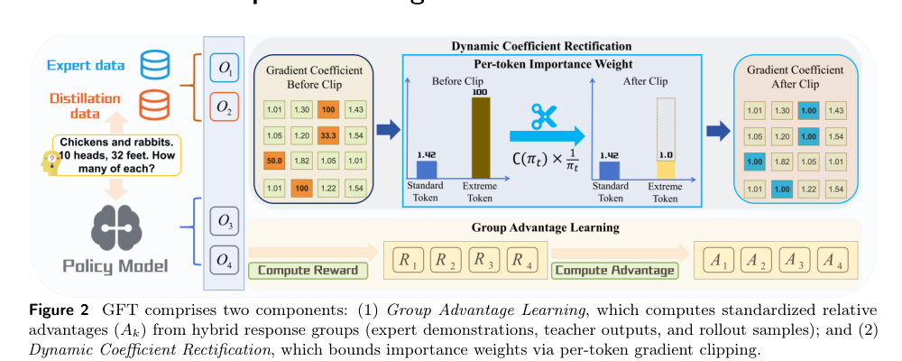
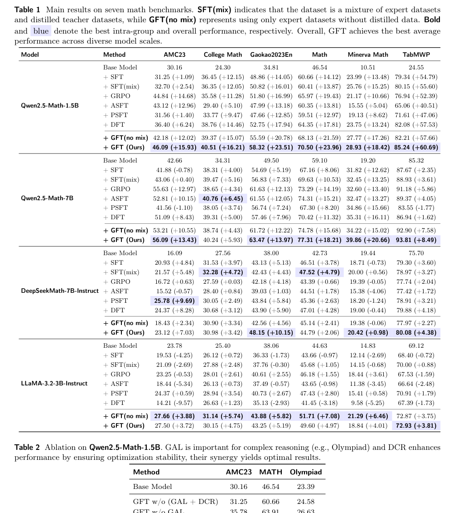
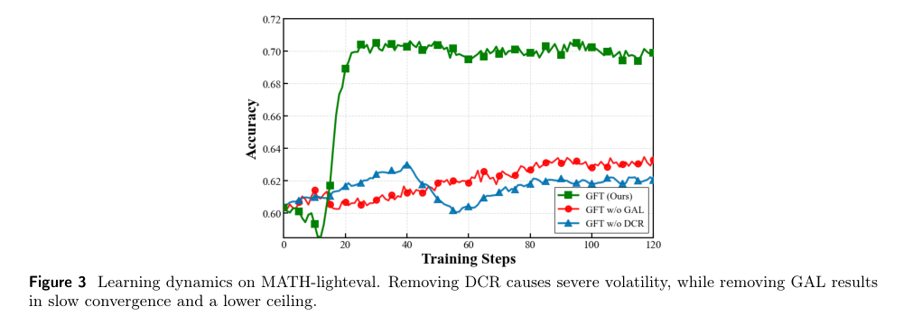
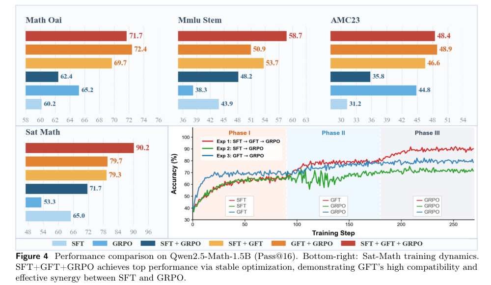
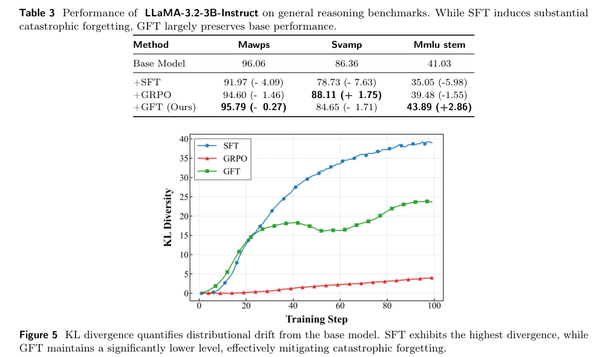
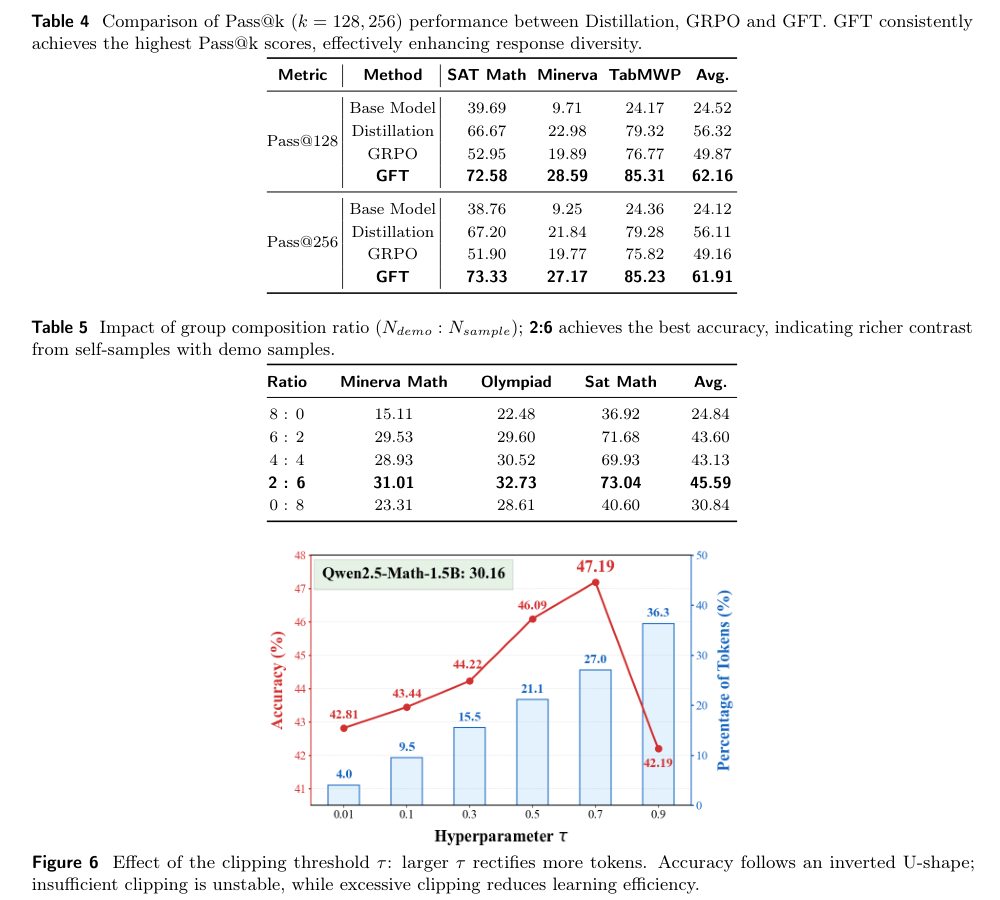

> GFT 的核心是把 SFT 看成一种退化的 policy gradient：只有专家轨迹有奖励，而且低概率 token 会被反概率权重放大。它用 group advantage 把单一路径监督改成组内对比学习，再用动态系数修正压住极端 token 的梯度爆炸，从而在 SFT 的知识注入和 RL 的探索泛化之间做一个更平滑的过渡。

# 论文概览

论文：**GFT: From Imitation to Reward Fine-Tuning with Unbiased Group Advantages and Dynamic Coefficient Rectification**  
作者：Wangjie Gan, Miao Pan, Linbo Xi, Wenqi Zhang, Jintao Chen, Jianwei Yin, Xuhong Zhang  
机构：Zhejiang University, ZJU ACES Lab / OmniAI Group  
本地 PDF：`raw/GFT From Imitation to Reward Fine-Tuning with Unbiased Group Advantages and Dynamic Coefficient Rectification.pdf`

资源：

- arXiv：<https://arxiv.org/abs/2604.14258>
- GitHub：<https://github.com/ZJU-OmniAI/GFT>
- Hugging Face Paper：<https://huggingface.co/papers/2604.14258>
- 版本日期：2026-04，PDF 中标注 arXiv v3 为 2026-05-02

一句话总结：

> GFT 把 SFT、distillation 和 self-sampling 放进一个 group-wise reward fine-tuning 框架，用组内标准化 advantage 提供更密的对比信号，并用 Dynamic Coefficient Rectification 限制低概率 token 的更新幅度，让模型既能吸收新知识，又不把策略压成低熵、难以继续 RL 的窄分布。

# 背景：SFT 和 RL 的后训练矛盾

LLM 后训练常见路线是：

1. 用 SFT 做 cold start，让模型学会格式、任务步骤和基本能力；
2. 再用 RL / GRPO / PPO 按 reward 优化，提升推理、可验证任务或偏好对齐。

问题在于，这两步并不总是协同。论文用 Qwen2.5-Math-1.5B 在 Numina-Math 上的结果说明：

Fig.1 的信息可以压缩成两点：

- SFT 相对 base model 可能带来灾难性遗忘：某些泛化任务下降；
- GRPO 单独能带来明显收益，但 `SFT -> GRPO` 的收益低于直接 GRPO，说明 SFT 会收窄后续 RL 的探索空间。

这就是论文说的 **synergy dilemma**：SFT 擅长知识注入，但容易把模型拉向单一示范分布；RL 擅长沿 reward 搜索更好的策略，但需要策略保留足够探索空间。

# 核心诊断：SFT 梯度如何变成退化 policy-gradient

论文附录 A 的推导不是为了“炫公式”，而是为了说明：SFT 看起来是普通的 supervised learning，但它的梯度可以通过 **重要性采样（Importance Sampling）** 改写成当前策略分布下的 policy-gradient-like 形式。这个改写会暴露两个问题：奖励极稀疏，以及低概率专家 token 会带来 $1/\pi_\theta$ 级别的放大。

## 0. 符号说明

- $x$：训练集里的 prompt / question。
- $y$：模型或专家给出的 response / answer。
- $p_D(x)$：训练数据里 prompt 的边缘分布，可以理解成“从数据集抽到某个问题 $x$ 的概率”。
- $p_{\text{exp}}(y|x)$：专家答案分布，表示专家在 prompt $x$ 下给出 response $y$ 的概率。
- $\pi_\theta(y|x)$：当前模型策略，表示模型参数为 $\theta$ 时，在 prompt $x$ 下生成 response $y$ 的概率。
- $q_\theta(x,y)$：当前模型 rollout 的联合分布，后面会定义为 $p_D(x)\pi_\theta(y|x)$。

## 1. 从 SFT 的 NLL loss 开始

设 prompt 分布为 $p_D(x)$，专家响应分布为 $p_{\text{exp}}(y|x)$。标准 SFT 最小化 negative log-likelihood：

$$
L_{\text{SFT}}(\theta)
=
-
\mathbb{E}_{x \sim p_D,\; y \sim p_{\text{exp}}(\cdot|x)}
\left[
\log \pi_\theta(y|x)
\right]
$$

因此 loss gradient 是：

$$
\nabla_\theta L_{\text{SFT}}
=
-
\mathbb{E}_{x \sim p_D,\; y \sim p_{\text{exp}}(\cdot|x)}
\left[
\nabla_\theta \log \pi_\theta(y|x)
\right]
$$

如果把期望写成积分，就是：

$$
\nabla_\theta L_{\text{SFT}}
=
-
\int_x
\int_y
p_D(x)\,p_{\text{exp}}(y|x)
\nabla_\theta \log \pi_\theta(y|x)
\,dy\,dx
$$

## 2. 引入当前策略分布

现在定义当前模型 rollout 的联合分布：

$$
q_\theta(x,y)
=
p_D(x)\pi_\theta(y|x)
$$

也就是说，$q_\theta(x,y)$ 表示：先从训练 prompt 分布 $p_D(x)$ 里抽一个问题 $x$，再让当前模型 $\pi_\theta$ 对这个问题生成答案 $y$。它和专家数据联合分布 $p_D(x)p_{\text{exp}}(y|x)$ 的区别只在第二步：一个用专家答案分布，一个用当前模型分布。

我们想把“专家分布下的期望”改写成“当前策略分布下的期望”。根据重要性采样：

$$
\mathbb{E}_{y \sim p_{\text{exp}}(\cdot|x)}[f(y)]
=
\mathbb{E}_{y \sim \pi_\theta(\cdot|x)}
\left[
\frac{p_{\text{exp}}(y|x)}{\pi_\theta(y|x)}
f(y)
\right]
$$

把 $f(y)=\nabla_\theta \log \pi_\theta(y|x)$ 代入，就得到：

$$
\nabla_\theta L_{\text{SFT}}
=
-
\int_x
\int_y
p_D(x)\pi_\theta(y|x)
\frac{p_{\text{exp}}(y|x)}{\pi_\theta(y|x)}
\nabla_\theta \log \pi_\theta(y|x)
\,dy\,dx
$$

也就是：

$$
\nabla_\theta L_{\text{SFT}}
=
-
\mathbb{E}_{x \sim p_D,\; y \sim \pi_\theta(\cdot|x)}
\left[
\frac{p_{\text{exp}}(y|x)}{\pi_\theta(y|x)}
\nabla_\theta \log \pi_\theta(y|x)
\right]
$$

这里的关键项是 importance weight：

$$
\frac{p_{\text{exp}}(y|x)}{\pi_\theta(y|x)}
$$

## 3. 退化到单条专家示范

普通 SFT 数据集里，一个 prompt 通常只对应一条专家答案 $y^*$。这等价于专家分布是一个 indicator：

$$
p_{\text{exp}}(y|x)
=
\mathbb{I}[y=y^*]
$$

代入上式：

$$
\nabla_\theta L_{\text{SFT}}
=
-
\mathbb{E}_{x \sim p_D,\; y \sim \pi_\theta(\cdot|x)}
\left[
\frac{\mathbb{I}[y=y^*]}{\pi_\theta(y|x)}
\nabla_\theta \log \pi_\theta(y|x)
\right]
$$

这就是论文说的“把 SFT 看成一种退化 policy-gradient”的来源。它不是普通的 policy gradient：

$$
-
\mathbb{E}
\left[
\mathbb{I}[y=y^*]
\nabla_\theta \log \pi_\theta(y|x)
\right]
$$

关键差别是 SFT 的 on-policy 改写里多了一个 $1/\pi_\theta(y|x)$。因此它形式上像“只奖励专家答案”的 policy gradient，但更新幅度又会被反概率权重放大。

这个推导暴露了 SFT 的两个结构性问题。

## 1. 单路径依赖

隐式 reward 是：

$$
r(x,y)=\mathbb{I}[y=y^*]
$$

也就是说，只有完全等于专家答案的轨迹有奖励，其他合理路径都没有信号。对于数学推理、代码、复杂指令来说，这会导致：

- 多种正确解法被压成一条示范路径；
- 模型学到“照着数据集风格写”，而不是“找到高 reward 的解”；
- 策略熵下降，后续 RL 可探索的区域变小。

## 2. 反概率权重导致梯度爆炸

SFT 的 on-policy 改写里有一项：

$$
\frac{1}{\pi_\theta(y|x)}
$$

当专家 token 合理但模型当前概率很低时，这个系数会非常大。直觉上，它像是在告诉模型：

> 越是不熟悉但在示范里出现的 token，越要用更大的力硬拉过去。

这解释了为什么 SFT 很容易机械记忆、过拟合、分布漂移和灾难性遗忘。

# 方法：Group Fine-Tuning

GFT 用两个机制对应修复上面的两个问题：

1. **Group Advantage Learning (GAL)**：把单条专家路径扩展成一组候选 response，用组内 reward 标准化得到 advantage；
2. **Dynamic Coefficient Rectification (DCR)**：对低概率 token 的反概率权重做动态截断，避免梯度爆炸。

## 1. Group Advantage Learning：从单一路径到组内对比

对每个 query $x$，GFT 构造一个 response group：

$$
G_x = \{y_1,\ldots,y_K\}
$$

这组样本来自三类来源：

| 来源 | 作用 |
| --- | --- |
| Expert Demonstrations | 提供可靠 ground truth，保证有稳定优化方向。 |
| Teacher Distillations | 引入更强模型的不同推理模式，打破单路径依赖。 |
| Self-Generated Samples | 引入当前模型自己的 rollout，让训练更接近 on-policy。 |

论文默认设置是 $K=8$：1 条专家示范、3 条 Qwen2.5-Math-72B teacher distillation、4 条 self-generated samples。

对组内每个 response 打 reward $R(y_k)$，然后做标准化：

$$
A(y_k)
=
\frac{R(y_k)-\mu_R(G_x)}{\sigma_R(G_x)+\epsilon}
$$

这和 GRPO 的直觉很近：不直接看绝对 reward，而是看“这条 response 在同组里相对好不好”。好处是：

- reward 从单点监督变成组内对比；
- 不同来源的 response 可以放在同一尺度比较；
- 模型既能学专家答案，也能学 teacher 的多样 reasoning，还能修正自己的 rollout。

## 2. Dynamic Coefficient Rectification：压住极端 token 更新

GAL 解决了“只看一条示范路径”的问题，但还需要处理反概率权重爆炸。

论文提出 DCR，对 token-level 概率 $\pi_t$ 定义修正系数：

$$
C(\pi_t)
=
\begin{cases}
\text{sg}(\pi_t), & \pi_t < \tau \\
1, & \pi_t \ge \tau
\end{cases}
$$

其中 $\text{sg}(\cdot)$ 是 stop-gradient，$\tau$ 是置信度阈值。

直觉是：

- 如果 token 概率正常，保留原始梯度，让模型高效吸收新知识；
- 如果 token 概率极低，就用 stop-gradient 形式把有效系数界住，避免 $1/\pi_t$ 把梯度炸穿。

这和简单把所有低概率 token 都压小不一样。DCR 想保留“中等低概率但有学习价值”的 token 更新，只控制极端情况。

## 3. 最终目标

GFT 的序列级梯度写作：

$$
\nabla_\theta L
=
\mathbb{E}_{y_k \in G_x}
\left[
A(y_k)
\frac{C(\pi)}{\pi_\theta(y_k|x)}
\nabla_\theta \log \pi_\theta(y_k|x)
\right]
$$

token-level 形式则把 response 拆成每个 token 的 $\pi_{k,t}$，用同一个 advantage $A(y_k)$ 加权整条 response 中的 token 更新。

从关系上看：

- group 退化成单条 expert response 时，GFT 接近 SFT；
- group 里有多条 sampled trajectories 和非平凡 advantage 时，GFT 接近 group-normalized policy gradient；
- DCR 让这个 policy gradient 不至于被低概率 token 的反概率项放大到不稳定。

# 实验结果

## 主结果：10k group 数据超过 100k SFT

实验覆盖多个模型族：

- Qwen2.5-Math-1.5B / 7B；
- DeepSeekMath-7B；
- LLaMA-3.2-3B / LLaMA-3.1-8B。

训练数据使用 NuminaMath CoT。为了对齐训练量：

- GFT / GRPO 使用 10k queries，每个 query 8 条 trajectories；
- SFT、DFT、ASFT、PSFT 等单轨迹方法使用 100k samples。

Table 1 的核心结论：

- GFT 用 10k group 数据，在多模型、多数学 benchmark 上超过标准 SFT 和 DFT / ASFT / PSFT；
- `GFT(no mix)` 和完整 GFT 差距不大，说明收益不只是来自额外 teacher 数据，而主要来自 group advantage 和 DCR；
- 在 Qwen2.5-Math 上，GFT 对 AMC23、MATH、Minerva、TabMWP 等都有比较均匀的提升。

## 消融：GAL 管复杂推理，DCR 管稳定性

Table 2 和 Fig.3 验证两个组件的作用：

论文的结论是：

- 去掉 GAL：复杂任务，尤其 Olympiad，下降明显，说明组内对比信号对难题更重要；
- 去掉 DCR：训练曲线更震荡，说明动态修正主要负责稳定优化；
- 两者同时存在时，收敛速度和最终性能最好。

# 和后续 RL 的关系

GFT 不是想替代所有 RL，而是想解决 `SFT -> RL` 的交接问题。

论文比较了几种 pipeline：

- SFT；
- GFT；
- GRPO；
- SFT + GRPO；
- GFT + GRPO；
- SFT + GFT + GRPO。

最重要的观察是：`SFT + GFT + GRPO` 达到最高 performance ceiling。这个结果说明：

1. SFT 仍然适合做基础 cold start 和格式对齐；
2. GFT 可以在 SFT 后恢复一部分探索能力，并把策略从单一路径 imitation 拉回更宽的 response support；
3. GRPO 最后利用更高质量、更有多样性的 rollout 继续提升 reward。

换句话说，GFT 在 pipeline 中像一个“RL 友好的过渡层”：它不直接把模型推到极窄的示范分布，而是保留后续 RL 需要的可探索区域。

# 遗忘与多样性

## 灾难性遗忘

论文用 LLaMA-3.2-3B-Instruct 在 MAWPS、SVAMP、MMLU-STEM 上看一般推理能力保留，并用 KL divergence 衡量相对 base model 的分布漂移。

结果显示：

- SFT 在 MAWPS、SVAMP、MMLU-STEM 上都有明显掉点；
- GFT 基本保留 base 能力，MMLU-STEM 还提升；
- KL 曲线上，SFT 的分布漂移最大，GFT 接近 GRPO，说明它没有像纯 SFT 那样大幅重写 base policy。

这和前面的理论诊断一致：GAL 避免只拟合单条外部示范，DCR 抑制极端 token 的巨大更新，因此整体分布漂移更小。

## 解法多样性和超参数

论文用 Pass@128 / Pass@256 评估 solution coverage，并比较 Distillation、GRPO 和 GFT。

关键结论：

- GFT 的 Pass@128 / Pass@256 最高，说明它不是只把概率集中到一条最常见答案，而是保留了更多有效解法；
- Distillation 有多样性但缺少 reward 选择；
- GRPO 有 reward 选择但容易 sharpen 到少数高 reward 模式；
- GFT 同时利用 teacher / expert / self-samples，并用 group advantage 选择组内更优轨迹。

超参数上：

- group composition 中，论文发现 $N_{\text{demo}}:N_{\text{sample}}=2:6$ 最好；
- DCR 阈值 $\tau$ 呈倒 U 型，太小截断不够、训练不稳，太大又过度削弱学习；论文中 $\tau \approx 0.7$ 效果最好。

# 和现有方法的区别

| 方法 | 主要信号 | 优点 | 局限 |
| --- | --- | --- | --- |
| SFT | 单条专家示范的交叉熵 | 知识注入快，格式稳定 | 单路径依赖、低熵、容易遗忘 |
| Distillation | teacher 分布 / teacher samples | 多样性比 SFT 好 | 缺少显式 reward 选择 |
| GRPO | sampled group 的 reward advantage | 更 on-policy，泛化好 | 冷启动和采样成本更高 |
| DFT / ASFT / PSFT | 对 SFT 梯度或信任域做稳定化 | 减少部分梯度问题 | 仍偏单轨迹或外部示范驱动 |
| GFT | hybrid group + normalized advantage + DCR | 同时兼顾知识注入、对比 reward、稳定更新 | 需要构造 response group，主要在数学验证 |

GFT 和 [[sft_rl]] 里的分布视角可以接起来看：

- [[sft_rl]] 强调 SFT、RL、OPD 本质都是在重塑输出分布；
- GFT 进一步把 SFT 梯度写成 policy gradient 的特殊情形，解释为什么它容易把分布拉得太硬；
- GFT 的 group advantage 让 SFT 更像“带 reward 的多轨迹后训练”，DCR 则控制分布改写的力度。

# 局限

- 实验主要集中在数学推理和可验证 reward，开放式写作、偏好对齐、多模态任务是否同样有效还需要验证。
- 构造 response group 需要额外数据准备，包括 teacher distillation 和 self-generated samples，成本高于普通 SFT。
- 论文实验最大到 8B 级模型，70B+ 或更强 base model 上是否仍有同等收益尚不明确。
- GFT 依赖 reward 质量。如果 reward 对开放任务有偏，group advantage 也会把模型推向有偏方向。
- DCR 阈值 $\tau$ 需要调，虽然论文显示较鲁棒，但不同任务的 token 概率分布可能差异很大。

# 总结

GFT 的价值在于，它把“SFT 为什么会伤害泛化和 RL 兼容性”这件事写成了一个清楚的梯度问题：

1. SFT 的隐式 reward 太稀疏，只奖励单条专家轨迹；
2. SFT 的反概率权重会放大低概率 token，导致梯度爆炸和机械记忆。

对应地，GFT 用 GAL 让模型在一组 response 中学习相对好坏，用 DCR 把极端 token 更新限制住。这样它既不像纯 SFT 那样只盯一条示范，也不像直接 RL 那样完全依赖昂贵的在线探索，而是成为 SFT 和 GRPO 之间一个更稳定、更保留探索空间的后训练阶段。

## 附录：PDF 解析与图表抽取自检

- PDF 已成功读取：标题、作者、摘要、章节结构、公式、Figure 和 Table 均可解析。
- 已抽取关键图表：Fig.1、Fig.2、Table 1、Table 2、Fig.3、Fig.4、Table 3、Fig.5、Table 4、Table 5、Fig.6。
- 使用图片裁剪的复杂图表：SFT/GRPO synergy、GFT 方法框架、主结果表、消融、RL 兼容性、遗忘 KL、多样性和超参数分析。
- 已检索 arXiv、GitHub 和 Hugging Face Paper 页面。

## 索引信息

> 类别：论文笔记 / 大模型后训练 / SFT / RL / Reward Fine-Tuning  
> 索引标签：#GFT #SFT #RL #GRPO #RewardFineTuning #GroupAdvantage #DCR #PostTraining #CatastrophicForgetting #PolicyGradient
