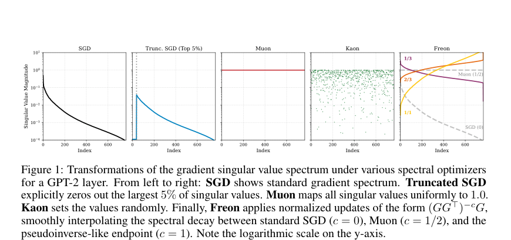
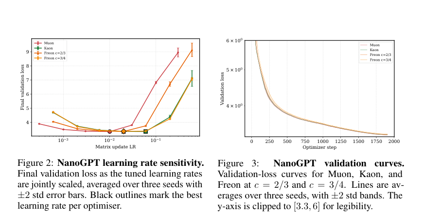
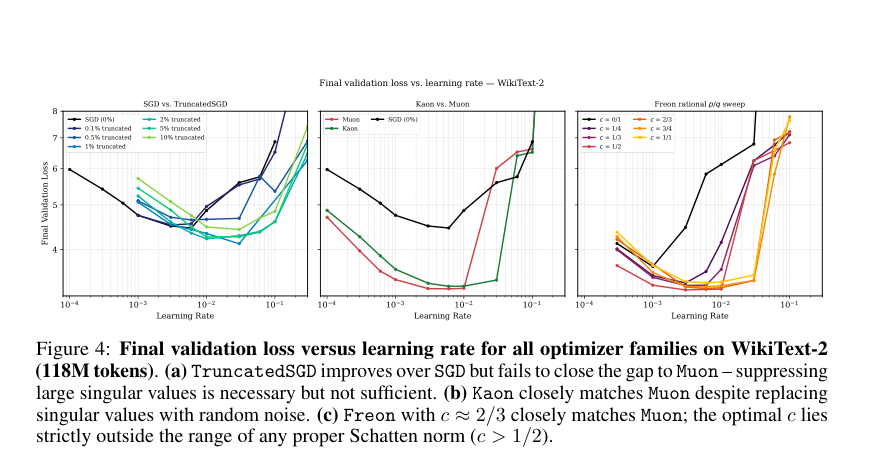
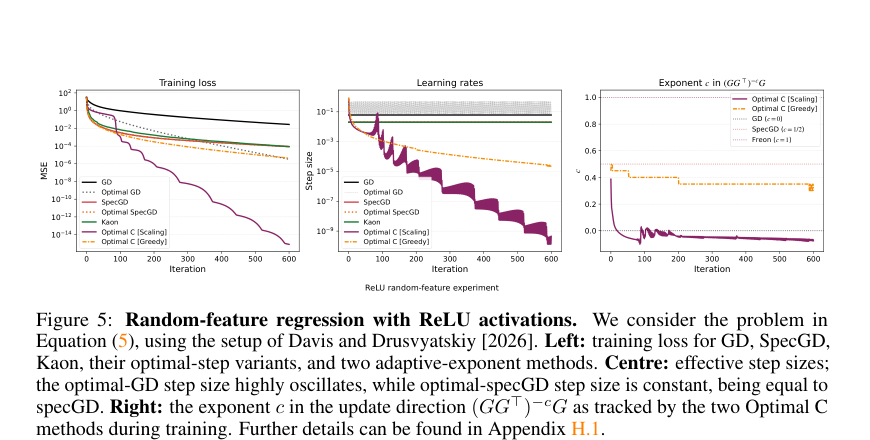
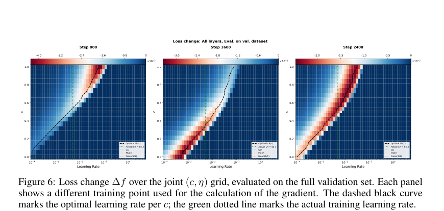

> 这篇论文的核心反直觉结论是：Muon 的效果不主要来自“精确的谱几何”或 LMO 理论。Freon 显示最优更新常落在非 norm 的 quasi-norm 区间，Kaon 甚至把奇异值替换成随机噪声也能接近 Muon；真正关键的是更新方向和 batch gradient 的 alignment、descent potential，以及学习率是否能吃到这个方向的下降潜力。

# 论文概览

论文：**Muon is Not That Special: Random or Inverted Spectra Work Just as Well**  
作者：Zakhar Shumaylov, Nathael Da Costa, Peter Zaika, Balint Mucsanyi, Alex Massucco, Yoav Gelberg, Carola-Bibiane Schonlieb, Yarin Gal, Philipp Hennig  
机构：University of Cambridge, University of Tubingen, University of Oxford  
本地 PDF：`raw/muon is not that special.pdf`

资源：

- arXiv：<https://arxiv.org/abs/2605.11181>
- arXiv HTML：<https://arxiv.org/html/2605.11181>
- SciRate：<https://scirate.com/arxiv/2605.11181>
- Keller Jordan Muon blog：<https://kellerjordan.github.io/posts/muon/>
- 版本日期：2026-05-11

一句话总结：

> 作者用 Freon 和 Kaon 两组反例挑战 Muon 的几何解释：如果 quasi-norm 区间和随机谱都能表现接近 Muon，那么“精确匹配某个谱 norm 的 LMO”就不是主要原因；更可靠的解释是谱更新在局部牺牲部分 alignment，换取更大的 descent potential，并且让可用学习率更稳定。

# 背景：Muon 的主流解释

这篇论文接在 Muon 被大规模关注之后。Muon 已经在 NanoGPT speedrun、小模型训练和 [[training-muon_scalable]] 这类大模型技术报告里显示出效果，但理论解释常常落在一个几何叙事上：

> Muon 通过矩阵正交化实现 spectral norm 下的 steepest descent，因此它的优势来自精确谱几何 / LMO。

作者质疑的是这个“精确几何是关键”的说法。

基础的 SGD、Adam、矩阵 SVD 和 Muon 正交化背景见 [[training-muon_scalable]]。这里只保留本文要反思的对象：理想 Muon 更新近似为：

$$
D_{\text{Muon}}
\approx
(GG^\top)^{-1/2}G
$$

如果 $G=U\operatorname{diag}(\sigma)V^\top$，则：

$$
D_{\text{Muon}}
=
UV^\top
$$

也就是把奇异值白化到接近 1。

Fig.1 对比了不同优化器如何改写奇异值谱：

- SGD：保留原始谱；
- Truncated SGD：砍掉最大奇异值；
- Muon：把奇异值白化；
- Kaon：用随机噪声替换奇异值；
- Freon：用参数 $c$ 连续改变谱衰减。

# 实验背景

论文不是训练一个新的 frontier model，而是做机制性实验，主要包括：

- **NanoGPT**：比较 Muon、Kaon、Freon 在 learning rate sensitivity 和 validation loss 曲线上的表现。
- **WikiText-2 / 118M tokens**：比较 SGD、Truncated SGD、Muon、Kaon、Freon 的 learning rate sweep。
- **Random-feature regression**：分析 alignment、descent potential 与 optimal step size。
- **GPT-2 层级分析**：评估不同 Freon 指数 $c$ 和学习率 $\eta$ 在不同训练 step / layer 上的 loss change。

这些实验的目的不是证明某个优化器最大规模可用，而是检验：

> Muon 的效果是否真的依赖某个精确谱几何。

# 方法一：Freon

Freon 是一族谱预条件更新：

$$
D_c
=
(GG^\top)^{-c}G
$$

不同 $c$ 对应不同谱变换：

| 参数 | 更新直觉 |
| --- | --- |
| $c=0$ | 接近 SGD，保留原始奇异值。 |
| $c=1/2$ | 接近 Muon，把奇异值白化。 |
| $c>1/2$ | 进入 quasi-norm / inverted spectrum 区间，超出标准 LMO。 |
| $c=1$ | 类似 pseudoinverse-like 更新。 |

作者从 Schatten $p$-norm 推导 Freon。当 $p \ge 1$ 时，它还能和 norm / dual norm / LMO 联系起来；但当 $c>1/2$ 时，对应区域已经不是 proper norm。

关键点是：

> GPT-2 上好的 $c$ 经常落在 $c>1/2$，也就是标准 LMO 理论无法表达的区域。

## Freon 的计算问题

Freon 需要计算：

$$
(GG^\top)^{-a/b}G
$$

普通 polynomial Newton-Schulz 在 $a/b \ne 1/2$ 时容易数值不稳定。作者提出 QDWH / rational approximation 路线，用有理函数迭代稳定近似这些矩阵幂。

# 方法二：Kaon

Kaon 是论文最强的反例。它不计算 LMO，也不逼近任何 Schatten norm，而是把梯度奇异值替换成随机噪声。

如果精确谱几何真是 Muon 的核心，Kaon 应该明显失败。但实验不是这样：

Fig.2 / Fig.3 显示，在 NanoGPT 上，Kaon、Muon、Freon 的学习率敏感性和 validation loss 曲线非常接近。

这说明：

> coherent geometry 不是必要条件；只要谱更新产生合适尺度和下降性质，也能工作。

# 实验结论

## 1. Truncated SGD 有帮助，但不够

Fig.4 显示：

- Truncated SGD 改善普通 SGD；
- 但 Truncated SGD 仍追不上 Muon / Kaon / Freon；
- Kaon 随机谱接近 Muon；
- Freon 在 $c \approx 2/3$ 等 quasi-norm 区间表现接近 Muon。

所以，大奇异值确实可能带来不稳定，但“砍掉大奇异值”解释不了全部收益。

## 2. 好参数常落在 LMO 之外

如果 LMO / norm geometry 是关键解释，最优 $c$ 应该落在 proper norm 能表达的范围内。但论文观察到，GPT-2 上好区域经常是：

$$
c>1/2
$$

这意味着有效更新可能需要更强地压制大奇异值、相对放大中间或小奇异方向。

# 新解释：alignment 与 descent potential

作者把局部下降拆成两个量：

## Batch gradient alignment

更新方向 $D$ 与 batch gradient 是否一致。alignment 高，方向更像普通梯度下降，保守但未必最强。

## Directional descent potential

这个方向如果配上合适学习率，能带来多大局部 loss decrease。descent potential 高，往往意味着牺牲一部分 alignment。

论文的 tradeoff 是：

> 谱优化器不是单纯找最像二阶方法的几何方向，而是在牺牲 alignment 的同时放大 descent potential；收益是否实现，取决于学习率能不能吃到这个 potential。

随机特征模型中，标准 GD 如果 exact line search 也能很好，但它需要非常震荡、难以实际使用的学习率。Muon / spectral descent 的优势在于 optimal step size 更稳定。

# GPT-2 上的观察

Fig.6 展示不同训练阶段的 $(c,\eta)$ loss change 网格。结论是：

- 最优 $c$ 会随 batch 和 training step 波动；
- 好区域经常进入 $c>1/2$；
- 单 batch 局部几何不能完全预测 full validation set 效果；
- 方向和学习率必须一起看。

作者还观察到，中间奇异值区域可能有更好的 signal-to-noise ratio。因此 $c \approx 2/3$ 或 $3/4$ 会自然压制大奇异值、减少 alignment，但放大 descent potential。

# 对 Muon 叙事的影响

| 常见说法 | 论文反驳 |
| --- | --- |
| Muon 成功是因为精确谱白化。 | Kaon 随机谱也接近 Muon，说明精确白化不是必要条件。 |
| LMO / norm geometry 是关键解释。 | Freon 好参数常在 quasi-norm 区间，超出标准 LMO。 |
| 大奇异值噪声是主要问题。 | Truncated SGD 有帮助但不够。 |
| 局部几何可给固定最优规则。 | GPT-2 上最优 $c$ 随 batch / training step 波动。 |
| 最优方向最重要。 | 方向和学习率必须一起看。 |

# 局限

- Kaon 主要是 pedagogical construction，不是生产优化器建议。
- 实验集中在 NanoGPT / GPT-2 / WikiText-2，和 [[training-muon_scalable]] 的大规模 MoE 训练问题不同。
- alignment / descent potential 很有解释力，但实际训练中仍难预测和在线调参。
- Freon 的 QDWH / rational iteration 工程复杂度更高。

# 总结

这篇论文的价值，是把 Muon 的讨论从“它是不是某个 norm 下的最陡下降”转向：

1. 谱更新如何改写 gradient 奇异值结构；
2. 哪些奇异方向真的带来有效下降；
3. 更新方向牺牲多少 alignment；
4. 学习率是否能稳定吃到 descent potential。

Freon 说明：好更新可以落在 LMO 理论之外。  
Kaon 说明：随机谱也能接近 Muon，精确几何不是必要条件。  
alignment / descent potential 说明：收益可能来自局部下降和步长稳定性，而不是优雅的全局几何解释。

## 附录：PDF 解析与图表抽取自检

- PDF 已成功读取：标题、作者、摘要、章节结构、公式、Figure、Algorithm 和 Theorem 均可解析。
- 已抽取关键图表：Fig.1、Fig.2、Fig.3、Fig.4、Fig.5、Fig.6。
- 使用图片裁剪的复杂图表：谱变换对比、NanoGPT 学习率/曲线、WikiText-2 优化器对比、随机特征模型、GPT-2 loss change landscape。
- 已检索 arXiv、arXiv HTML、SciRate 和 Keller Jordan Muon blog。

## 索引信息

> 类别：论文笔记 / 训练与优化 / Optimizer / Muon  
> 索引标签：#Muon #Optimizer #Freon #Kaon #SpectralDescent #SchattenNorm #LMO #NanoGPT #GPT2 #TrainingOptimization
