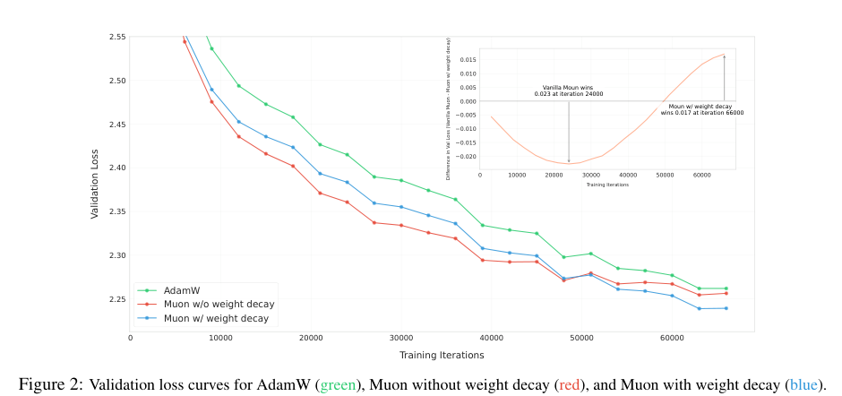
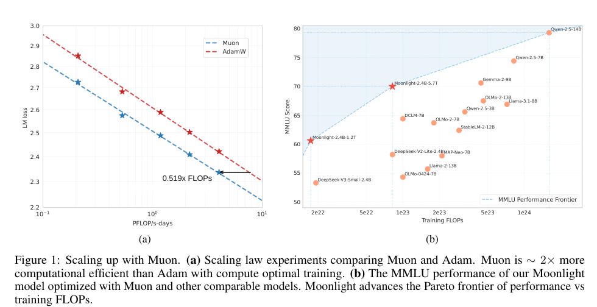
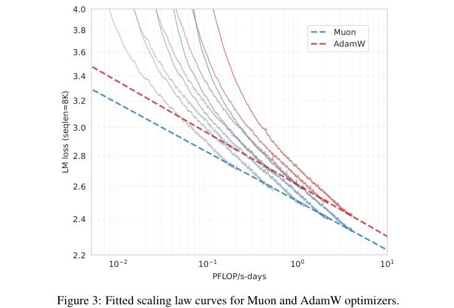
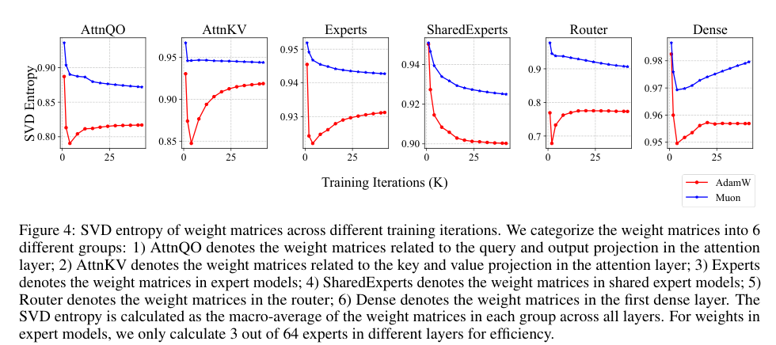

> 这篇报告回答的是“Muon 能不能真的用于大规模 LLM 训练”。Moonshot 的结论是：原始 Muon 不能裸用，但加入 weight decay、校准不同矩阵形状的 update RMS，并做 ZeRO-1 风格分布式实现后，Muon 可以训练 3B/16B MoE 的 Moonlight，并在 scaling law 上显示约 2 倍 AdamW compute efficiency。

# 论文概览

论文：**Muon is Scalable for LLM Training**  
作者：Jingyuan Liu, Jianlin Su, Xingcheng Yao, Zhejun Jiang, Guokun Lai, Yulun Du, Yida Qin, Weixin Xu, Enzhe Lu, Junjie Yan, Yanru Chen, Huabin Zheng, Yibo Liu, Shaowei Liu, Bohong Yin, Weiran He, Han Zhu, Yuzhi Wang, Jianzhou Wang, Mengnan Dong, Zheng Zhang, Yongsheng Kang, Hao Zhang, Xinran Xu, Yutao Zhang, Yuxin Wu, Xinyu Zhou, Zhilin Yang  
机构：Moonshot AI, UCLA  
本地 PDF：`raw/Muon is Scalable for LLM Training.pdf`

资源：

- arXiv：<https://arxiv.org/abs/2502.16982>
- Keller Jordan Muon blog：<https://kellerjordan.github.io/posts/muon/>
- 版本日期：2025-02-24

一句话总结：

> 论文把 Muon 从小模型 speedrun 扩展到 LLM 预训练：通过 weight decay、per-parameter update scale 和 Distributed Muon，直接复用 AdamW 超参，在 compute-optimal scaling law 下达到 AdamW 同等 loss 只需约 52% FLOPs，并训练出 Moonlight 3B/16B MoE。

# 背景：为什么要证明 Muon 可扩展

先把普通优化器和矩阵谱背景说清楚，才能看出 Muon 的起点在哪里。

## SGD：直接沿负梯度走

设参数为 $\theta$，loss 为 $L(\theta)$，当前 mini-batch 上的梯度是：

$$
g_t = \nabla_\theta L_t(\theta_t)
$$

SGD 更新为：

$$
\theta_{t+1}
=
\theta_t
-
\eta g_t
$$

它对所有参数方向使用同一个学习率。如果某些方向梯度特别大或噪声很强，SGD 会被这些方向主导。

## Adam：逐元素自适应缩放

Adam 维护一阶动量和二阶梯度平方统计：

$$
m_t
=
\beta_1m_{t-1}
+
(1-\beta_1)g_t
$$

$$
v_t
=
\beta_2v_{t-1}
+
(1-\beta_2)g_t^2
$$

更新为：

$$
\theta_{t+1}
=
\theta_t
-
\eta
\frac{\hat m_t}{\sqrt{\hat v_t}+\epsilon}
$$

Adam 的自适应是 element-wise 的：哪个坐标长期梯度平方大，就把该坐标的有效步长压小。

## 矩阵参数：奇异值谱

Transformer 的很多参数是矩阵：

$$
W \in \mathbb{R}^{m \times n}
$$

对应梯度也是矩阵：

$$
G=\nabla_W L
$$

SVD 分解为：

$$
G
=
U\operatorname{diag}(\sigma)V^\top
=
\sum_i \sigma_i u_i v_i^\top
$$

其中 $\sigma_i$ 是第 $i$ 个 rank-1 更新方向的强度。Muon 不是逐元素缩放，而是直接改写这些奇异值。

从数学原理上看，SVD 来自两个对称半正定矩阵的特征分解：

$$
G^\top G
\succeq
0,
\quad
GG^\top
\succeq
0
$$

因为 $G^\top G$ 是对称半正定矩阵，根据谱定理，它存在一组正交特征向量 $v_i$ 和非负特征值 $\lambda_i$：

$$
G^\top G v_i
=
\lambda_i v_i
$$

奇异值定义为：

$$
\sigma_i
=
\sqrt{\lambda_i}
$$

当 $\sigma_i \gt 0$ 时，定义左奇异向量：

$$
u_i
=
\frac{Gv_i}{\sigma_i}
$$

于是有两个关键关系：

$$
Gv_i
=
\sigma_i u_i
$$

$$
G^\top u_i
=
\sigma_i v_i
$$

把所有右奇异向量组成 $V=[v_1,\ldots,v_r]$，左奇异向量组成 $U=[u_1,\ldots,u_r]$，奇异值放进对角矩阵 $\Sigma=\operatorname{diag}(\sigma)$，就得到：

$$
G
=
U\Sigma V^\top
$$

等价地：

$$
G
=
\sum_i \sigma_i u_i v_i^\top
$$

这里每一项 $u_i v_i^\top$ 是一个 rank-1 矩阵方向，$\sigma_i$ 是这个方向上的系数。Muon 操作奇异值谱，本质上是在改变这些 rank-1 更新方向的系数。

这也解释了 Muon 的白化形式。若：

$$
G
=
U\Sigma V^\top
$$

则：

$$
(GG^\top)^{-1/2}G
=
(U\Sigma^2U^\top)^{-1/2}U\Sigma V^\top
=
UV^\top
$$

也就是说，Muon 用 $\Sigma^{-1}$ 抵消了原梯度里的 $\Sigma$，把非零奇异值都归一化为 1。

## Muon：正交化矩阵梯度

Muon 最早的吸引力来自小模型训练速度。它对矩阵参数的梯度动量 $M_t$ 做近似正交化：

$$
M_t
=
\mu M_{t-1}
+
\nabla L_t(W_{t-1})
$$

$$
O_t
=
\operatorname{NewtonSchulz}(M_t)
\approx
(M_tM_t^\top)^{-1/2}M_t
$$

$$
W_t
=
W_{t-1}
-
\eta_t O_t
$$

如果 $M_t=U\Sigma V^\top$，则理想正交化结果是：

$$
(M_tM_t^\top)^{-1/2}M_t
=
UV^\top
$$

也就是把矩阵更新的奇异值白化，避免少数大奇异方向主导更新。

但要把 Muon 用到十亿级 LLM，有三个未解决问题：

1. **长期训练稳定性**：原始 Muon 在小规模快，但长训练中权重 RMS 和 layer output RMS 可能持续变大。
2. **矩阵形状差异**：不同 shape 的矩阵经过 Muon 后 update RMS 不一致，导致某些矩阵更新过小或过大。
3. **分布式实现**：Muon 需要完整矩阵做正交化，不能像 AdamW 那样天然逐元素分片更新。

# 实验背景

论文做了两层实验：

1. **Scaling law 对比**：用 Llama-like dense models 做 compute-optimal training，对 AdamW 做强 grid search baseline，再比较 Muon。
2. **真实预训练**：用 DeepSeek-V3-Small 风格 MoE 架构训练 Moonlight。

Scaling law 模型规模覆盖约 399M 到 1.5B 非 embedding 参数，context length 为 8K。Moonlight 规模为：

- 2.24B activated / 15.29B total，不含 embedding；
- 含 embedding 时约 3B activated / 16B total；
- 训练 5.7T tokens；
- 训练后对 MMLU、MMLU-Pro、BBH、HumanEval、MBPP、GSM8K、MATH、C-Eval、CMMLU 等评测。

# 方法

## 1. 加入 weight decay

原始 Muon 不一定包含 AdamW 式 decoupled weight decay。Moonshot 发现，裸 Muon 前期收敛快，但更长训练后权重 RMS 可能变大，影响长期性能。

因此更新改成：

$$
W_t
=
W_{t-1}
-
\eta_t
\left(
O_t
+
\lambda W_{t-1}
\right)
$$

其中 $O_t$ 是正交化后的 Muon update，$\lambda W_{t-1}$ 是 weight decay。

Fig.2 显示：

- vanilla Muon 前期领先；
- 后期带 weight decay 的 Muon 反超；
- 带 weight decay 的 Muon 比 AdamW 和 vanilla Muon 更稳。

## 2. 校准 update RMS

论文指出，Muon update 的 RMS 会随矩阵形状变化。对 full-rank 矩阵 shape $[A,B]$，其理论 RMS 约为：

$$
\operatorname{RMS}(O)
\approx
\frac{1}{\sqrt{\max(A,B)}}
$$

这会导致：

- 大 MLP 矩阵 update 过小，表达能力受限；
- 小 KV head 或小矩阵 update 过大，训练不稳定。

Moonshot 的做法是按 shape 缩放 update：

$$
W_t
=
W_{t-1}
-
\eta_t
\left(
0.2 \cdot O_t \cdot \sqrt{\max(A,B)}
+
\lambda W_{t-1}
\right)
$$

这里的 $0.2$ 是为了让 Muon update RMS 接近 AdamW 常见的 $0.2 \sim 0.4$。好处是：Muon 可以直接复用 AdamW 调好的 learning rate 和 weight decay。

## 3. Distributed Muon

AdamW 是 element-wise update，ZeRO-1 分片后仍然容易算。Muon 不一样：它要看到完整矩阵才能做 Newton-Schulz。

Distributed Muon 的流程是：

1. 在 data parallel group 内 reduce-scatter 梯度；
2. 本地分片上更新 momentum；
3. gather 出完整矩阵梯度；
4. 在完整矩阵上跑 Newton-Schulz 得到 $O_t$；
5. 丢弃不属于本 rank 的 update 分片，只更新本地参数；
6. all-gather 更新后的参数。

论文认为开销可控：

- Muon 只需要一个 momentum buffer，AdamW 需要一阶和二阶两个 buffer；
- Newton-Schulz 使用 bf16 即可；
- 额外 latency 通常只有 forward-backward 的 1% - 3%。

# 实验结果

## 1. Scaling law：约 2 倍 compute efficiency

Fig.1(a) 显示，在 compute-optimal training 设置下，Muon 达到 AdamW 同等 LM loss 大约只需要 **52% training FLOPs**。

Fig.1(b) 显示，Moonlight 位于 MMLU performance frontier 上，用更少 training FLOPs 达到更强性能。

Fig.3 给出拟合 scaling law 曲线，Muon 整体优于 AdamW。论文中拟合形式大致为：

$$
L_{\text{Muon}}
\approx
2.506 C^{-0.052}
$$

$$
L_{\text{AdamW}}
\approx
2.608 C^{-0.054}
$$

指数接近，但 Muon 的前因子更低，因此在相同 compute 下 loss 更低。

## 2. Moonlight 预训练结果

Moonlight 使用 Muon 训练 5.7T tokens。对比 Moonlight-A（相同设置但 AdamW optimizer），Muon 在 1.2T token checkpoint 上已经更强，尤其 code / math 任务更明显。

最终 5.7T token 后，Moonlight 在 MMLU、MMLU-Pro、BBH、HumanEval、MBPP、GSM8K、MATH、CMath、C-Eval、CMMLU 等任务上表现很强，和更大训练预算的 dense 模型相比也有竞争力。

论文特别指出：Muon 对 math 和 code 的提升值得后续研究。

## 3. SVD entropy：Muon 权重谱更分散

作者用 SVD entropy 衡量权重矩阵奇异值能量是否分散：

$$
H(\sigma)
=
-
\frac{1}{\log n}
\sum_i
\frac{\sigma_i^2}{\sum_j \sigma_j^2}
\log
\frac{\sigma_i^2}{\sum_j \sigma_j^2}
$$

直觉：

- 少数奇异值占主导，entropy 低；
- 更多方向都有能量，entropy 高。

实验显示：

- Muon 在 attention、expert、router、dense 等多类权重上 SVD entropy 更高；
- router 上差异尤其明显；
- 这支持“Muon 让权重矩阵探索更多方向”的直觉。

## 4. SFT 阶段

论文还做了 SFT ablation：

- Muon-pretrain + Muon-SFT 效果最好；
- AdamW-pretrain 后切到 Muon-SFT，不一定比 AdamW-SFT 更好；
- Qwen2.5-7B 上单独用 Muon 做 SFT，也只是和 AdamW-SFT 接近。

这说明 Muon 的收益更明显地体现在 pretraining 阶段；pretrain / finetune optimizer mismatch 仍然是开放问题。

# 和 AdamW 的关系

| 维度 | AdamW | Scalable Muon |
| --- | --- | --- |
| 更新方式 | element-wise adaptive update | matrix orthogonalized update |
| 二阶统计 | 用 $v_t$ 做逐元素缩放 | 不维护 Adam 式二阶矩 |
| 权重衰减 | decoupled weight decay | 也加入 decoupled weight decay |
| 矩阵结构 | 不显式处理矩阵谱 | 直接改写矩阵梯度奇异值谱 |
| 分布式 | ZeRO-1 容易做 | 需要 gather 完整矩阵做 Newton-Schulz |
| 超参 | 需要调 AdamW baseline | update RMS 校准后可复用 AdamW 超参 |

# 局限

- 这是 Moonshot 技术报告，部分结论依赖内部数据、训练系统和 Moonlight 架构，外部复现很重要。
- Scalable Muon 不是原始 Muon 裸替 AdamW，而是依赖 weight decay、update RMS scaling 和分布式实现。
- SFT 阶段收益不稳定，尤其 AdamW-pretrained checkpoint 直接换 Muon-SFT 未必占优。
- 报告证明 Muon 工程上可扩展，但没有完全解释 Muon 为什么在 math / code 上更强。

# 总结

这篇报告的价值是把 Muon 从“小模型 speedrun 优化器”推进到“大模型可用优化器”：

1. weight decay 解决长训练权重膨胀问题；
2. update RMS scaling 解决不同矩阵 shape 更新尺度不一致；
3. Distributed Muon 解决完整矩阵正交化和 ZeRO-1 分片之间的冲突；
4. scaling law 和 Moonlight 证明 Muon 在 LLM 预训练中可以带来实际 compute efficiency。

但它回答的是工程可扩展性，不是最终理论解释。Muon 为什么好，还需要结合 [[training-muon_not_special]] 里的机制反思一起看。

## 附录：PDF 解析与图表抽取自检

- PDF 已成功读取：标题、作者、摘要、方法、scaling law、Moonlight 实验、SVD entropy 和 SFT ablation 均可解析。
- 已抽取关键图表：Fig.1、Fig.2、Fig.3、Fig.4。
- 使用图片裁剪的复杂图表：scaling frontier、weight decay 曲线、scaling law、SVD entropy。
- 已检索 arXiv 和 Keller Jordan Muon blog。

## 索引信息

> 类别：论文笔记 / 训练与优化 / Optimizer / Muon  
> 索引标签：#Muon #AdamW #Moonlight #Optimizer #LLMTraining #ScalingLaw #SVD #DistributedTraining
