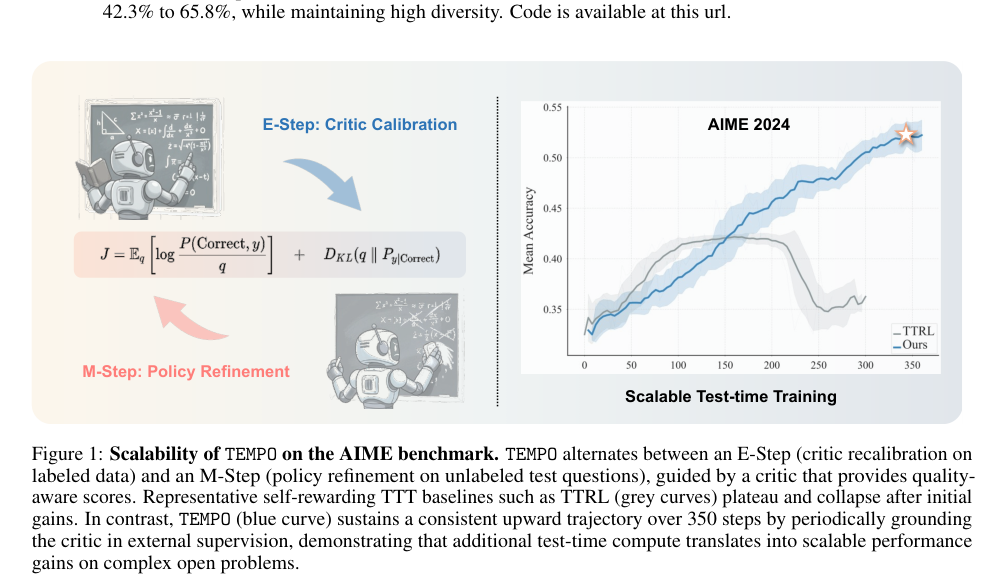
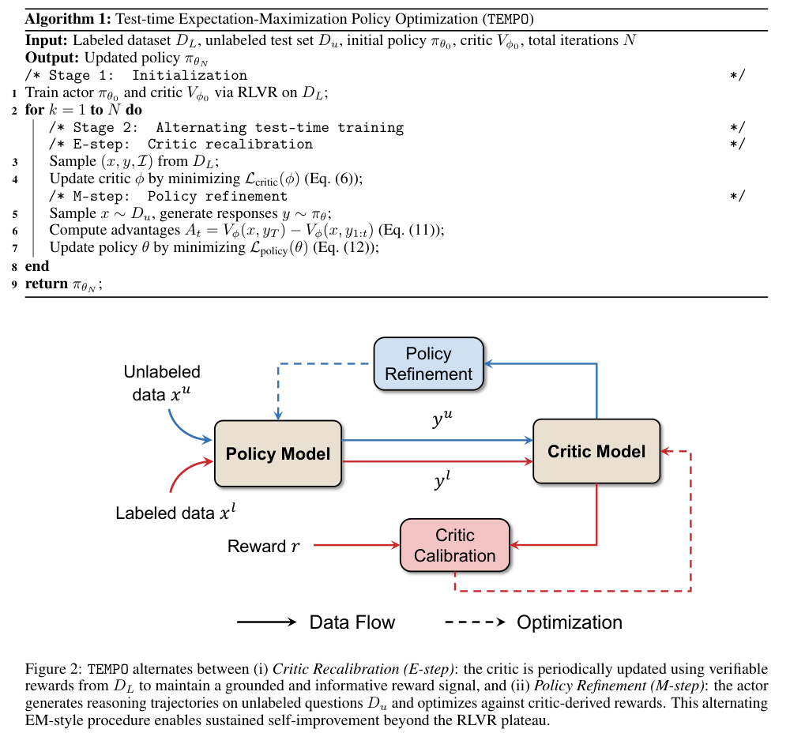
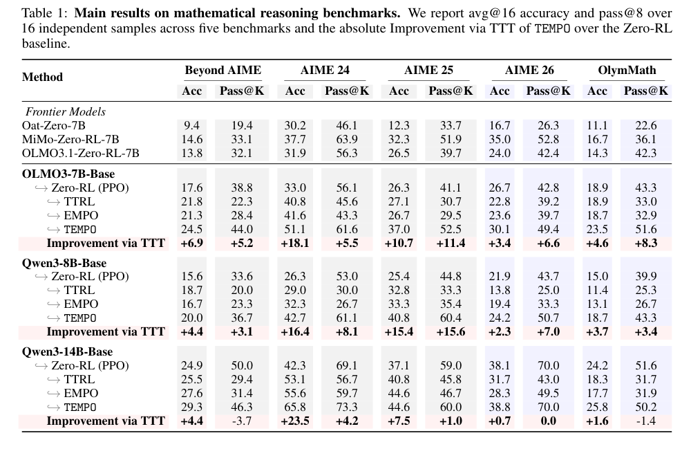
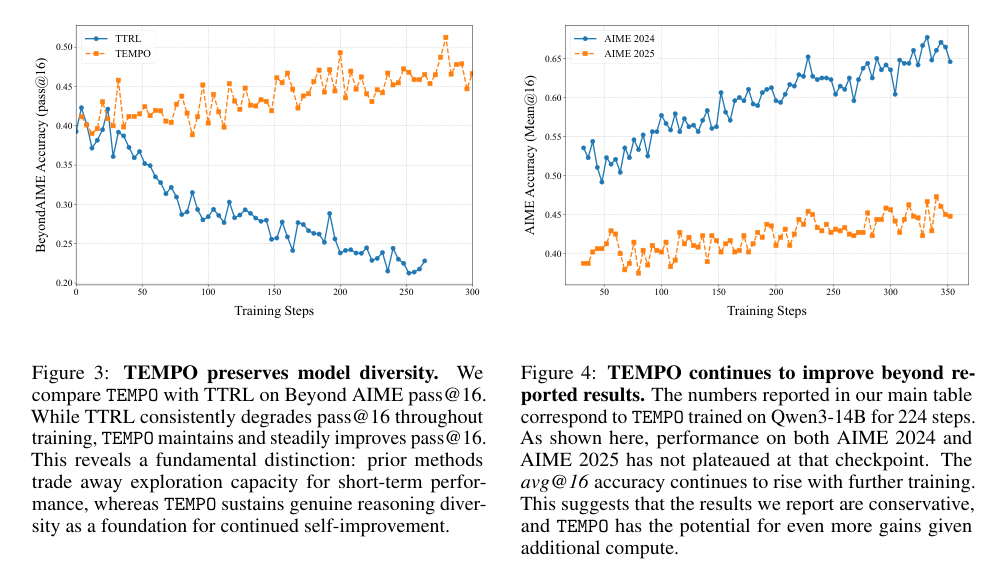
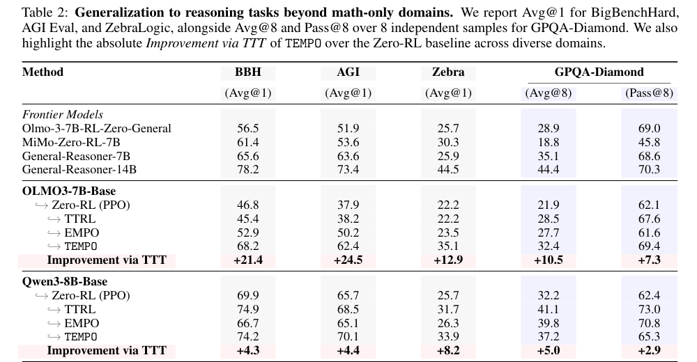
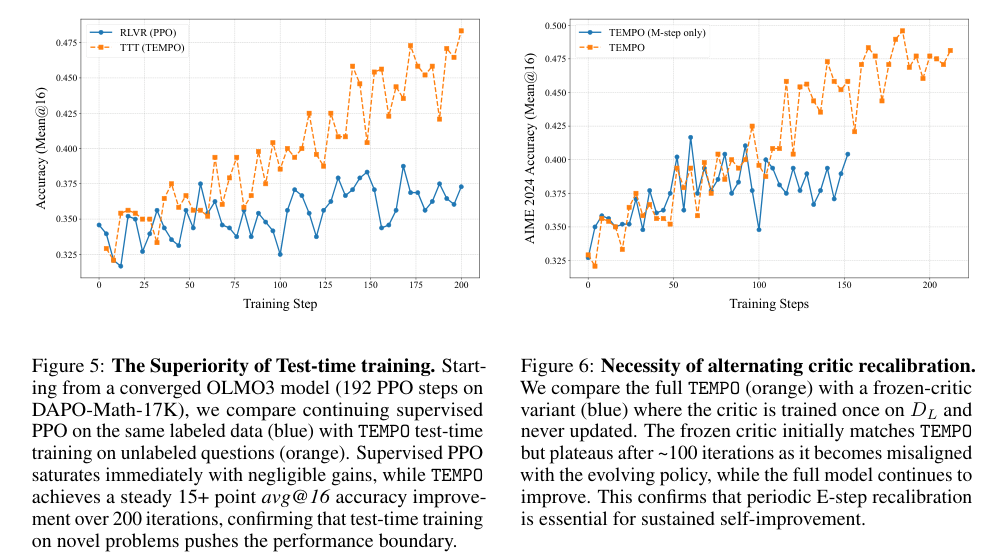

> TEMPO 的核心是把大推理模型的 test-time training 写成一个 EM 过程：未标注测试题上的“答案是否正确”是隐变量，critic calibration 是 E-step，用少量标注数据重新校准正确性后验；policy refinement 是 M-step，用 critic 给未标注题生成的回答打分并更新策略。这样可以避免纯 self-rewarding TTT 的 reward drift 和 diversity collapse。

# 论文概览

论文：**TEMPO: Scaling Test-time Training for Large Reasoning Models**  
作者：Qingyang Zhang, Xinke Kong, Haitao Wu, Qinghua Hu, Minghao Wu, Baosong Yang, Yu Cheng, Yun Luo, Ganqu Cui, Changqing Zhang  
机构：Tianjin University, Tongyi Lab / Alibaba Group, The Chinese University of Hong Kong, Shanghai AI Lab  
本地 PDF：`raw/TEMPO Scaling Test-time Training for Large Reasoning Models.pdf`

资源：

- arXiv：<https://arxiv.org/abs/2604.19295>
- arXiv HTML：<https://arxiv.org/html/2604.19295v1>
- Project Page：<https://qingyangzhang.github.io/tempo-homepage/>
- GitHub：<https://github.com/QingyangZhang/TEMPO>
- 版本日期：2026-04-21 / PDF 日期 2026-04-22

一句话总结：

> 现有 TTT 方法让模型用自己的 self-reward 继续训练，早期能涨但很快 reward drift、模式变窄；TEMPO 通过“标注集校准 critic + 未标注测试题更新 policy”的交替过程，把额外 test-time compute 转化成持续收益。

# 背景：为什么 test-time training 会卡住

Large Reasoning Models（LRMs）已经能通过长 CoT 和 test-time compute 解决复杂数学、逻辑和 STEM 题。但普通推理时，模型参数是静态的：

```text
输入新题 -> 生成长推理 -> 输出答案
```

模型虽然在测试时花了很多算力，但这些经验不会写回参数。

Test-time training（TTT）的想法是：在推理阶段，让模型在未标注测试题上继续更新自己。已有方法如 TTRL、EMPO、Theta-Evolve 会用 self-generated signal：

- majority voting；
- entropy；
- self-consistency；
- self-certainty；
- reasoning topology。

问题是这些 reward 都来自模型自己。随着 policy 变化，reward signal 也会跟着漂移：

1. 模型越来越偏向某些自己已经会的 reasoning pattern；
2. self-reward 会高估这些 dominant pattern；
3. policy 继续强化这些 pattern；
4. 输出多样性下降，pass@K 变差；
5. 性能进入 plateau，更多 test-time compute 不再带来收益。

这就是论文要解决的两个核心失败模式：

- **performance plateau**：TTT 初期涨一点，然后停住；
- **diversity collapse**：avg accuracy 可能涨，但 pass@K 和探索能力下降。



Fig.1 展示了 TEMPO 和 TTRL 的差异：TTRL 早期提升后趋于平台甚至 collapse；TEMPO 通过周期性 critic recalibration，可以在 350 步内继续提升。

# 方法总览：TEMPO

TEMPO 全称是 **Test-time Expectation-Maximization Policy Optimization**。

它维护两个模型：

| 模型 | 作用 |
| --- | --- |
| Policy / Actor $\pi_\theta$ | 在未标注测试题 $D_u$ 上生成 reasoning trajectory，并被继续训练。 |
| Critic $V_\phi$ | 给生成答案估计 correctness / value，提供 reward 和 token-level baseline。 |

TEMPO 有两个数据源：

| 数据 | 作用 |
| --- | --- |
| Labeled dataset $D_L$ | 有 ground-truth / verifiable reward，用来周期性校准 critic。 |
| Unlabeled test set $D_u$ | 没有答案标签，用来让 policy 在测试时继续学习。 |

整体流程：

1. 先用 $D_L$ 做 RLVR 初始化 actor 和 critic；
2. 每个 test-time training iteration 交替执行：
   - **E-step：Critic Recalibration**，在 $D_L$ 上用真实 correctness 更新 critic；
   - **M-step：Policy Refinement**，在 $D_u$ 上生成回答，用 critic reward 更新 policy。



Fig.2 和 Algorithm 1 表达的是：TEMPO 不是只让 policy 在未标注题上自我强化，而是周期性把 critic 拉回 labeled data，避免 reward 随 policy 漂移。

# EM 视角：为什么需要 E-step

论文最核心的理论视角是：测试题上的 response correctness 是不可观测隐变量。

对一个问题 $x$，模型生成回答 $y$。目标是最大化模型生成正确回答的概率：

$$
J(\theta)
=
\mathbb{E}_x
\left[
\log P(\text{Correct}|x;\theta)
\right]
$$

而：

$$
P(\text{Correct}|x;\theta)
=
\sum_y
P(\text{Correct}|x,y)
\pi_\theta(y|x)
$$

难点是：在未标注测试题 $D_u$ 上，我们不知道 $P(\text{Correct}|x,y)$。

## 引入辅助分布 $q(y|x)$

EM 的做法是引入一个辅助分布 $q(y|x)$，近似“在正确条件下哪些回答更可能”：

$$
q(y|x)
\approx
P(y|x,\text{Correct})
$$

论文推导 ELBO：

$$
J(\theta)
\ge
L(q,\theta)
$$

直觉是：

- 如果 $q$ 能准确估计“哪些回答更可能正确”，policy update 就有可靠方向；
- 如果 $q$ 漂移，policy 会优化错误的 self-reward，进入 self-reinforcing loop。

## E-step：估计正确回答的后验

理想的 E-step 是：

$$
q(y|x)
=
P(y|x,\text{Correct})
=
\frac{
P(\text{Correct}|y,x)\pi_{\theta_0}(y|x)
}{
P(\text{Correct}|x)
}
$$

其中 $P(\text{Correct}|y,x)$ 不可直接知道，所以 TEMPO 用 critic 近似。

critic 的训练目标是：

$$
L_{\text{critic}}(\phi)
=
\mathbb{E}_{(x,y,I)\sim D_L}
\left\|
V_\phi(x,y_t)-I
\right\|_2^2
$$

$I\in\{0,1\}$ 表示答案是否正确。训练后，critic 的 last-token value $V_\phi(x,y_T)$ 被看作 response correctness 的估计。

于是：

$$
q(y|x)
\propto
V_\phi(x,y_T)
\pi_{\theta_0}(y|x)
$$

这就是 “critic calibration”：用少量有标签数据，把 reward signal 定期拉回真实 correctness。

## M-step：用 critic reward 更新 policy

固定 $q(y|x)$ 后，M-step 更新 policy：

$$
\theta_{\text{new}}
=
\arg\max_\theta
\sum_{x\in D_u}
\sum_y
q(y|x)
\log
\pi_\theta(y|x)
$$

论文进一步把它写成采样回答上的 weighted log-likelihood：

$$
\theta_{\text{new}}
=
\arg\max_\theta
\sum_{x\in D_u}
\sum_y
V_\phi(x,y_T)
\log
\pi_\theta(y|x)
$$

实现上用 policy gradient。终止 token 的 critic value 作为整个 response 的 reward：

$$
R
=
V_\phi(x,y_T)
$$

中间 token 的 critic value 作为 baseline：

$$
A_t
=
R
-
V_\phi(x,y_{1:t})
$$

policy loss：

$$
L_{\text{policy}}(\theta)
=
-
\mathbb{E}_{x\in D_u,y\sim\pi_\theta}
\left[
\sum_{t=1}^T
A_t
\log
\pi_\theta(y_t|x,y_{1:t-1})
\right]
$$

直觉是：如果最终回答 critic 认为更可能正确，那么导致这个回答的 token 得到正 advantage；如果中间 value 已经很高但最后 reward 没跟上，则 advantage 变小或为负。

## 如果只用普通 reward model 会怎样？

如果只用 reward model 给完整 response 打分，也可以训练。形式上可以写成：

$$
R
=
r_\phi(x,y)
$$

然后让所有 token 共用这个 response-level reward，做 REINFORCE / GRPO 式更新：

$$
A
=
R
-
\text{baseline}
$$

这种做法是可行的，但它少了 TEMPO critic 的一个关键能力：**token-level baseline**。

TEMPO 使用的是：

$$
A_t
=
R
-
V_\phi(x,y_{1:t})
$$

也就是说，critic 不只给完整答案打一个分，还会估计每个 partial reasoning prefix 的未来价值。这样可以判断当前推理前缀是否已经偏离高价值方向。

如果只有完整 response reward，会带来几个问题：

- credit assignment 更粗：很难知道是哪一步推理让答案变好或变坏；
- 方差更大：整条长 CoT 共享同一个 outcome reward；
- 中间过程缺少 baseline：无法细分每个 token 相对当前前缀预期的贡献；
- 训练信号更稀疏：只有最终回答有分数，长 reasoning chain 里的所有 token 都吃同一个 reward。

所以，普通 reward model 可以替代 TEMPO critic 的最后打分功能，但如果它不能输出 prefix-level value，本质上就退化成更粗的 outcome-reward RL。

# 为什么旧方法容易失败

论文把 TTRL / EMPO 这类方法看成不完整 EM：

```text
只做 M-step：policy refinement
缺少 E-step：posterior / critic recalibration
```

例如 TTRL 用 majority voting 构造 pseudo-label：

$$
q(y|x)
\propto
\mathbb{I}(y\in Y_{\text{majority}})
\pi_{\theta_0}(y|x)
$$

问题是 majority set 由当前 policy 自己决定。当模型越来越自信于某类推理路径时，这个路径更容易成为 majority，然后又被进一步强化。

这就是 self-reinforcement trap：

```text
policy 偏向某类答案
-> self-reward 认为这类答案更好
-> policy 更偏向这类答案
-> diversity collapse
```

TEMPO 的 critic 不是完全跟着 policy 走，而是定期在 $D_L$ 上校准，因此能减少 reward drift。

# 实验设置

论文分数学和通用推理两组。

数学任务：

- base models：OLMO3-7B、Qwen3-8B、Qwen3-14B；
- labeled data：DAPO-Math-17K，用 RLVR / PPO 初始化 actor 和 critic；
- test-time training：AIME 2024、AIME 2025、Beyond AIME；
- holdout：AIME 2026、OlymMath；
- metrics：avg@16、pass@8。

通用推理任务：

- labeled data：Dolci-RL-Zero-General，12.8K；
- test-time training：BigBenchHard、AGI Eval、ZebraLogic；
- holdout：GPQA-Diamond；
- judge：gpt-oss-120b；
- metrics：Avg@1，GPQA-Diamond 额外报告 Avg@8 和 Pass@8。

Baselines：

- Zero-RL / RLVR with PPO；
- TTRL；
- EMPO；
- frontier / comparable models。

# 实验结果

## 1. 数学推理：TEMPO 持续提升



Table 1 的核心结果：

- OLMO3-7B 在 AIME 2024 上从 33.0% 提升到 51.1%；
- Qwen3-8B 在 AIME 2024 上从 26.3% 提升到 42.7%；
- Qwen3-14B 在 AIME 2024 上从 42.3% 提升到 65.8%；
- AIME 2025、Beyond AIME、AIME 2026、OlymMath 上也有提升。

更重要的是 pass@K：TTRL / EMPO 往往 avg accuracy 提升但 pass@K 降低，说明多样性 collapse；TEMPO 能更好保留 pass@K。

## 2. 多样性：不牺牲 pass@K



Fig.3 显示，在 Beyond AIME 上，TTRL 的 pass@16 随训练下降，而 TEMPO 维持并提升 pass@16。这说明 TEMPO 不是简单把模型压到一个 dominant reasoning pattern。

Fig.4 显示，TEMPO 继续训练更久仍能提升，而不是像 self-rewarding baseline 一样早早停住。

## 3. 泛化到非数学推理



Table 2 显示 TEMPO 不只适用于数学：

- OLMO3-7B 在 BBH 上 +21.4；
- OLMO3-7B 在 AGI Eval 上 +24.5；
- OLMO3-7B 在 ZebraLogic 上 +12.9；
- Qwen3-8B 在 ZebraLogic 上 +8.2；
- GPQA-Diamond 上也有 Avg@8 / Pass@8 提升。

这说明 alternating critic-policy design 不只是数学题 verifier 的特例，而是能迁移到更广的 reasoning tasks。

## 4. 消融：E-step 不是实现细节



Fig.5：从已经在 DAPO-Math-17K 上收敛的 OLMO3 出发，继续在同一个 labeled set 上做 PPO 几乎不涨；TEMPO 在未标注测试题上继续训练，可以再提升 15+ avg@16。

Fig.6：冻结 critic 的 variant 前期接近 TEMPO，但 100 步左右开始 plateau；完整 TEMPO 继续上升。说明：

> critic recalibration 不是小技巧，而是持续自我提升的必要条件。

# 和 GFT / GRPO 的关系

TEMPO 和 [[training-gft]]、GRPO 类方法都使用 group / advantage / policy update 思想，但目标场景不同：

| 方法 | 数据 | reward 来源 | 目标 |
| --- | --- | --- | --- |
| GRPO / RLVR | 有 verifier / reward 的训练题 | 外部可验证 reward | 离线或在线提升 reasoning policy |
| GFT | GT + teacher + self-samples | 组内 reward advantage + DCR | 改善 SFT 到 RL 的过渡 |
| TTRL / EMPO | 未标注测试题 | self-consistency / entropy 等 self-reward | test-time self-training |
| TEMPO | 标注集 + 未标注测试题 | 周期性校准 critic | 让 TTT 随 test-time compute 持续扩展 |

TEMPO 的关键不是“只要未标注题就能自我变强”，而是：

> 未标注题负责提供新问题分布，标注集负责定期校准 reward。

# 局限

- 需要维护 actor 和 critic，显存和计算成本高于单模型 TTT。
- 需要一个 labeled dataset $D_L$ 做 critic recalibration；$D_L$ 的规模和分布会影响 critic 泛化。
- 实验集中在数学、STEM、逻辑 puzzle；代码生成、agentic task 等领域还没充分验证。
- EM 视角提供了统一解释，但论文没有给出严格收敛保证。
- 频繁 critic recalibration 和 test-time compute 之间存在效率权衡。

# 总结

TEMPO 的主要贡献是把 test-time training 从“模型自己给自己打分然后更新”变成一个有外部校准的 EM 过程：

1. **E-step**：用 labeled data 校准 critic，估计哪些 response 更可能正确；
2. **M-step**：用 critic reward 在 unlabeled test questions 上更新 policy；
3. 周期性交替，避免 reward drift；
4. 保留输出多样性，让 pass@K 不随 self-training collapse；
5. 让额外 test-time compute 真正转化成持续性能收益。

一句话：

> TEMPO 不是让模型盲目自我强化，而是让模型在未标注测试题上学习，同时用标注数据定期校准“什么是正确”。

## 附录：PDF 解析与图表抽取自检

- PDF 已成功读取：标题、作者、摘要、章节结构、公式、Figure、Table 和 Algorithm 均可解析。
- 已抽取关键图表：Fig.1、Fig.2 / Algorithm 1、Table 1、Fig.3/4、Table 2、Fig.5/6。
- 使用图片裁剪的复杂图表：TEMPO scalability、算法流程、数学主结果、diversity / scaling 曲线、通用推理结果、消融曲线。
- 已检索 arXiv、arXiv HTML、Project Page 和 GitHub。

## 索引信息

> 类别：论文笔记 / 大模型后训练 / Test-Time Training / Reasoning  
> 索引标签：#TEMPO #TestTimeTraining #ReasoningModel #EM #ELBO #Critic #PolicyOptimization #RLVR #AIME #Qwen3 #OLMO3
