> 这篇论文的核心信息很直接：在自监督目标条件 RL 里，只要训练目标和架构足够稳定，网络深度可以从传统的 2-5 层扩展到 64、256 甚至 1024 层，并带来 2x 到 50x 以上的性能提升，以及新的 goal-reaching 行为。 
> 作者把 Contrastive RL 改造成一种可深度缩放的自监督 RL recipe，证明在无奖励、无示范的 goal-conditioned setting 中，深层网络不仅能提高成功率，还会产生浅层网络学不到的新行为。

# 论文概览

论文：**1000 Layer Networks for Self-Supervised RL: Scaling Depth Can Enable New Goal-Reaching Capabilities**  
作者：Kevin Wang, Ishaan Javali, Michał Bortkiewicz, Tomasz Trzciński, Benjamin Eysenbach  
机构：Princeton University, Warsaw University of Technology, Tooploox, IDEAS Research Institute  
本地 PDF：`raw/1000 Layer Networks for Self-Supervised RL Scaling Depth Can Enable New Goal-Reaching Capabilities-with-annotations.pdf`

资源：

- arXiv：<https://arxiv.org/abs/2503.14858>
- Project：<https://wang-kevin3290.github.io/scaling-crl/>
- GitHub：<https://github.com/wang-kevin3290/scaling-crl>
- OpenReview：<https://openreview.net/forum?id=s0JVsx3bx1>
- 会议：NeurIPS 2025，公开信息显示为 Best Paper

# 背景：为什么 RL 很少堆到 1000 层？

在 NLP 和视觉里，模型越大、越深，常常越强；有些能力甚至只在超过某个规模后才出现。但在基于状态的 RL 中，常见网络仍然很浅。

这里要区分两类 RL：

- **视觉 RL**：输入是像素，视觉编码器本来就需要 ResNet、ViT 这类深网络。
- **状态 RL**：输入是低维状态，比如关节角、速度、物体位置。MuJoCo / Brax / Stable Baselines 这类 setting 中，常见 actor-critic MLP 往往只有 2-5 层。

传统经验认为，RL 不适合深网络，原因包括：

- reward 很稀疏，每条轨迹只有少量反馈；
- TD 回归目标不稳定，深层网络容易放大 bootstrapping error；
- online 数据不断变化，深模型还没充分学习，数据分布已经变了；
- 深层 actor / critic 容易出现梯度、Q 值或 plasticity 问题。

这篇论文挑战的是这个经验偏见：**深网络在传统 TD / PPO / SAC setting 里不好训，不等于 RL 本身不能变深。**

# 核心问题

论文真正要回答的问题是：

> 如果把 RL 变成更接近自监督学习的形式，并使用稳定的深层架构，网络深度是否会像语言和视觉模型一样带来新的能力？

具体 setting 是 unsupervised goal-conditioned RL：

- 没有外部 reward；
- 没有人类 demonstration；
- agent 从零开始探索；
- 训练目标是学会到达任意给定 goal；
- 评估指标是 agent 在 1000 步 episode 中有多少时间处于 goal 附近。

这比普通有奖励 RL 更接近“自监督”：goal 可以来自环境状态本身，critic 用对比学习区分“这个 state-action 是否能到达这个 goal”。

# 方法总览：Scaled CRL

作者没有提出一个全新的 RL 算法，而是在 Contrastive RL（CRL）上做 scaling recipe。

整体 pipeline：

1. agent 在线探索环境，收集 trajectory 到 replay buffer；
2. 从同一条 trajectory 中采样 state-action 和未来 goal，作为正样本；
3. 从其他 trajectory 采样 goal，作为负样本；
4. 用 InfoNCE 训练 critic，让它判断当前 state-action 是否和目标 goal 匹配；
5. actor 根据 critic 分数学习选择更可能到达 goal 的动作；
6. actor 和 critic 都使用深层 residual MLP，并共同随深度扩展。

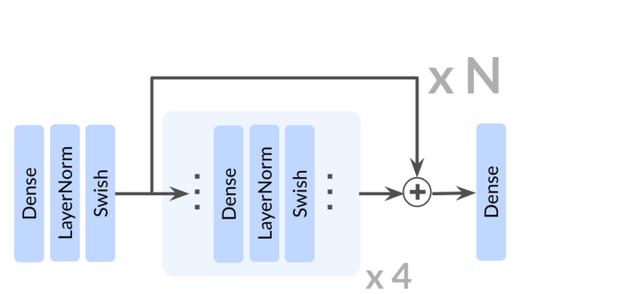

Fig.2 展示的是本文的架构核心：actor 和 critic 都加入 residual block。每个 residual block 由 Dense、LayerNorm、Swish 组成，论文把网络深度定义为所有 residual block 中 Dense 层的总数。

# 核心方法精读

## 1. Contrastive RL：把 goal-reaching 变成对比分类问题

传统 goal-conditioned RL 会显式定义 reward：到 goal 附近就是 1，否则是 0。问题是这种 reward 极其稀疏，长 horizon 下很难训练。

CRL 的做法更像自监督表征学习：

- **输入端**：当前状态 $s$、动作 $a$、目标 $g$。
- **输出端**：critic 分数 $f_{\phi,\psi}(s,a,g)$，表示这个 state-action 是否和 goal 匹配。
- **中间表示**：两个 embedding，一个是 state-action embedding $\phi(s,a)$，一个是 goal embedding $\psi(g)$。

论文中 critic 定义为两者的距离：

$$
f_{\phi,\psi}(s,a,g) = \|\phi(s,a) - \psi(g)\|_2
$$

直观理解：

- $\phi(s,a)$：当前这样行动之后，未来可能到哪里；
- $\psi(g)$：目标位置在表征空间里的坐标；
- 两者越接近，说明这个动作越可能通向 goal。

critic 用 InfoNCE 训练：

$$
\min_{\phi,\psi} \mathbb{E}_B
\left[
-\sum_{i=1}^{|B|}
\log
\frac{
e^{f_{\phi,\psi}(s_i,a_i,g_i)}
}{
\sum_{j=1}^{K} e^{f_{\phi,\psi}(s_i,a_i,g_j)}
}
\right]
$$

这里 $g_i$ 是同一条轨迹里的未来状态，属于正样本；$g_j$ 是其他 trajectory 里的 goal，属于负样本。

为什么这适合 scaling？因为它把 RL 中难训的 value regression，部分转化成了“匹配 / 不匹配”的对比分类目标。作者认为这和视觉、语言里可扩展的 cross-entropy / contrastive objective 更接近。

## 2. Residual 深层 MLP：让 64 到 1024 层可训练

如果只是把普通 MLP 堆到几百层，基本会崩。本文的 scaling recipe 是：

- residual connection；
- layer normalization；
- Swish activation；
- GPU 加速的 JaxGCRL 在线环境；
- actor 和 critic 共同缩放深度。

residual block 的核心公式是：

$$
h_{i+1} = h_i + F_i(h_i)
$$

这句话的直观含义是：每一层不是从头生成一个全新表示，而是在已有表示上学习一个“修正量”。这样深层网络可以保留早期有用特征，也让梯度更容易传回浅层。

在本文里，“深度”不是只算 block 数，而是算 Dense 层总数。由于每个 residual block 有 4 个 Dense 层，所以 $N$ 个 residual block 对应 $4N$ 层。

## 3. 输入 / 输出：goal-conditioned policy 到底学什么？

在 goal-conditioned MDP 中：

- 当前状态是 $s_t$；
- 动作是 $a_t$；
- 目标是 $g$；
- policy 是 $\pi(a \mid s,g)$。

可以把 policy 理解成一个“导航函数”：给它当前位置和目标，它输出下一步该怎么动。

论文中的目标不是从人工 reward 学一个具体任务，而是让 agent 在探索中学会：

> 给定任意 goal，如何最大化未来到达该 goal 的可能性。

这就是自监督 RL 的关键：goal 本身来自环境状态，训练信号来自 trajectory 内部的 future state，而不是外部标注。

## 4. 训练目标如何支撑深度缩放？

本文的假设是：要让 RL 像视觉/语言一样扩展，需要同时满足两个条件。

第一，训练目标要稳定。InfoNCE 比 TD value regression 更像分类目标，数值范围和梯度更适合深层网络。

第二，数据吞吐要足够。作者使用 JaxGCRL 和 GPU 并行仿真，让 replay buffer 有足够在线数据支持深模型训练。

因此，本文不是单独证明“层数越多越好”，而是在证明一个组合：

```text
Contrastive objective + residual architecture + layer norm + Swish + GPU online data
```

这个组合才能让深度 scaling 在 self-supervised RL 中真正发生。

# 主要实验结果

## 结果 1：深度带来大幅性能提升

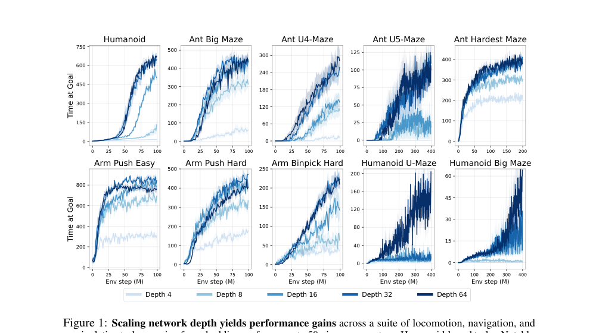

Fig.1 是全文最重要的结果图。横轴是环境步数，纵轴是 Time at Goal。作者在 10 个 locomotion、navigation 和 manipulation 任务上比较深度 4、8、16、32、64 的 CRL。

结论很清楚：

- manipulation 任务提升约 2-5x；
- Ant 长路径迷宫任务提升可超过 20x；
- Humanoid 任务提升可超过 50x；
- 某些任务不是平滑提升，而是在临界深度后突然跳升。

Table 1 给出了更具体的最终提升：

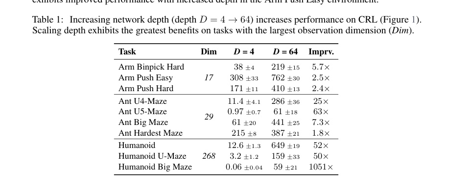

| Task | Dim | Depth 4 | Depth 64 | 提升 |
| --- | ---: | ---: | ---: | ---: |
| Arm Binpick Hard | 17 | 38 ± 4 | 219 ± 15 | 5.7x |
| Arm Push Easy | 17 | 308 ± 33 | 762 ± 30 | 2.5x |
| Arm Push Hard | 17 | 171 ± 11 | 410 ± 13 | 2.4x |
| Ant U4-Maze | 29 | 11.4 ± 4.1 | 286 ± 36 | 25x |
| Ant U5-Maze | 29 | 0.97 ± 0.7 | 61 ± 18 | 63x |
| Ant Big Maze | 29 | 61 ± 20 | 441 ± 25 | 7.3x |
| Ant Hardest Maze | 29 | 215 ± 8 | 387 ± 21 | 1.8x |
| Humanoid | 268 | 12.6 ± 1.3 | 649 ± 19 | 52x |
| Humanoid U-Maze | 268 | 3.2 ± 1.2 | 159 ± 33 | 50x |
| Humanoid Big Maze | 268 | 0.06 ± 0.04 | 59 ± 21 | 1051x |

最值得注意的是 Humanoid 系列。它的 observation dimension 是 268，远高于 Ant 和 Arm。论文认为，观测维度越高、环境动力学越复杂，深度 scaling 的优势越明显。

## 结果 2：深度不是只提高分数，还产生新行为

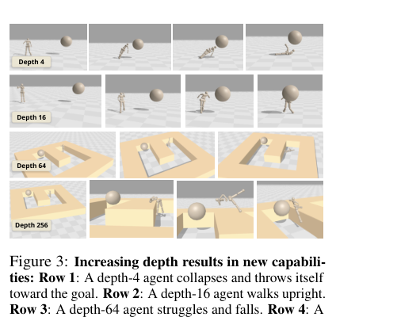

Fig.3 展示了不同深度的 Humanoid agent：

- depth 4：会倒下或把身体扔向目标；
- depth 16：开始能直立行走；
- depth 64：在 U-Maze 中仍会被墙挡住、摔倒；
- depth 256：学会利用身体姿态翻越或越过墙体障碍。

这就是论文标题中的 “new goal-reaching capabilities”。它不是简单更快到达目标，而是策略空间发生了质变：深模型学到浅模型根本没有出现过的动作技能。

## 结果 3：深度比宽度更有效

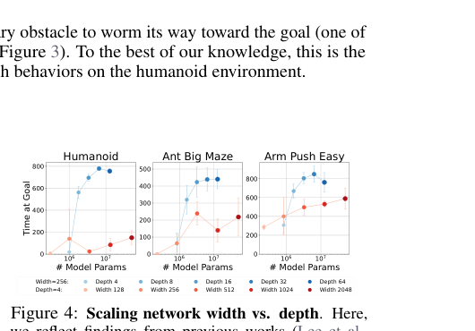

Fig.4 比较了 scaling width 和 scaling depth。结论是：

- 增加 width 确实有帮助；
- 但在本文 recipe 下，增加 depth 更有效；
- 在 Humanoid 中，4 层、宽度 2048 的模型仍不如 8 层、宽度 256 的模型。

这点很重要，因为过去一些 RL scaling 工作主要加宽网络，而不是加深网络。本文说明，至少在 CRL 这个 setting 下，深度是更强的 scaling axis。

## 结果 4：性能常在临界深度后跳升

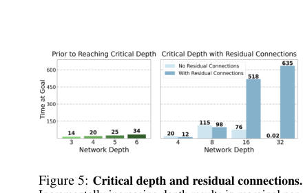

Fig.5 表达的是 critical depth。性能不是每加几层就平滑上涨，而是常常在某个层数后突然改善。

例子：

- Ant Big Maze 的临界深度可能在 8 层附近；
- Humanoid U-Maze 需要 64 层甚至更深；
- 复杂任务的临界深度更高。

这和语言模型中的 emergent ability 有相似味道：能力不一定随 scale 线性增加，而可能在模型容量足够表达某种策略或表示后突然出现。

# 消融分析：哪些设计真的重要？

## Q1：actor 和 critic 谁更需要变深？

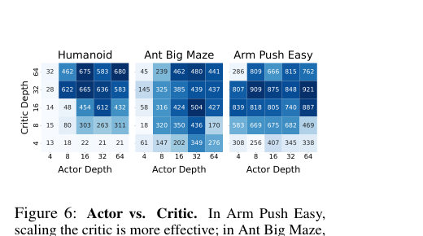

Fig.6 把 actor depth 和 critic depth 分开调。结论不是单一的：

- Arm Push Easy 中，critic scaling 更关键；
- Ant Big Maze 中，actor scaling 更关键；
- Humanoid 中，actor 和 critic 都需要扩展。

这说明 Scaled CRL 的收益不是只来自“更好的 critic 表征”或“更强的 policy 网络”，而是 actor 和 critic 在不同任务中互补。

## Q2：为什么大 batch 以前没用，现在有用了？

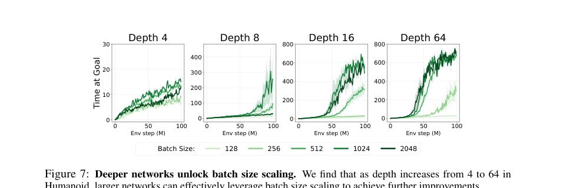

Fig.7 的结论是：深网络解锁了 batch size scaling。

浅层 depth 4 模型中，batch size 从 128 加到 2048 几乎没有收益。随着深度增加，较大 batch 开始显著提高性能。

直观理解：

- 小模型容量有限，给再多 batch 也吃不下；
- 深模型容量足够，能利用大 batch 降低梯度噪声、稳定训练；
- 这和大规模预训练中“更大模型配更大 batch”类似。

## Q3：深度收益来自更好探索，还是更强表达？

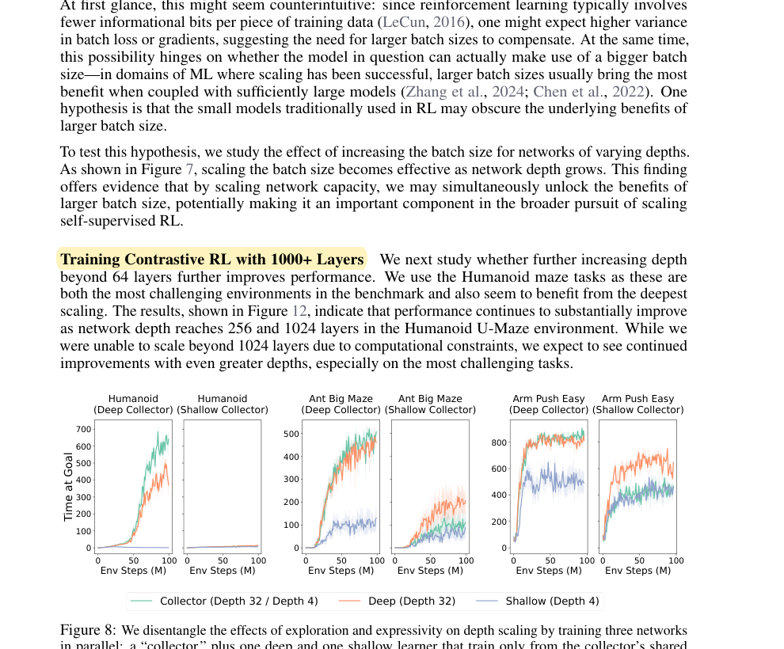

Fig.8 设计了一个很巧的实验：

1. 一个 collector 负责探索并写入 replay buffer；
2. 一个 deep learner 和一个 shallow learner 只从同一个 buffer 学习；
3. 这样就固定了数据分布，只比较模型表达能力。

结果：

- deep collector 产生好数据时，deep learner 明显优于 shallow learner；
- shallow collector 覆盖不足时，deep learner 也救不了。

结论是：depth scaling 的收益来自探索和表达能力的协同。深模型能探索得更好，也能从好数据中学到更复杂的表示；但如果数据覆盖很差，单纯模型更大仍然不够。

# 为什么深度有用？

## 1. 深 critic 学到环境拓扑，而不只是欧氏距离

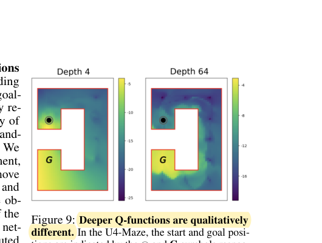

Fig.9 可视化了 U4-Maze 中的 Q-function / representation distance。浅层网络会把“离 goal 欧氏距离近”的位置看得很高，即使中间有墙挡住。深层网络则学到沿着 maze 内部路径逐步接近 goal 的结构。

这说明深层 critic 学到的是环境拓扑，而不是简单几何距离。

## 2. 深网络给关键状态分配更多表征容量

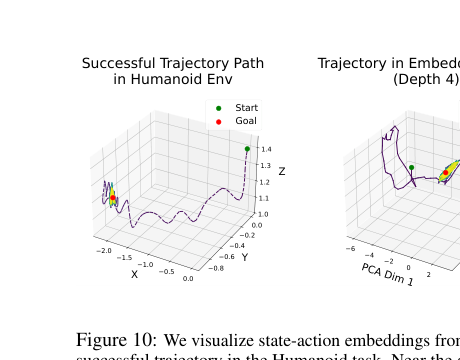

Fig.10 比较 Humanoid 轨迹上的 state-action embedding。浅层网络把 near-goal states 聚在一起，深层网络则把这些关键状态展开成更丰富的曲面。

直观上，深网络知道“接近 goal 的状态差异很重要”，因此给这部分状态空间分配更多表示容量。

## 3. 深网络能做 partial experience stitching

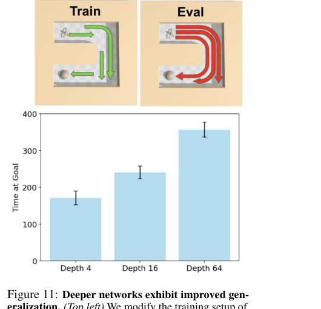

Fig.11 测试的是泛化能力。训练时只给距离不超过 3 的 start-goal pair，测试时要求到达更远的 goal。

结果：

- depth 4 只能解决最简单目标；
- depth 16 有一定泛化；
- depth 64 能把短距离经验拼接起来，解决更远 goal。

这类似“经验 stitching”：模型没有直接见过完整长路径，但能组合局部经验形成长路径策略。

# 1024 层实验：极限在哪里？

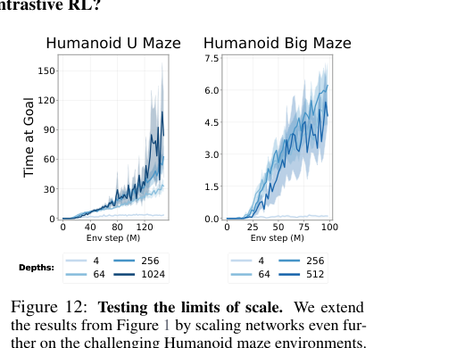

Fig.12 把深度继续推到 256、512、1024。作者主要在 Humanoid maze 上测试，因为这些任务最难，也最需要深度。

结论：

- Humanoid U-Maze 在 256 和 1024 层仍继续提升；
- 作者没能超过 1024 层，主要是计算约束；
- 对 1024 层模型，actor loss 在训练初期会爆，因此最终设置是 actor depth 512，两个 critic encoder 用 1024 层。

这说明 scaling 不是没有稳定性问题，而是本文 recipe 已经把可训练深度大幅推高。

# 与其他 baseline 的关系

论文在 appendix 中比较了：

- 原始 CRL；
- SAC；
- SAC + HER；
- TD3 + HER；
- GCSL；
- GCBC。

Scaled CRL 在 10 个环境中的 8 个超过这些 baseline。更关键的是，作者发现 SAC、SAC+HER、TD3+HER 这类 TD 方法加深后通常没有收益，甚至可能变差。

这说明本文结果不是“任何 RL 算法加深都有效”，而是：

> Contrastive RL 这类自监督、分类式目标更适合深度 scaling。

# 局限与风险

## 1. 计算成本很高

最直接的限制是 compute。Appendix 中报告，Humanoid U-Maze 从 4 层到 1024 层，wall-clock time 从约 3.23 小时上升到约 134.15 小时。

深度 scaling 有效果，但不便宜。未来需要分布式训练、剪枝、蒸馏等方法降低部署和训练成本。

## 2. Offline setting 不成立

论文在 OGBench 的 offline goal-conditioned setting 中测试了深度 scaling，发现没有明显收益，甚至两个环境中性能随深度增加而下降。

这说明本文 recipe 依赖 online exploration 和数据分布随策略共同改进。没有新的探索数据，单纯加深模型可能无法发挥作用。

## 3. 不是所有算法都能照搬

TD-based 方法和部分 supervised baseline 并没有稳定获得深度收益。本文更像是在说明“CRL + 合适架构可以深度缩放”，而不是给所有 RL 方法提供通用结论。

## 4. 1024 层仍有训练不稳定

1024 层实验中 actor loss 会爆，因此作者只把 critic encoder 推到 1024 层，actor 保持在 512 层。这说明进一步 scaling 仍需要更稳定的 actor 架构或优化方法。

# 对后续研究的启发

研究启发：

- RL scaling 可能需要先选择更像自监督学习的目标，而不是直接放大 PPO/SAC。
- 深度、batch size、数据吞吐、residual architecture 必须一起考虑。
- goal-conditioned RL 是观察 emergent behavior 的好场景，因为任务本身要求长 horizon、组合泛化和探索。
- Offline RL scaling 仍是开放问题，需要新的数据覆盖或表征学习机制。

工程启发：

- 如果要复现，不要只改网络层数；必须同时使用 residual connection、LayerNorm、Swish 和足够大的在线数据吞吐。
- 深度 scaling 对高维状态任务更可能有收益，例如 humanoid、复杂机器人控制。
- actor 和 critic 的深度最好一起调，不同任务中瓶颈不同。
- 大 batch 只有在模型足够深时才可能转化为收益。

## 2. PPO vs. CRL (本文方法) 的深度适配性对比

| 特性 | 传统 PPO / SAC | 本文 CRL 方法 |
| :--- | :--- | :--- |
| **训练目标** | 回归 Q/V 值，深度增加后对初始化和梯度缩放非常敏感。 | 对比分类，训练信号更稳定，更接近 CV / NLP 中可扩展的目标。 |
| **数据利用** | 在线/近在线采集，旧数据很快丢弃，深模型很难被充分训练。 | 可离线或离线混合训练，能反复利用数据。 |
| **数值范围** | Q/V 值可能从 0 变到几千，容易爆炸；自举误差会沿深层网络放大。 | 特征向量通常在固定范围内，数值更稳定。 |
| **稳定目标** | 缺少稳定的对比目标，TD 回归容易在深网络中崩溃。 | 用状态和目标的匹配关系构造对比目标。 |
| **历史经验** | SAC / PPO 等 TD 方法加深后常出现不收敛、Q 值爆炸、性能不如浅层网络，形成“RL 不需要深层网络”的经验偏见。 | CRL 是较新的范式，早期重点在验证方法可行性，过去较少系统探索深度缩放。 |
| **关键洞察** | 失败来自 TD / 回归目标，不等于 RL 本身不能变深。 | InfoNCE 这类对比分类目标更接近 CV / NLP 的可扩展训练目标，因此更适合堆深度。 |
| **深度潜力** | 4-8 层即达到瓶颈 | **1024 层**仍有收益 |

Scaled CRL 的结果说明，在自监督 goal-conditioned setting 中，深度可以带来：

- 更高的成功率；
- 更强的拓扑表征；
- 更好的经验 stitching；
- 更复杂的 humanoid 行为；
- 对 batch size scaling 的利用能力；
- 某些类似 emergent ability 的临界深度现象。

最大的开放问题是：这种 scaling recipe 能否迁移到更通用的 RL、offline RL、视觉输入、真实机器人，以及更接近 foundation model 的 embodied learning pipeline。

## 附录：PDF 解析与图表抽取自检

- PDF 已成功读取：标题、作者、摘要、章节结构、公式、Figure 和 Table 均可解析。
- 已抽取关键图表：Fig.1、Fig.2、Fig.3、Fig.4、Fig.5、Fig.6、Fig.7、Fig.8、Fig.9、Fig.10、Fig.11、Fig.12、Table 1。
- 使用图片裁剪的复杂图表：所有曲线图、架构图、行为图和 Table 1 均保存为 `wiki/assets/unsupervised_rl_1000layer_*.png`。
- 公式已使用 MathJax 写法重写，避免使用代码块模拟公式。
- 已检索 Project、GitHub、OpenReview、arXiv 和会议状态。

## 索引信息

> 类别：论文笔记 / 自监督强化学习 / Goal-Conditioned RL / RL Scaling  
> 索引标签：#SelfSupervisedRL #ContrastiveRL #GoalConditionedRL #Scaling #DeepRL #ResidualNetwork #InfoNCE #EmergentBehavior #NeurIPS2025

